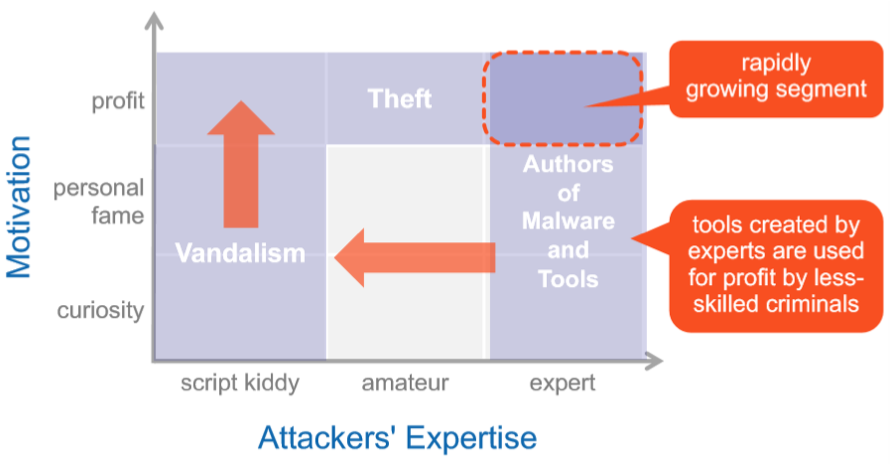

# M-ITSec - Management von Informationssicherheit, INF-V-IS001, BE-Sa-1, FS21

- [M-ITSec - Management von Informationssicherheit, INF-V-IS001, BE-Sa-1, FS21](#m-itsec---management-von-informationssicherheit--inf-v-is001--be-sa-1--fs21)
  * [Lerninhalte](#lerninhalte)
    + [Aufbau eines ISMS (Information Security Management System)](#aufbau-eines-isms--information-security-management-system-)
    + [Control Frameworks & IT Security Massnahmen](#control-frameworks---it-security-massnahmen)
    + [Prozesse und Incident Management](#prozesse-und-incident-management)
    + [Nachhaltiger Betrieb und Verbesserung](#nachhaltiger-betrieb-und-verbesserung)
    + [Business Continuity, Audit & Recht](#business-continuity--audit---recht)
- [1 Aufbau eines ISMS (Information Security Management System)](#1-aufbau-eines-isms--information-security-management-system-)
  * [Lernziele](#lernziele)
  * [Vorbereitung](#vorbereitung)
    + [CobIT - Control Objectives for Information and Related Technology](#cobit---control-objectives-for-information-and-related-technology)
    + [ISO/IEC 27001](#iso/iec-27001)
    + [ITIL - Information Technology Infrastructure Library](#itil---information-technology-infrastructure-library)
    + [BSI - Bundesamt für Sicherheit in der Informationstechnik (Deutschland)](#bsi---bundesamt-für-sicherheit-in-der-informationstechnik--deutschland-)
    + [Common Criteria](#common-criteria)
    + [OSSTMM](#osstmm)
    + [FIPS 140](#fips-140)
    + [Verwendung mehrerer Standards](#verwendung-mehrerer-standards)
    + [Weitere Regelwerke](#weitere-regelwerke)
    + [Sicherheitsanforderungen](#sicherheitsanforderungen)
    + [Anforderungsklatalog](#anforderungsklatalog)
    + [IT-Sicherheitsbeauftragter](#it-sicherheitsbeauftragter)
      - [ISMS - Informationssicherheits-Managementsystem](#isms---informationssicherheits-managementsystem)
    + [Datenschutzbeauftragter](#datenschutzbeauftragter)
    + [Notfallteam](#notfallteam)
    + [Risikomanagement](#risikomanagement)
    + [IKS - Internes Kontrollsystem](#iks---internes-kontrollsystem)
    + [PDCA-Zyklus - Plan Do Check Act](#pdc-zyklus---plan-do-check-act)
    + [Risikoanalyse](#risikoanalyse)
      - [Vorbereitung](#vorbereitung)
      - [Durchführung](#durchführung)
    + [Risikoidentifikation](#risikoidentifikation)
    + [Risikobbewertung](#risikobbewertung)
      - [Risk Map](#risk-map)
    + [Business-Impact-Analyse](#business-impact-analyse)
    + [BCM - Business Continuity Managements](#bcm---business-continuity-managements)
    + [Strukturanalyse](#strukturanalyse)
    + [Sicherheitsstrategie und Sicherheitskonzept](#sicherheitsstrategie-und-sicherheitskonzept)
      - [Unternehmensstrategie](#unternehmensstrategie)
      - [Intelligente IT-Strategie](#intelligente-it-strategie)
      - [IT-Sicherheitsstrategie](#it-sicherheitsstrategie)
      - [IT-Sicherheitskonzept](#it-sicherheitskonzept)
      - [Kontrollmodell](#kontrollmodell)
    + [Managementsystem für IT-Sicherheit entwickeln](#managementsystem-für-it-sicherheit-entwickeln)
      - [Komponenten eines ISMS](#komponenten-eines-isms)
      - [MAnagementprinzipien](#managementprinzipien)
    + [Kontrolle der Überwachungsziele](#kontrolle-der-Überwachungsziele)
    + [Auswertung von Sicherheitsvorfälle](#auswertung-von-sicherheitsvorfälle)
    + [Überwachunngs und Detektionssysteme](#Überwachunngs-und-detektionssysteme)
    + [Beweissicherung](#beweissicherung)
    + [Eskalationsplan](#eskalationsplan)
    + [Personelle Massnahmen](#personelle-massnahmen)
      - [Personelle SIcherheitsmassnahmen](#personelle-sicherheitsmassnahmen)
      - [Sicherheitsweisungen](#sicherheitsweisungen)
      - [Regelmässige Sicherheitsschulungen](#regelmässige-sicherheitsschulungen)
      - [Austritt von Mitarbeitenden](#austritt-von-mitarbeitenden)
    + [Organisatorische Massnahmen](#organisatorische-massnahmen)
      - [Konzepte für die IT-Sicherheit](#konzepte-für-die-it-sicherheit)
      - [Weisungen](#weisungen)
      - [Verwaltung der Konzepte, Weisungen, Sicherheitsdokumente](#verwaltung-der-konzepte--weisungen--sicherheitsdokumente)
      - [Life-Cycle-Management](#life-cycle-management)
      - [Management-Tipps](#management-tipps)
  * [Präsenz](#präsenz)
      - [Agenda](#agenda)
      - [Bedrohungen wandeln sich](#bedrohungen-wandeln-sich)
      - […sind aber auch inhärent](#-sind-aber-auch-inhärent)
      - [Enemy Within…](#enemy-within-)
      - […and Outside](#-and-outside)
      - [Data Breaches](#data-breaches)
    + [Phasen einer Cyberattacke](#phasen-einer-cyberattacke)
      - [Marktplatz](#marktplatz)
    + [Vorgehen zum Aufbau eines ISMS](#vorgehen-zum-aufbau-eines-isms)
      - [ISIS12](#isis12)
        * [Übersicht](#Übersicht)
        * [Phase 0: Wieso benötige ich ein ISMS?](#phase-0--wieso-benötige-ich-ein-isms-)
        * [Phase 1: Initialisierung](#phase-1--initialisierung)
        * [Phase 2: Aufbau- & Ablauforganisation](#phase-2--aufbau----ablauforganisation)
        * [Phase 3: Entwicklung und Umsetzung](#phase-3--entwicklung-und-umsetzung)
        * [IAM](#iam)
    + [IT Sicherheitsstrategie](#it-sicherheitsstrategie)
      - [Definition](#definition)
      - [Strategiebaum](#strategiebaum)
        * [So viel wie nötig… …so wenig wie möglich](#so-viel-wie-n-tig---so-wenig-wie-m-glich)
      - [SWOT Analyse - Strengths, Weaknesses, Opportunities und Threats](#swot-analyse---strengths--weaknesses--opportunities-und-threats)
        * [Umsetzung](#umsetzung)
      - [Kritik an Strategischer Planung](#kritik-an-strategischer-planung)
    + [Risikoanalyse & Wahrnehmung von Risiken](#risikoanalyse---wahrnehmung-von-risiken)
      - [Definition](#definition-1)
      - [Wahrnehmung von Risiken](#wahrnehmung-von-risiken)
      - [Spezialfall: Cyber](#spezialfall--cyber)
      - [Risikoanalyse Schematischer Ablauf](#risikoanalyse-schematischer-ablauf)
      - [Risikobewertung](#risikobewertung)
      - [Identifizieren von Risiken](#identifizieren-von-risiken)
      - [Threat Model](#threat-model)
    + [Aufbauorganisation ISMS](#aufbauorganisation-isms)
      - [Übersicht](#Übersicht-1)
      - [Managementprinzipien](#managementprinzipien)
      - [Organisation](#organisation)
      - [Ressourcen](#ressourcen)
      - [Sicherheitskonzepte](#sicherheitskonzepte)
      - [Sicherheitskonzepte: Struktur](#sicherheitskonzepte--struktur)
      - [Prozesse](#prozesse)
    + [ISMS & PDCA](#isms---pdca)
    + [Personelle Massnahmen](#personelle-massnahmen-1)
      - [Mitarbeiter: ein Security Problem?](#mitarbeiter--ein-security-problem-)
      - [Security Awareness](#security-awareness)
      - [Wichtige HR Prozesse](#wichtige-hr-prozesse)
        * [Rollenbeschreibung](#rollenbeschreibung)
        * [Rekrutierung](#rekrutierung)
        * [Ausbildung](#ausbildung)
        * [Erkennen fehlender Stellvertretung](#erkennen-fehlender-stellvertretung)
        * [Schlüsselpersonen identifizieren](#schlüsselpersonen-identifizieren)
        * [Verletzung von Aufgabentrennung erkennen (Segregation of Duties)](#verletzung-von-aufgabentrennung-erkennen--segregation-of-duties-)
        * [Leistungsbeurteilung](#leistungsbeurteilung)
        * [Rollenwechsel und Austritt](#rollenwechsel-und-austritt)
          + [Nachbearbeitung](#nachbearbeitung)
- [2 Control Frameworks und IT Security Massnahmen](#2-control-frameworks-und-it-security-massnahmen)
          + [Lernziele](#lernziele)
  * [Vorbereitung](#vorbereitung)
    + [IT-Sicherheit](#it-sicherheit)
    + [Schutzziel Datensicherheit](#schutzziel-datensicherheit)
      - [Schutzziele (CIA)](#schutzziele--cia-)
      - [Vertraulichkeit (Confidentiality)](#vertraulichkeit--confidentiality-)
      - [Integrität (Integrity)](#integrit-t--integrity-)
        * [Realität](#realit-t)
        * [Aktualität](#aktualit-t)
        * [Authentizität](#authentizit-t)
      - [Verfügbarkeit (Availability)](#verf-gbarkeit--availability-)
      - [Verbindlichkeit](#verbindlichkeit)
        * [Authentizität](#authentizit-t-1)
        * [Rechtsgültigkeit](#rechtsg-ltigkeit)
        * [Nicht-Abstreitbarkeit](#nicht-abstreitbarkeit)
    + [Schutzziel Datenschutz](#schutzziel-datenschutz)
    + [Datensicherung](#datensicherung)
    + [Notfallvorsorge (Continuity Management, Contingency Management)](#notfallvorsorge--continuity-management--contingency-management-)
    + [Sicherheitsgefahren und -bedürfnisse](#sicherheitsgefahren-und--bed-rfnisse)
      - [Bedrohung, Verletzbarkeit und Risiko](#bedrohung--verletzbarkeit-und-risiko)
        * [Bedrohungen](#bedrohungen)
        * [Verletzbarkeit](#verletzbarkeit)
        * [Risiko](#risiko)
      - [Sicherheitsbedarf und Risikobereitschaft](#sicherheitsbedarf-und-risikobereitschaft)
        * [Güterabwägung](#g-terabw-gung)
      - [Sicherheitsmassnahmen](#sicherheitsmassnahmen)
      - [Sicherheit der Geschäftsprozesse](#sicherheit-der-gesch-ftsprozesse)
      - [Rolle der Informatik](#rolle-der-informatik)
      - [Sicherheitskriterien](#sicherheitskriterien)
        * [Organisatorische udn personelle Sicherheitskriterien](#organisatorische-udn-personelle-sicherheitskriterien)
    + [Anforderungen an die Sicherheit](#anforderungen-an-die-sicherheit)
      - [Externe Anforderungen](#externe-anforderungen)
      - [Interne Anforderungen](#interne-anforderungen)
      - [Sicherheitsanforderungen ermitteln](#sicherheitsanforderungen-ermitteln)
      - [Anfoderungskatalog](#anfoderungskatalog)
    + [Strukturanalyse und Schutzbedarfsstetllung](#strukturanalyse-und-schutzbedarfsstetllung)
      - [Netzplan erstellen](#netzplan-erstellen)
      - [Komplexität durch Gruppenbildung reduzieren](#komplexit-t-durch-gruppenbildung-reduzieren)
      - [Infrastrukturkomponeten erheben](#infrastrukturkomponeten-erheben)
      - [Geschäftskritische Anwendungen erfassen](#gesch-ftskritische-anwendungen-erfassen)
      - [Systemkomponeten pro Anwendung erheben](#systemkomponeten-pro-anwendung-erheben)
      - [Schutzbedarf für Anwendungen festlegen](#schutzbedarf-f-r-anwendungen-festlegen)
      - [Schutzbedarf für Systemkomponenten festlegen](#schutzbedarf-f-r-systemkomponenten-festlegen)
      - [Schutzbedarf für Kommunikationsverbindungen feststellen](#schutzbedarf-f-r-kommunikationsverbindungen-feststellen)
      - [Schutzbedarf für Räume festlegen](#schutzbedarf-f-r-r-ume-festlegen)
    + [Risiken analysieren, Schutzbedarf feststellen, Schwachsttellen aufdecken](#risiken-analysieren--schutzbedarf-feststellen--schwachsttellen-aufdecken)
  * [Präsenz](#pr-senz-1)
    + [Aufgabe 'Policy Templates'](#aufgabe--policy-templates-)
      - [SANS Policies: Kapitelstruktur](#sans-policies--kapitelstruktur)
      - [Frameworks: Übersicht](#frameworks---bersicht)
        * [Treiber](#treiber)
        * [Übersicht gebräuchlicher Frameworks](#-bersicht-gebr-uchlicher-frameworks)
        * [Center for Internet Security](#center-for-internet-security)
        * [National Institute of Standards and Technology](#national-institute-of-standards-and-technology)
        * [International Organization for Standardization](#international-organization-for-standardization)
        * [Information Security Forum](#information-security-forum)
      - [BSI](#bsi)
        * [BSI: Organisation](#bsi--organisation)
        * [BSI: IT Grundschutz Kataloge](#bsi--it-grundschutz-kataloge)
        * [BSI: Vernetzung der Kataloge](#bsi--vernetzung-der-kataloge)
        * [BSI: Bausteine](#bsi--bausteine)
        * [BSI: Gefährdungskataloge](#bsi--gef-hrdungskataloge)
        * [BSI: Massnahmenkataloge](#bsi--massnahmenkataloge)
      - [COBIT](#cobit)
        * [COBIT: Organisation](#cobit--organisation)
        * [COBIT: Geschichte](#cobit--geschichte)
        * [COBIT: Top-Down Vorgehen](#cobit--top-down-vorgehen)
        * [COBIT: Gesamtsicht](#cobit--gesamtsicht)
        * [COBIT: Prozesse](#cobit--prozesse)
        * [COBIT: Prozessbeschreibung](#cobit--prozessbeschreibung)
        * [COBIT 5: Vergleich zu Version 4](#cobit-5--vergleich-zu-version-4)
      - [ISO 27001](#iso-27001)
    + [ITIL](#itil)
      - [ITIL: Organisation](#itil--organisation)
      - [ITIL: Bücher und Inhaltsübersicht](#itil--b-cher-und-inhalts-bersicht)
      - [ITIL: Wallchart](#itil--wallchart)
    + [Frameworks anwenden: Risiken erkennen & Schutzbedarf bestimmen](#frameworks-anwenden--risiken-erkennen---schutzbedarf-bestimmen)
      - [Preventive & Detective Controls](#preventive---detective-controls)
      - [Gruppenarbeit](#gruppenarbeit)
          + [Nachbearbeitung](#nachbearbeitung-1)
- [3 Prozesse und Security Incident Management](#3-prozesse-und-security-incident-management)
          + [Lernziele](#lernziele-2)
  * [Vorbereitung](#vorbereitung-3)
  * [Präsenz](#pr-senz-2)
    + [Agenda](#agenda-1)
    + [Business Case](#business-case)
      - [Business Case - Details](#business-case---details)
      - [Business Case - Kapitelübersicht](#business-case---kapitel-bersicht)
    + [Prozessdesign](#prozessdesign)
      - [Definition 'Prozess'](#definition--prozess-)
      - [Prozess Design: Erste Schritte](#prozess-design--erste-schritte)
      - [Prozessdiagramm: Erstellung](#prozessdiagramm--erstellung)
      - [Prozessdiagramm: Visualisierung](#prozessdiagramm--visualisierung)
      - [Kontrollen](#kontrollen)
      - [Prozessdesign: Praxis](#prozessdesign--praxis)
      - [Prozessdesign: Abschluss](#prozessdesign--abschluss)
      - [Prozessdesign: Subjektivität](#prozessdesign--subjektivit-t)
      - [Gruppenarbeit: Prozessanalyse](#gruppenarbeit--prozessanalyse)
    + [RACI - Responsible Accountability Consulted Informed](#raci---responsible-accountability-consulted-informed)
      - [RACI: Einige Beobachtungen](#raci--einige-beobachtungen)
      - [Fallstudie: Erstellen eines RACI](#fallstudie--erstellen-eines-raci)
    + [Incident-, Problem & Change Management](#incident---problem---change-management)
      - [Begriffe](#begriffe)
      - [Incident Management](#incident-management)
      - [Problem Management](#problem-management)
      - [Incident oder Problem?](#incident-oder-problem-)
      - [Change Management](#change-management)
      - [IT Security Incident](#it-security-incident)
    + [Security Incident Response](#security-incident-response)
      - [CSIRT / CERT](#csirt---cert)
      - [CSIRT Einführung (1/2)](#csirt-einf-hrung--1-2-)
      - [CSIRT Einführung (2/2)](#csirt-einf-hrung--2-2-)
      - [Incident- und Krisenmanagement](#incident--und-krisenmanagement)
      - [Eskalationskriterien](#eskalationskriterien)
      - [Eskalationsstufen (1/4)](#eskalationsstufen--1-4-)
      - [Eskalationsstufen (2/4)](#eskalationsstufen--2-4-)
      - [Eskalationsstufen (3/4)](#eskalationsstufen--3-4-)
      - [Eskalationsstufen (4/4)](#eskalationsstufen--4-4-)
      - [Ausgewählte Kontrollen: Patch Management](#ausgew-hlte-kontrollen--patch-management)
        * [Patch Management Lifecycle & Process](#patch-management-lifecycle---process)
      - [Ausgewählte Kontrollen: IAM](#ausgew-hlte-kontrollen--iam)
      - [IAM als fortlaufender Prozess](#iam-als-fortlaufender-prozess)
      - [IAM Präventive Controls](#iam-pr-ventive-controls)
      - [Ausnahmeerkennung und Behandlung](#ausnahmeerkennung-und-behandlung)
  * [Nachbearbeitung](#nachbearbeitung-2)
- [4 Nachhaltiger Betrieb und Verbesserung](#4-nachhaltiger-betrieb-und-verbesserung)
          + [Lernziele](#lernziele-3)
  * [Vorbereitung](#vorbereitung-4)
  * [Präsenz](#pr-senz-3)
    + [Agenda](#agenda-2)
    + [Diskussion der Aufgabe 'Fallstudie Prozessdesign'](#diskussion-der-aufgabe--fallstudie-prozessdesign-)
      - [Lösen der Fallstudie](#l-sen-der-fallstudie)
        * [Musterlösung](#musterl-sung)
    + [IT Security Monitoring](#it-security-monitoring)
      - [SIEM: Begriff](#siem--begriff)
      - [SIEM: Eigenschaften](#siem--eigenschaften)
      - [SIEM Produkte](#siem-produkte)
      - [SIEM Produkte: Unruhiger Markt](#siem-produkte--unruhiger-markt)
    + [Big Picture: Logging & SIEM](#big-picture--logging---siem)
      - [Bottom-up Ansatz](#bottom-up-ansatz)
      - [Top-Down Ansatz: Threat Model](#top-down-ansatz--threat-model)
      - [Integration](#integration)
      - [Logmanagement](#logmanagement)
      - [Monitoring](#monitoring)
      - [Security Monitoring – Overview](#security-monitoring---overview)
      - [Incident Management](#incident-management-1)
    + [Risk- und Exception Management](#risk--und-exception-management)
      - [Weshalb Risk Management?](#weshalb-risk-management-)
      - [Definition](#definition-2)
      - [Risikoidentifikation](#risikoidentifikation-1)
      - [Risikobewertung](#risikobewertung-1)
      - [Risikosteuerung](#risikosteuerung)
      - [Risikosteuerung](#risikosteuerung-1)
      - [Risk Appetite](#risk-appetite)
      - [Risikosteuerung](#risikosteuerung-2)
      - [Risikokontrolle](#risikokontrolle)
    + [Maturity Model CMMI (Reifegradmessung)](#maturity-model-cmmi--reifegradmessung-)
      - [Definition CMMI](#definition-cmmi)
      - [Anwendung von CMMI](#anwendung-von-cmmi)
      - [Reifegrade](#reifegrade)
      - [Maturity Levelshttps://cmmiinstitute.com/learning/appraisals/levels](#maturity-levelshttps---cmmiinstitutecom-learning-appraisals-levels)
      - [Fallstudie CMMI](#fallstudie-cmmi)
      - [Fallstudie CMMI 'Benutzerberechtigungen'](#fallstudie-cmmi--benutzerberechtigungen-)
    + [Continuous Improvement: KPI](#continuous-improvement--kpi)
      - [Provide Actionable Risk Intelligence](#provide-actionable-risk-intelligence)
        * [Identify](#identify)
        * [Protect](#protect)
        * [Detect](#detect)
        * [Respond](#respond)
        * [Recover](#recover)
      - [Definition](#definition-3)
      - [Metrik – KPI – SLA](#metrik---kpi---sla)
      - [Bestimmen von KPI](#bestimmen-von-kpi)
      - [Definition sinnvoller KPI](#definition-sinnvoller-kpi)
      - [KPI: Beispiele](#kpi--beispiele)
      - [Einführen von KPI](#einf-hren-von-kpi)
      - [Auswerten / Rapportieren](#auswerten---rapportieren)
      - [Auswerten / Rapportieren](#auswerten---rapportieren-1)
      - [Metriken: Praxisbeispiele](#metriken--praxisbeispiele)
      - [KPI: Praxisbeispiel](#kpi--praxisbeispiel)
    + [Continuous Improvement: PDCA](#continuous-improvement--pdca)
      - [Geschichte](#geschichte)
      - [Plan – Do – Check – Act](#plan---do---check---act)
      - [Plan – Do](#plan---do)
        * [Plan](#plan)
        * [Do](#do)
      - [Check – Act](#check---act)
        * [Check](#check)
        * [Act](#act)
      - [PDCA: Standardize](#pdca--standardize)
  * [Nachbearbeitung](#nachbearbeitung-3)
- [5 Business Continuity, Audit & Recht](#5-business-continuity--audit---recht)
          + [Lernziele](#lernziele-4)
  * [Vorbereitung](#vorbereitung-5)
  * [Präsenz](#pr-senz-4)
    + [Agenda](#agenda-3)
    + [Diskussion der Fallstudie 'Audit Planung'](#diskussion-der-fallstudie--audit-planung-)
      - [Fallstudie: Plattform Beurteilung](#fallstudie--plattform-beurteilung)
      - [Fallstudie: Prozessbeurteilung](#fallstudie--prozessbeurteilung)
      - [Fallstudie: Prüfprogramm](#fallstudie--pr-fprogramm)
      - [Fallstudie: Zeitplan](#fallstudie--zeitplan)
    + [Revision (Audit)](#revision--audit-)
      - [Übersicht](#-bersicht-2)
      - [Audit und Projektarbeit](#audit-und-projektarbeit)
      - [Phasen eines Audits](#phasen-eines-audits)
        * [Planung](#planung)
        * [Fieldwork](#fieldwork)
        * [Rapportieren](#rapportieren)
          + [Rapportieren: Rating](#rapportieren--rating)
        * [Kontrolle](#kontrolle)
    + [Fehler-Usachen-Analyse oder Root cause analysis](#fehler-usachen-analyse-oder-root-cause-analysis)
      - [Definitionen](#definitionen)
      - [Wichtige Grundsätze](#wichtige-grunds-tze)
      - [Root Cause Übung 1](#root-cause--bung-1)
        * [Was ist das Problem?](#was-ist-das-problem-)
        * [Was ist der nächste Schritt?](#was-ist-der-n-chste-schritt-)
        * [Was nun?](#was-nun-)
        * [Was schliessen wir daraus? Haben wir ein Problem identifiziert?](#was-schliessen-wir-daraus--haben-wir-ein-problem-identifiziert-)
        * [Unser nächster Schritt?](#unser-n-chster-schritt-)
        * [Wie kommt es, dass das Managementsystem keine zweite Bestätigung vom Dateneigentümer einfordert, obwohl das nach unserer Security Policy beim Zugriff auf sensitive Daten nötig ist?](#wie-kommt-es--dass-das-managementsystem-keine-zweite-best-tigung-vom-dateneigent-mer-einfordert--obwohl-das-nach-unserer-security-policy-beim-zugriff-auf-sensitive-daten-n-tig-ist-)
        * [Was ist das Problem?](#was-ist-das-problem--1)
        * [Was nun?](#was-nun--1)
        * [Wieso war das Inventar nicht korrekt?](#wieso-war-das-inventar-nicht-korrekt-)
        * [Was ist schief gelaufen?](#was-ist-schief-gelaufen-)
        * [Unser nächster Schritt?](#unser-n-chster-schritt--1)
        * [Haben wir das Problem abschliessend und nachhaltig gelöst?](#haben-wir-das-problem-abschliessend-und-nachhaltig-gel-st-)
      - [Root Cause Übung 2](#root-cause--bung-2)
        * [Ausgangslage](#ausgangslage)
        * [Aufgabe:](#aufgabe-)
      - [Root Cause Übung 2: SOC](#root-cause--bung-2--soc)
      - [Root Cause Übung 2: PC Support](#root-cause--bung-2--pc-support)
      - [Root Cause Übung 2: CEO](#root-cause--bung-2--ceo)
      - [Root Cause Übung 2:](#root-cause--bung-2-)
    + [Schweizerische Gesetzesnormen mit Einfluss auf IT Sicherheit](#schweizerische-gesetzesnormen-mit-einfluss-auf-it-sicherheit)
      - [Recht und IT](#recht-und-it)
      - [Übersicht wichtigerer Gesetze](#-bersicht-wichtigerer-gesetze)
        * [OR](#or)
        * [DSG (neu auch: GDPR)](#dsg--neu-auch--gdpr-)
        * [StGB](#stgb)
      - [Schlussbemerkungen](#schlussbemerkungen)
    + [IT Forensik](#it-forensik)
      - [Definition](#definition-4)
      - [Die '6 W'](#die--6-w-)
        * [Wer:](#wer-)
        * [Was:](#was-)
        * [Wann:](#wann-)
        * [Wo:](#wo-)
        * [Wie:](#wie-)
        * [Warum:](#warum-)
      - [Anforderungen an die Vorgangsweise](#anforderungen-an-die-vorgangsweise)
      - [Zu sichernde Daten](#zu-sichernde-daten)
        * [Persistente Daten](#persistente-daten)
        * [Halb persistente Daten](#halb-persistente-daten)
        * [Flüchtige Daten](#fl-chtige-daten)
        * [Echtzeit Daten](#echtzeit-daten)
      - ['Pull the plug'?](#-pull-the-plug--)
      - [Schlussbemerkungen](#schlussbemerkungen-1)
    + [Business Continuity Management (BCM) Disaster Recovery Planning (DRP)](#business-continuity-management--bcm--disaster-recovery-planning--drp-)
      - [Definition](#definition-5)
      - [BCM & DRP](#bcm---drp)
      - [Begriffe](#begriffe-1)
        * [Recovery Time Objective (RTO)](#recovery-time-objective--rto-)
        * [Recovery Point Objective (RPO)](#recovery-point-objective--rpo-)
      - [Analyse](#analyse)
      - [Planung](#planung-1)
      - [Umsetzung](#umsetzung-1)
      - [Test](#test)
  * [Nachbearbeitung](#nachbearbeitung-4)
  * [Prüfungsvorbereitung](#pr-fungsvorbereitung)
    + [Aufgabe 1](#aufgabe-1)
    + [Aufgabe 2](#aufgabe-2)
    + [Aufgabe 3](#aufgabe-3)
    + [Aufgabe 4](#aufgabe-4)
    + [Aufgabe 5](#aufgabe-5)
    + [Aufgabe 6](#aufgabe-6)
    + [Aufgabe 7](#aufgabe-7)
    + [Aufgabe 8](#aufgabe-8)
    + [Aufgabe 9](#aufgabe-9)
    + [Aufgabe 10](#aufgabe-10)
    + [Aufgabe 11](#aufgabe-11)
    + [Aufgabe 12](#aufgabe-12)
    + [Lernziele](#lernziele-5)
      - [Aufgaben](#aufgaben)
      - [Lösungen](#l-sungen)
- [Zusammenfassugen - IT Security Management](#zusammenfassugen---it-security-management)
  * [Kapitel 1 - Schutzziele und Schutzbedarf](#kapitel-1---schutzziele-und-schutzbedarf)
    + [Management-Tipps](#management-tipps-1)
  * [Kapitel 2 - Gesetze, Standards und Regelwerke](#kapitel-2---gesetze--standards-und-regelwerke)
    + [Management-Tipps](#management-tipps-2)
  * [Kapitel 3 - Sicherheitsanforderungen und -aufgaben](#kapitel-3---sicherheitsanforderungen-und--aufgaben)
    + [Management-Tipps](#management-tipps-3)
  * [Kapitel 4 - Methoden und Techniken](#kapitel-4---methoden-und-techniken)
    + [Management-Tipps](#management-tipps-4)
  * [Kapitel 5 - Sicherheitsstrategie und Sicherheitskonzept erstellen](#kapitel-5---sicherheitsstrategie-und-sicherheitskonzept-erstellen)
    + [Management-Tipps](#management-tipps-5)
  * [Kapitel 6 - Risiken analysieren, Schutzbedarf feststellen, Schwachstellen aufdecken](#kapitel-6---risiken-analysieren--schutzbedarf-feststellen--schwachstellen-aufdecken)
    + [Management-Tipps](#management-tipps-6)
  * [Kapitel 7 - Managementsystem für IT-Sicherheit entwickeln](#kapitel-7---managementsystem-f-r-it-sicherheit-entwickeln)
    + [Management-Tipps](#management-tipps-7)
  * [Kapitel 8 - Sicherheits- und Notfallmassnahmen entwickeln](#kapitel-8---sicherheits--und-notfallmassnahmen-entwickeln)
    + [Management-Tipps](#management-tipps-8)
  * [Kapitel 9 - Sicherheitsmassnahmen aufeinander abstimmen](#kapitel-9---sicherheitsmassnahmen-aufeinander-abstimmen)
    + [Management-Tipps](#management-tipps-9)
  * [Kapitel 10 - Personelle Massnahmen planen und umsetzen](#kapitel-10---personelle-massnahmen-planen-und-umsetzen)
    + [Management-Tipps](#management-tipps-10)
  * [Kapitel 11 - Organisatorische Massnahmen planen und umsetzen](#kapitel-11---organisatorische-massnahmen-planen-und-umsetzen)
    + [Management-Tipps](#management-tipps-11)
  * [Kapitel 12 - Technische Massnahmen planen und umsetzen](#kapitel-12---technische-massnahmen-planen-und-umsetzen)
    + [Management-Tipps](#management-tipps-12)
  * [Kapitel 13 - Bereichsübergreifende Massnahmen](#kapitel-13---bereichs-bergreifende-massnahmen)
    + [Management-Tipps](#management-tipps-13)
  * [Kapitel 14 - Sicherheitsmassnahmen und -aktivitäten überwachen](#kapitel-14---sicherheitsmassnahmen-und--aktivit-ten--berwachen)
    + [Management-Tipps](#management-tipps-14)
  * [Kapitel 15 - Audits und Tests organisieren und durchführen](#kapitel-15---audits-und-tests-organisieren-und-durchf-hren)
    + [Management-Tipps](#management-tipps-15)
  * [Kapitel 16 - Wirksamkeit und Wirtschaftlichkeit der Massnahmen kontrollieren](#kapitel-16---wirksamkeit-und-wirtschaftlichkeit-der-massnahmen-kontrollieren)
    + [Management-Tipps](#management-tipps-16)
  * [Kapitel 17 - Prüf- und Messergebnisse auswerten und dokumentieren](#kapitel-17---pr-f--und-messergebnisse-auswerten-und-dokumentieren)
    + [Management-Tipps](#management-tipps-17)
  * [Kapitel 18 - Optimierungsmöglichkeiten ermitteln](#kapitel-18---optimierungsm-glichkeiten-ermitteln)
    + [Management-Tipps](#management-tipps-18)
  * [Kapitel 19 - Verbesserungsmassnahmen planen und umsetzen, Sicherheitskultur fördern](#kapitel-19---verbesserungsmassnahmen-planen-und-umsetzen--sicherheitskultur-f-rdern)
    + [Management-Tipps](#management-tipps-19)
  * [Kapitel 20 - Strategie, Konzepte, Notfallpläne, ISMS und Massnahmen anpassen](#kapitel-20---strategie--konzepte--notfallpl-ne--isms-und-massnahmen-anpassen)
    + [Management-Tipps](#management-tipps-20)
  * [Kapitel 21 - Kontinuierliche Qualitätsverbesserung](#kapitel-21---kontinuierliche-qualit-tsverbesserung)
    + [Management-Tipps](#management-tipps-21)
- [Fragen](#fragen)
- [Prüfungsvorbereitung](#pr-fungsvorbereitung-1)

<small><i><a href='http://ecotrust-canada.github.io/markdown-toc/'>Table of contents generated with markdown-toc</a></i></small>

Die Studierenden erhalten einen vertieften Einblick in das Manage- ment von Informationssicherheit und lernen die grundlegenden Konzepte und Prozesse, um in einer Firma die Informationssicher- heit aufzubauen, zu überwachen, zu prüfen und laufend zu verbes- sern.

Spezifische Methoden der Informationssicherheit, wie Methodik zur Erstellung von Sicherheitskonzepten, Security Incident Manage- ment können die Studierenden verstehen und aufbauen.

Die Studierenden können Frameworks, Standards und Prozesse (Abläufe) verstehen, interpretieren, anwenden, entwerfen, hinterfra- gen und verbessern.

---

## Lerninhalte

### Aufbau eines ISMS (Information Security Management System)
- Phasen einer typischen Cyberattacke
- Vorgehen zum Aufbau eines Informationssicherheitsmanagementsystems (ISMS) 
- IT Sicherheitsstrategie
- Repetition und Vertiefung Risikoanalyse
- Aufbauorganisation für ein ISMS
- Personelle Massnahmen

### Control Frameworks & IT Security Massnahmen
- Frameworks BSI, COBIT, CIS, ISF, NIST & ITIL
- ISO Standards der ISO 2700x Familie
- Erkennen und bewerten von Sicherheitsrisiken
- Schutzbedarf und angemessene Massnahmen bestimmen

### Prozesse und Incident Management
- Prozessdesign
- Analyse und Darstellung von Verantwortlichkeiten (RACI) 
- Incident-, Problem- und Change Management
- Besonderheiten Security Incident Response
- Ausgewählte Kontrollen: IAM und Patch Management

### Nachhaltiger Betrieb und Verbesserung
- IT Security Monitoring
- Risk- & Exception Management
- Maturity Model CMMI zur Reifegradmessung
- Continuous Improvement mittels Metriken, Key Performance Indicators (KPI) sowie den Plan- Do-Check-Act (PDCA) Zyklus

### Business Continuity, Audit & Recht
- Revision (Audit)
- Fehler-Ursachen-Analyse oder Root Cause Analysis
- Schweizerische Gesetzesnormen mit Einfluss auf IT Sicherheit 
- IT Forensik
- Notfallvorsorge oder Business Continuity Management (BCM)

---
# 1 Aufbau eines ISMS (Information Security Management System)

## Lernziele

Ich kenne mögliche Vorgehensweisen um ein ISMS einzuführen.

Ich kenne die Methodik des klassischen Risikomanagements und kann diese interpretieren und wo nötig kritisch hinterfragen.

Ich kann begründen, welche organisatorischen, infrastrukturellen und technischen Massnahmen nötig sind, um ein erfolgreiches ISMS einführen und nachhaltig betreiben zu können.

Ich verstehe die Wichtigkeit des menschlichen Faktors in der Informationssicherheit und weiss, welche personellen Massnahmen die Sicherheit des Unternehmens steigern können.

## Vorbereitung

https://moodle.ffhs.ch/mod/assign/view.php?id=3731180

Lesen sie im Lehrbuch (Annino U,Romagna A., IT Security Management) die Kapitel 

2.2 - 2.4 

### CobIT - Control Objectives for Information and Related Technology

https://de.wikipedia.org/wiki/COBIT

(COSO, ISO/IEC 27001, ITIL)

Drei Dimensionen von CobIT:

- Geschäftliche Anforderungen,
- IT-Prozesse
- IT-Ressourcen

Domänen der IT-Prozesse:
- Planung und Organisation
- Beschaffung und Implementation
- Auslieferung und Unterstützung
- Überwachung und Optimierung

CobIT - Gliederung der Anforderungen

|Bereich|Anforderungen|Quellen(Beispiele)|
|---|---|---|
|Qualität|Anforderung aud dem Business|Geschäftsprozesse, Standards und Best Practices aus dem Qualitätsmanagement|
|Compilance|Normative Anforderungen|Gesetze, Regulative und branchenspezifische Vorgaben (z.B. Anforderungen der Finanzmarktaufsicht FINMA für Banken)|
|Sicherheit|Anforderungen an die IT-Sicherheit|Geschäftsprozesse, IT-Management|

CobIT – Gruppierung Kathegorien
- Menschen: Mitarbeitenden, Kunden, Lieferanten
- Anwendungen: Applikationen, Dienste (Services)
- Infrastuktur: Logistik, Gebäude, IT-Infrastuktur
- Informstionen: Datenbestände

CobIT Würfel

### ISO/IEC 27001

Anforderungen an ein systematisches IT-Sicherheitsmanagementsystem (ISMS)

https://www.iso.org/isoiec-27001-information-security.html

https://de.wikipedia.org/wiki/ISO/IEC_27001

### ITIL - Information Technology Infrastructure Library

Standard für das Servicemanagement in der Informatik

https://de.wikipedia.org/wiki/ITIL

https://wiki.de.it-processmaps.com/index.php/ITIL-Prozesse

### BSI - Bundesamt für Sicherheit in der Informationstechnik (Deutschland)

https://de.wikipedia.org/wiki/BSI-Gesetz

Strukturanalyse / Schutzbedarfsanalyse
Für die Erstellung eines Sicherheitskonzepts und insbesondere für die Anwendung der IT-Grund- schutz-Kataloge ist es erforderlich, das Zusammenspiel der Geschäftsprozesse, der Anwendungen und der vorliegenden Informationstechnik zu analysieren und zu dokumentieren. Aufgrund der heute üblichen starken Vernetzung von IT-Systemen bietet sich ein Netztopologieplan als Ausgangsbasis für die weitere technische Analyse an. Die folgenden Aspekte müssen berücksichtigt werden:
- im Informationsverbund betriebene Anwendungen und die dadurch gestützten Geschäftsprozesse,
- die organisatorischen und personellen Rahmenbedingungen für den Informationsverbund,
- im Informationsverbund eingesetzte vernetzte und nicht-vernetzte IT-Systeme,
- die Kommunikationsverbindungen zwischen den IT-Systemen und nach außen,
- die vorhandene Infrastruktur.
Die einzelnen Schritte der Strukturanalyse werden im Detail in Kapitel 4.2 dieses Dokuments in Form
einer Handlungsanweisung beschrieben.

Schutzbedarfsfeststellung
Zweck der Schutzbedarfsfeststellung ist es, zu ermitteln, welcher Schutz für die Geschäftsprozesse, die dabei verarbeiteten Informationen und die eingesetzte Informationstechnik ausreichend und angemessen ist. Hierzu werden für jede Anwendung und die verarbeiteten Informationen die zu erwartenden Schäden betrachtet, die bei einer Beeinträchtigung von Vertraulichkeit, Integrität oder Verfügbarkeit entstehen können. Wichtig ist es dabei auch, die möglichen Folgeschäden realistisch einzuschätzen. Bewährt hat sich eine Einteilung in die drei Schutzbedarfskategorien "normal", "hoch" und "sehr hoch".
Die einzelnen Schritte der Schutzbedarfsfeststellung werden im Detail in Kapitel 4.3 dieses Doku- ments erläutert.
Auswahl und Anpassung von Maßnahmen
Voraussetzung für die Anwendung der IT-Grundschutz-Kataloge auf einen Informationsverbund sind detaillierte Unterlagen über seine Struktur und den Schutzbedarf der darin enthaltenen Zielobjekte. Diese Informationen sollten über die zuvor beschriebenen Arbeitsschritte ermittelt werden. Um geeignete Sicherheitsmaßnahmen für den vorliegenden Informationsverbund identifizieren zu können, müssen anschließend die Bausteine der IT-Grundschutz-Kataloge auf die Zielobjekte und Teilbereiche abgebildet werden.
Dieser Vorgang der Modellierung wird in Kapitel 4.4 detailliert beschrieben.

Basis-Sicherheitscheck
Der Basis-Sicherheitscheck ist ein Organisationsinstrument, welches einen schnellen Überblick über das vorhandene Sicherheitsniveau bietet. Mit Hilfe von Interviews wird der Status quo eines beste- henden (nach IT-Grundschutz modellierten) Informationsverbunds in Bezug auf den Umsetzungsgrad von Sicherheitsmaßnahmen des IT-Grundschutzes ermittelt. Als Ergebnis liegt ein Katalog vor, in dem für jede relevante Maßnahme der Umsetzungsstatus "entbehrlich", "ja", "teilweise" oder "nein" erfasst ist. Durch die Identifizierung von noch nicht oder nur teilweise umgesetzten Maßnahmen werden Verbesserungsmöglichkeiten für die Sicherheit der betrachteten Geschäftsprozesse und der Informationstechnik aufgezeigt.
Kapitel 4.5 beschreibt einen Aktionsplan für die Durchführung eines Basis-Sicherheitschecks. Dabei wird sowohl den organisatorischen Aspekten als auch den fachlichen Anforderungen bei der Projekt- durchführung Rechnung getragen.

Weiterführende Sicherheitsmaßnahmen (Dringende Sicherheitsmassnahmen umsetzen)
Die Standard-Sicherheitsmaßnahmen nach IT-Grundschutz bieten im Normalfall einen angemessenen und ausreichenden Schutz. Bei hohem oder sehr hohem Schutzbedarf kann es jedoch sinnvoll sein, zu prüfen, ob zusätzlich oder ersatzweise höherwertige Sicherheitsmaßnahmen erforderlich sind. Dies gilt auch, wenn besondere Einsatzbedingungen vorliegen oder wenn Komponenten verwendet werden, die nicht mit den existierenden Bausteinen der IT-Grundschutz-Kataloge abgebildet werden können. Hierzu ist zunächst im Rahmen einer ergänzenden Sicherheitsanalyse zu entscheiden, ob für die jeweils betroffenen Bereiche eine Risikoanalyse durchgeführt werden muss.
Eine Methode für Risikoanalysen ist die im BSI-Standard 100-3 "Risikoanalyse auf der Basis von IT- Grundschutz" beschriebene Vorgehensweise. In Kapitel 4.6 wird diese Methode überblicksartig dargestellt. Die erfolgreiche Durchführung einer Risikoanalyse hängt entscheidend von den Fach- kenntnissen des Projektteams ab. Daher ist es häufig sinnvoll, fachkundiges externes Personal hinzu- zuziehen.

### Common Criteria

### OSSTMM

### FIPS 140

### Verwendung mehrerer Standards

### Weitere Regelwerke

- Basel II
- Solvency II
- Sarbanes-Oxley (SOx)
- COSO

3.2 & 3.3 

### Sicherheitsanforderungen
- Externe und interne Anspruchsgruppen
- Externe Sicherheitsanforderungen

### Anforderungsklatalog
- Grundlage für die Beurteilung von Risiken und angestrebtes Sicherheitsninveau

### IT-Sicherheitsbeauftragter
- Für die Wahrnehmung aller Belange der IT-SIcherheit ihherhalb des Unternehmens zuständig
- Funktion, Aufgaben, Kompetenzen variieren von Unternehmen zu Unternehmen
- Kontroll und Überwachungsaufgaben
- Planung und Umsetzung der notwendigen SIcherheitsmassnahmen
- Beratung der Geschäftsleitung in Sachen Sicherheitsanforderungen und Unterstützung bei Umsetzung

#### ISMS - Informationssicherheits-Managementsystem
- IT-Sicherheitsforum zum Auf- und Ausbau der IT-Sicherheit

### Datenschutzbeauftragter
- Wenn Unternehmung untner das DGS fällt

### Notfallteam
- Einberufung bei bestimmtem Eintreten von Ereignissen

### Risikomanagement

### IKS - Internes Kontrollsystem

4.2 & 4.3 

### PDCA-Zyklus - Plan Do Check Act

### Risikoanalyse
- ermitteln und bewerten

#### Vorbereitung
- initiieren
- ab- und eingrenzung des Untersuchungsbereich

#### Durchführung
- identifizieren und bewerten

### Risikoidentifikation
- Risikomatrix
- Abschätzen von Gesamtrisiko und Abhängigkeiten

### Risikobbewertung
- Beurteilung der identifizierten Risiken
- quantitative
    - Bewertung des Schadensausmass anhand absoluter Bewertung der Auswirkungen in CHF 
- qualitative Bemessung
    - Bewertung des Schadensausmass anhand einer relativen Zuordnung

#### Risk Map
- Schnelle Übersicht des Ausmass und Eintrittswahrscheinlichkeit
- Netzdiagramm
- Blasendiagramm

### Business-Impact-Analyse
- Grundlage der unternehmerischen Sicherheitsstrategie
- Betriebliche Notfallvorsorge
- Untersuch des Ausfalls von einzeknen Geschäftsprozessen
- Ausfallszenarien durchspielen
- Schutzziele
    - Vertraulichkeit
    - Verfügbarkeit
    - Integrität
    - Verbindlichkeit
### BCM - Business Continuity Managements

### Strukturanalyse
- Erhebung der IT-Inftrastruktur
- Grundlage für Ermittlung des Schutzbedarfs nach BSI
  -Vorgehen
    - Netzplan erheben
    - Komplexität durch clustering reduzieren
    - Schutzbedarf von Anwendungen festlegen
    - Schutzbedarf von Komponenten festlegen
    - Schutzbedarf für Kommunikationsverbindungen festlegen
    - Schutzbedarf für Räume festlegen
    - Ergebnisse interpretieren

5 

### Sicherheitsstrategie und Sicherheitskonzept

#### Unternehmensstrategie
- mittel- und langfristige ausrichtung des Unternehmens
- Erfolgschance erhalten / ausbauen
- Misserfolgschancen vermeiden / reduzieren

#### Intelligente IT-Strategie
- Sie trägt zum Wachstum bei, indem sie neue Märkte oder Geschäftsfelder erschliesst
- Sie trägt zum Wachstum bei, indem sie neue Märkte oder Geschäftsprozesse ermöglicht
- Sie trägt zur Effektivitätssteigerung bei, indem sie wichtige Beiträge zur Zielerreichung liefert
- Sie trägt zur Effizienzsteigerung bei, indem sie die Geschäftsprozesse unterstützt und optimeirt

#### IT-Sicherheitsstrategie
- interne und externe Sicherheitsanforderungen erfüllen, ohne Nachteile für das Unternehmen
- Aussagen zu wesentlichen Schutzzielen, regelt grob die verbundenen Verantwortlichkeiten
- Aussagen zur Risikobewältigungsstrategie
- Ist Leitfaden und Legitimationsgrundlage für Sicherheitsaktivitäten

#### IT-Sicherheitskonzept
- Wie werden Vogaben der IT-Strategie umgesetzt
- Welche Risiken mit welchen Massnahmen bekämpfen
- Werkzeug der IT-Sicherheitsbeauftragten zur Erfüllung der Sicherheitsanforderungen
- Angepasst an Realität und laufend optimiert
- Vor der Erstellung des IT-Sicherheitskonzept
    - Bewertung der Risiken von bestehenden oder geplanten Geschäftsprozessen und Applikationen verbunden sind
    - Festlegung der RIsikobewältigungsstrategie
    - Auswahl angemessener Sicherheitsmassnahmen
#### Kontrollmodell
- Prozessbezogene Steuerungsvorgaben (Control Objectives)

7 

### Managementsystem für IT-Sicherheit entwickeln

#### Komponenten eines ISMS
- Managementprinzipien
- Ressourcen
- Mitarbeitende
- Sicherheitsprozesse

#### Managementprinzipien
- Gesamtverantwortung übernehmen
- IT-Sicherheit integrieren
- Aktive beteiligung der Führungspersonen
- Verständliche und realistische Ziele
- GLeichgewicht zwischen AUfwand und Nutzen
- Vorbildfunktion

### Kontrolle der Überwachungsziele

### Auswertung von Sicherheitsvorfälle
- Entscheidungsfähigkeit
- Reaktinsfähigkeit
- Handlungsfähigkeit
- Schadenminimierung
- Effektivität

### Überwachunngs und Detektionssysteme

### Beweissicherung

### Eskalationsplan

10

### Personelle Massnahmen

#### Personelle SIcherheitsmassnahmen

#### Sicherheitsweisungen
- Unterschreiben bei Eintritt
- Vertreterregelungen
- Non-Disclosure-Agreement

#### Regelmässige Sicherheitsschulungen
- Unwissenheit und Fahrlässigkeit vermindern
- Präventions- und Reaktionsmassnahmen
- Zentrale Anlaufstelle für Meldungen
- Disziplinarische Massnahmen

#### Austritt von Mitarbeitenden
- Berechtigungen ändern oder sperren
- Daten, Dokumente, Geräte, Schlüssel, Zugangskarten, usw. zurückgeben

11

### Organisatorische Massnahmen

#### Konzepte für die IT-Sicherheit
- Virenschutz
- Wireless-Communication
- Dateiablage
- Zutritts-, Zugangs-, Zugriffsberechtigung
- Logging
- Standard Arbeitsplatz
- Peer-to-Peer Konzept
- Dokumentationskonzept
- Schlüsselverwaltungskopnzept
- Systemmanagement

#### Weisungen
- Passwortgebrauch
- Umgang mit Betriebsmittel
- Ungesicherte Netzzugänge
- Datenaustausch
- Wartungs- und Reparaturarbeiten
- Verantwortlichkeiten, Aufgaben, Funktionen
- Einrichten von Benutzern, Benutzergruppen und Rechten
- Gebäudereinigung

#### Verwaltung der Konzepte, Weisungen, Sicherheitsdokumente
- Dokumentenmanagementsysteme
- Intranet
- Wiki

#### Life-Cycle-Management
- Einhaltung der Sicherheitsanforderungen
- Beschaffung und Entwicklung
- Betrieb und Wartung
- Entsorgung von Systemkomponenten

#### Management-Tipps
- Planung organisatorischer Sicherheitsmassnahmen
- Grundlage ist das ISMS und Life-Cycle-Management
- Sicherheitskonzepte und -weisungen
- Dokumentationssystem

## Präsenz

Programm Präsenzveranstaltung 1

Dauer	Thema
10'	Begrüssung und Agenda
10'	Fragen zur Vorbereitung
15' Phasen einer typischen Cyberattacke
30' Vorgehen zum Aufbau eines ISMS
30' IT Sicherheitsstrategie
15'	Pause
30'	Repetition, Festlegen der Arbeitsgruppen und Übung
20'	Aufbauorganisation für ein ISMS
20'	Personelle Massnahmen
15'	Didaktischer Puffer

######Lernziele
- Ich kenne mögliche Vorgehensweisen um ein ISMS einzuführen
- Ich kenne die Methodik des klassischen Risikomanagements und kann diese interpretieren und wo nötig kritisch hinterfragen 
- Ich kann begründen, welche organisatorischen, infrastrukturellen und technischen Massnahmen nötig sind, um ein erfolgreiches ISMS einführen und nachhaltig betreiben zu können 
- Ich verstehe die Wichtigkeit des menschlichen Faktors in der Informationssicherheit und weiss, welche personellen Massnahmen die Sicherheit des Unternehmens steigern können

#### Agenda
- Phasen einer typischen Cyberattacke
- Vorgehen zum Aufbau eines ISMS
- IT Sicherheitsstrategie 
- Repetition und Vertiefung Risikoanalyse
- Aufbauorganisation für ein ISMS
- Personelle Massnahmen

#### Bedrohungen wandeln sich
Technologie entwickelt sich in nie gekannter Geschwindigkeit:
- Wenig Zeit für Individuen, Gesellschaft und Industrie, sich an neue Gegebenheiten anzupassen

Mehr Leistung zu tieferen Preisen:
- Transistoren sind um Faktor 90k effizienter und Faktor 60k günstiger als 1971
- Know-how (z.B. Hacking) lässt sich in Software bündeln und Amateuren zur Verfügung stellen (Script Kiddies)

Neue Technologie hat im Laufe der Geschichte die Kriegsführung verändert:
- Piken beendeten die Dominanz der Kavallerie auf dem Schlachtfeld
- Kanonen überwanden unbesiegbare Festungen

Da erfolgreiche Verbrecher oft ‘early adopters’ sind, spielt dieser Mechanismus auch zwischen Gesetz und Kriminellen:
- Die Bonnot Bande in Frankreich (1912) verwendete Repetiergewehre und Automobile, während die Polizei sie auf Fahrrädern und Pferden verfolgte
- Das Darknet hat Kryptowährungen schnell und umfassend angenommen

#### …sind aber auch inhärent
Why would cyber security be any more difficult than most technological problems?
- Most technology-related efforts are concerned with ensuring that something good happens. **Security is all about ensuring that bad things never happen.**
- In security, not only do you have to find “bugs” that make the system behave differently than expected, you have to **identify any features of the system that are susceptible to misuse and abuse**, even if your systems behave exactly as you expect them to.
- If security is all about ensuring that bad things never happen, that means **we have to know what those bad things are**.

#### Enemy Within…
Ex-Mitarbeiter hackt sich in Firma.

#### …and Outside

|Attacker|-->|Objectives|Resources|Proceeding|
|---|---|---|---|---|
|Nation, States, Agencies|-->|- Information - Fighting Crime/Terrorism - Espionage - Sabotage| | |
|Terrorists|-->| | | |
|(Organized) Crime|-->| | | |
|Hacktivists, Groups|-->| | | |
|Vandals, Script Kiddies|-->| | | |

APT - Advanced persistent Thread

https://de.wikipedia.org/wiki/Advanced_Persistent_Threat

Zero Day - Exploits

https://de.wikipedia.org/wiki/Exploit

#### Data Breaches

http://www.informationisbeautiful.net/visualizations/worlds-biggest-data-breaches-hacks/

### Phasen einer Cyberattacke
- Adversary
- Researche -> Xing, LinkedIn
- Infiltration -> Eine Maschine infizieren, Priviledge Escalation
- Discovery -> Was ist spannend 
- Capture -> Was ist wo
- Exfiltration -> Güter aus der Firma entfernen
- Marketplace -> Güter verkaufen

#### Marktplatz
How much is your stolen data worth on the dark web?
- Credit and debit cards: $5 to $45 n Bank login credentials for a $2,200 balance bank account: $190
- Bank login credentials plus stealth funds transfers to US banks: $500 for a $6,000 account balance, $1,200 for a $20,000 account balance
- Login credentials for online payment services such as PayPal: between $20 and $50 for account balances from $400 to $1,000; between $200 and $300 for balances from $5,000 to $8,000
- Login credentials for online premium content services such as Netflix: as little as $0.55

Exploits: 

https://zerodium.com/program.html

### Vorgehen zum Aufbau eines ISMS

#### ISIS12
- Es gibt verschiedene Frameworks die beschreiben, wie ein ISMS aufgebaut werden kann. Wir werden zwei behandeln: BSI & COBIT.
- Die Frameworks geben gute Hilfestellung dabei, was aufgebaut werden soll. Wieviel davon und in welcher Tiefe Sie das in Ihrer Umgebung umsetzen bleibt Ihnen überlassen. 
- Aufbauend auf dem BSI Standard hat der Bayrische Sicherheitscluster e.V. das ISIS12 Vorgehensmodell (Informations-SIcherheitsmanagementSystem in 12 Schritten) erstellt. Es ist zugeschnitten auf die Bedürfnisse des Mittelstands und beschreibt ein einfach einzuführendes ISMS, welches ISMS und IT-Service Management verknüpft. Das Verfahren kann als mögliche Vorstufe zur ISO/IEC 27001- bzw. BSI IT-Grundschutz-Zertifizierung verwendet werden. 

https://www.it-sicherheit-bayern.de/produkte-dienstleistungen/isis12

##### Übersicht
- Unser Kurs folgt grob dem ISIS12 Ansatz:

##### Phase 0: Wieso benötige ich ein ISMS?
- Ist das Management auf ihrer seite und comittet?

##### Phase 1: Initialisierung
- Leitlinie erstellen
    - Das zentrale Strategiepapier welches Informationssicherheitsziele, sowie die daraus abgeleiteten und abzuleitenden Konzepte und Massnahmen festhält
- Mitarbeiter sensibilisieren
    - Auf allen Organisationsebenen muss die Notwendigkeit von IT Security kommuniziert werden.
    - Wir gehen hier etwas weiter als ISIS12 und beleuchten ausserdem Sicherheitsüberprüfung (vetting) von Mitarbeitern, Schulung und Austritt von Mitarbeitern (IAM)

Gibt es einen Weg die Sicherheit zu umgehen - Sie wird umgangen...

##### Phase 2: Aufbau- & Ablauforganisation
- Informationssicherheits-Team aufbauen
    - Aufbau, die Zusammensetzung, die Aufgaben und Pflichten des Informationssicherheitsteams
- IT Dokumentationsstruktur festlegen
    - Definition einer zielführenden und aktuellen IT-Dokumentation. Neben IT Security Policy, technischen Standards und relevanten Prozessen gehört auch die CMDB (Configuration Management Database) zu diesem Schritt.
- IT Servicemanagement-Prozess einführen
    - ISIS12 konzentriert sich auf die ITIL Teilprozesse Change Management, Incident Management und Problem Management.
    - Wir werden diesem Vorschlag folgen (ITIL wird in einem eigenen Kurs umfassend behandelt), schauen uns aber zusätzlich auch an, wie diese Teilprozesse im ITIL Framework positioniert sind.

Wichtig!: CMDB - Configuration Management Database: Inventar

https://de.wikipedia.org/wiki/Configuration_Management_Database

##### Phase 3: Entwicklung und Umsetzung
- Kritische Applikationen identifizieren
    - Anhand von Schutzbedarf für Vertraulichkeit, Integrität und Verfügbarkeit (Confidentiality, Integrity, Availability) werden unternehmenskritische Anwendungen identifiziert und bewertet. Aus der Bewertung ergeben sich die Maximal Tolerierbare Ausfallzeit (MTA) und die Service Level Agreements (SLA)
    - Die Themen Risikomanagement und Business Continuity Planning (BCM) machen uns mit den für diesen Schritt notwendigen Werkzeugen vertraut.
- IT-Struktur analysieren
    - Definition des Informationsverbunds: Erfassung der technischen, personellen, organisatorischen und infrastrukturellen Objekte, die für die Verarbeitung von Informationen im Unternehmen benötigt werden.
    - Dieses Thema ist sehr firmenspezifisch und wird uns daher nur kurz im BCM Teil beschäftigen.
- Sicherheitsmassnahmen modellieren
    - Zuordnung der empfohlenen Sicherheitsmassnahmen zu den unternehmenskritischen Objekten. Stichwort: Control Frameworks
    - Im Rahmen der Präsenz 2 werden wir verschiedene Control Frameworks kennenlernen und dieses Thema mit den COBIT und BSI Frameworks vertieft behandeln.
- Ist-Soll vergleichen, Umsetzung planen, Umsetzen
    - Diese drei Schritte sind firmenspezifisch und ausserdem eher Projektmanagement als IT Security.
- Revision
    - Prüfung der erfolgreichen Umsetzung des ISMS.
    - ISIS12 hat hier einen Projekt Ansatz: wir werden sehr viel weiter gehen und untersuchen, wie Sicherheit nachhaltig erbracht und kontrolliert werden kann.

>Wichtig!: BCM - Business Continuity Planning
>
>https://de.wikipedia.org/wiki/Betriebliches_Kontinuit%C3%A4tsmanagement
>
> - Was man nicht kennt, kann man nicht managen: ohne ein vollständiges, akkurates Inventar sind weder die Assets noch ihre aktuelle Konfiguration bekannt.

##### IAM 
ToDo
Prinzip:

Joiner

Mover

Leavers

### IT Sicherheitsstrategie

#### Definition
Unter Strategie werden in der Wirtschaft klassisch die (meist langfristig) geplanten Verhaltensweisen der Unternehmen zur Erreichung ihrer Ziele verstanden. In diesem Sinne zeigt die Unternehmensstrategie in der Unternehmensführung, **auf welche Art ein mittelfristiges (ca. 2–4 Jahre) oder langfristiges (ca. 4–8 Jahre) Unternehmensziel erreicht werden soll**. Diese klassische Definition von Strategie wird heute vor allem auf Grund ihrer Annahme der Planbarkeit kritisiert. Eine homogene Auffassung von Strategie herrscht in der wissenschaftlichen Literatur nicht vor.

http://de.wikipedia.org/wiki/Strategie_(Wirtschaft)

#### Strategiebaum

##### So viel wie nötig… …so wenig wie möglich

- Absolute Sicherheit ist nicht (wirtschaftlich) erreichbar.
- Security bringt immer Einschränkungen mit sich: Kosten, Funktionalität, Bedienungsfreundlichkeit, …
- Information Security (Strategie, Risikomanagement, ISMS, …) ist daher, zwischen ‘zu viel’ und ‘zu wenig’ die heute optimale Balance zu erreichen.

#### SWOT Analyse - Strengths, Weaknesses, Opportunities und Threats

**Nur wer weiss, was er nicht will, kann sich auf das konzentrieren, was er erreichen möchte**

Die SWOT-Analyse (Strengths, Weaknesses, Opportunities und Threats) ist ein Instrument der Strategischen Planung - sie dient der Positionsbestimmung und der Strategieentwicklung.
- SWOT-Analysen beschreiben Zustände, Strategien hingegen Aktionen.
- Bei der SWOT-Analyse wird keine Priorisierung vorgenommen. Es lassen sich keine konkreten Massnahmen ableiten, Massnahmen werden also weder beschlossen noch umgesetzt.

##### Umsetzung

Relevanz:

Alles ist Relevant und von grosser Bedeutung

Reife:

Vieles ist gut angedacht, fast alles ist nicht fertig gedacht worden und nucht fertig gemacht worden

#### Kritik an Strategischer Planung
- 95% der Manager geben an, dass strategische Planung wichtig ist – sie wird aber nur von der Hälfte tatsächlich eingesetzt. Nur 8% geben an, dass in ihrem Unternehmen eine eindeutige Strategie vorliegt.
- Der Zusammenhang zwischen strategischer Planung und Unternehmenserfolg lässt sich nur vermuten.
- Eine von zwei Strategieimplementierungen scheitert.
- In der Strategieliteratur wurde der Einstieg von Honda um das Jahr 1960 in den amerikanischen Markt für Motorräder als Ergebnis professioneller Strategischer Planung dargestellt. Die verantwortlichen Manager dazu: "In Wirklichkeit bestand unsere ganze Strategie darin, einfach nachzusehen, ob wir in den Vereinigten Staaten überhaupt irgendetwas verkaufen können." Eine Planung lag überhaupt nicht vor.

### Risikoanalyse & Wahrnehmung von Risiken

#### Definition
- Die Risikoanalyse (threat and risk assessment) findet in allen Lebensbereichen Anwendung und stellt damit ein wichtiges Mittel zur Bewertung bestimmter Situationen, Vorhaben, Ereignisse oder Systeme dar.
- Risikoanalyse ist in der Betriebswirtschaftslehre die Abschätzung der Kosten möglicherweise eintretender Risiken zwecks Risikomanagement und Ermittlung der Höhe kalkulatorischer Wagniskosten.
- Risikoanalysen werden allgemein zur Identifikation und Bewertung von Risiken eingesetzt, damit im Rahmen des Risikomanagements mögliche negative Ereignisse mit Präventionsmassnahmen vermieden, reduziert oder auf Dritte abgewälzt werden können. Des Weiteren werden sie für die Kommunikation von Risikosituationen verwendet, um z. B. die Risikowahrnehmung zu fördern.

>Wichtig zum Thema Risiko:
>- Welche zwei Dinge benötigen wir für Risikoabschätzung:
>  - Eintrittswahrscheinlichkeit
>  - Schadensausmass

>Wichtig zum Thema Security:
>- Grundsätze:
>  - IT-Sicherheit ist kein Selbstzweck, sondern dient immer einem übergeordneten Ziel (Unterstützung eines Geschäftsprozesses ider Wahrung der Privatsphäre).
>  - Es gibt keine 100% Sicherheit, aber es gibt eine für ein Problem abgemessene SIcherheti. Diese muss für jedes Projekt / jede Anwendung / jede Firma individuell bestimmt werden.
>  - Sicherheit soll einfach sein und soll den Benutzer möglichst nicht behindern.
>  - Sicherheit ist eine Kette und nur so stark wie ihr schwächstes Glied.
>    
>- Confidentiality (Vertraulichkeit)
>    - Vertraulichkeit bedeutet: Daten vor unbefugtem Zugriff zu schützen.
>        - Need to know Prinzip
>        - Zugriffsberechtigungen
>        - Datenverschlüsselung (Kryptographie)
>        - Daten verstecken (Steganographie)
>        
>- Integrity (Integrität)
>    - Integrität besagt, dass Daten über einen bestimmten Zeitraum vollständig und unverändert sein müssen.
>        - Dazu müssen die Daten vor Verlust und nicht autorisierter Veränderung geschützt werden.
>        - Integrität kann mit kryptographisch gesichterten Prüfsummen geprüft/bewiesen werden (Hash).
>        
>- Availability (Verfügbarkeit)
>    - Die Verfügbarkeit stellt sicher, dass ein berechtigter Benutzer zu dem Zeitpunkt auf eine Information zugreifen kann, zu der er sie braucht.
>    - Eine Verfügbarkeit von 99.99% entspricht dabei einer jährichen Ausfallzeit von ca. 1h.

#### Wahrnehmung von Risiken

- Welches Tier ist gefährlicher?

|Hai|Bambi|
|---|---|

Wahrnehmung… …kann täuschen

Average number of fatalities per year per animal (USA):
- Deer (vehicular collisions) 130 
- Dogs 18 
- Snakes 15 
- Sharks 0.4

#### Spezialfall: Cyber
- Wir nehmen an, sicher zu sein, da alle Systeme funktionieren 
    - Aber: Besitz impliziert nicht Kontrolle 
        - Illusion von Kontrolle 
        - Kumulation von Risiken
- Menschen reagieren erst nach einem offensichtlichen Incident; typische (schlechte) Verhaltensmuster sind:
    - Überreaktionen (Stichwort: ‘Security Theater’) 
    - Schutz gegen bereits eingetretene, oft einmalige Bedrohungen (‘Movie-Plot Security’)
- Awareness für abstrakte Risiken zu schaffen, ist schwierig

#### Risikoanalyse Schematischer Ablauf

#### Risikobewertung
- Risiko = Eintretenswahrscheinlichkeit x Schadensausmass 
- In der Regel nimmt man für beide Werte die schwersten Ausprägungen an 
- Die Werte lassen sich oft nicht berechnen, sondern müssen aufgrund von Annahmen bestimmt werden
- Visualisierung erlaubt, das Risiko in Relation zum Risk Appetite zu setzen:

- Mögliche Strategien im Umgang mit Risiken:
- Eliminieren: Die Eintretenswahrscheinlichkeit auf Null senken.
- Überwälzen: Das Risiko versichern, bzw. auf einen anderen Marktteilnehmer übertragen. 
- Reduzieren (Mitigieren): Das Schadensausmass reduzieren.
- Akzeptieren: Das Risiko als geschäftsnotwendig akzeptieren, laufend überwachen und regelmässig neu bewerten.

#### Identifizieren von Risiken
Bottom-up
- Ausgehend von schützenswerten Assets mögliche Bedrohungen identifizieren und die daraus entstehenden Risiken bewerten 
    - Zielgerichtet 
    - Möglicherweise lückenhafter Schutz

Top-down
- Ausgehend von einem risikobewerteten Katalog von Bedrohungen (Threat Model) bestimmen, welche Assets betroffen sind 
    - Tendenziell umfassender 
    - Höherer Initialaufwand

#### Threat Model

- Bedrohungsmodell wählen (OCTAVE Tables 6 & 7, ISF, …) 
- Use cases sammeln und in Modell einfügen 
- Instanzen bestimmen 
- Risk rating bestimmen 
- Abdeckung bestimmen 

Dokumentierte Bedrohungslage:

>Definition der "OK" Positionen sind selbst definierte quantitative oder qualitative Aspekte.
>
>- quantitativ: ab 90% Antivirus Programme auf allen Endgeräten gilt als i.O.
>
>- qualitativ: alle Endgeräte mit dem Programm Antivir123 gelten als i.O.

### Aufbauorganisation ISMS

#### Übersicht
Ein ISMS aufzubauen bedingt Aktivitäten in verschiedenen Bereichen und Disziplinen. Viele dieser Aktivitäten laufen parallel, die untenstehende Reihenfolge ist daher nur ein Vorschlag, wie die Themen angegangen werden können.

1. Managementprinzipien aufstellen

2. Sicherheitsstrategie erstellen

3. IT Security Organisation definieren und implementieren

4. Ressourcen bereitstellen

5. IT Security Policy erstellen und kommunizieren

6. Sicherheitskonzept(e) erstellen

7. Prozesse, Richtlinien, Weisungen erstellen

8. Nachhaltigen Betrieb sicherstellen

#### Managementprinzipien
- Gesamtverantwortung übernehmen: Gilt nicht nur für Management und TopManagement, end-to-end accountability muss auf allen Ebenen verstanden und gelebt werden
- IT Security integrieren: Sicherheit nachträglich einzubauen ist teuer und nicht immer erfolgreich
- Aktive Beteiligung und Vorbildsfunktion des Managements: ohne konstante und konsequente Umsetzung durch Management kann Security nicht erreicht oder gehalten werden
- Ziele müssen SMART sein (Specific, Measurable, Assignable, Realistic, Time-related)
- Gleichgewicht zwischen Aufwand und Nutzen: z.B. durch Anwendung des Pareto-Prinzips (80% Ertrag durch 20% Aufwand)

#### Organisation
Obwohl IT Security Aufgabe der gesamten Organisation ist sollten die unten aufgeführten Rollen formell zugeteilt sein:
- Geschäftsleitung 
- Information Security Officer: Gesamtverantwortung für Security im Auftrag der Geschäftsleitung; zentrale Stelle "There's no 'T' in Information Security": es geht nicht nur um Technologie 
- Risk Manager: Identifikation und Verwaltung von Risiken; zentral oder verteilt, evtl. in Personalunion mit Information Security Officer 
- Dateneigentümer: verteilte Rolle; wer Daten erstellt klassifiziert sie 
- Prozessverantwortliche: Erstellen, implementieren, messen und korrigieren von Prozessen 
- IT Spezialisten: Verantwortlich für spezifische Sicherheitskonzepte

#### Ressourcen
Die Geschäftsleitung muss sich im Klaren darüber sein, dass Security Geld kostet und die entsprechenden Mittel nachhaltig zur Verfügung stellen. Ressourcen beinhalten mehr als auf den ersten Blick ersichtlich ist:
- Dedizierte Security Mitarbeiter (z.B. SecOf oder Risk Manager) 
- Aufwand von indirekt involvierten Mitarbeitern (Schulung, Miteinbezug in Risiko Management, Erstellen und Pflege von Sicherheitsrichtlinien, durch Security getriebener Mehraufwand in Prozessen, …)
- Security kann die Architektur von Gebäude, Netzwerk, Applikationen beeinflussen und damit Mehrkosten generieren 
- Es werden Produkte und/oder Technologien eingeführt, welche sonst nicht benötigt würden (Antivirus, Firewall, IDS, UPS, Badges, …)

#### Sicherheitskonzepte
- Zutritts- und Zugriffsberechtigungs Konzept
  - Wer darf was unter welchen Voraussetzungen
- System Management
  - Anforderungen an Administration von Systemen, Change Management
- Virenschutz 
- Dokumentationskonzept
  - Was muss dokumentiert werden (Architektur, Systemdokumentation, Prozesse, Organisation) und wo sind die Dokumente abzulegen
- Dateiablagekonzept
  - Wie werden Daten klassifiziert und welcher Schutz ist nötig
- Logging Konzept
  - Welche Logdaten werden wie und wo gespeichert 
  - (Achtung: das Lehrbuch verwendet eine zu enge Definition und spricht nur von Login-Rechten)

#### Sicherheitskonzepte: Struktur
- Sicherheitskonzepte sollten einem definierten Raster folgen, formell abgenommen und regelmässig überprüft und aktualisiert werden.
- Sie bilden die Basis für das Interne Kontrollsystem der Informatik.
- Bis zum Präsenzblock 2 haben Sie die Aufgabe, 5 der von SANS publizierten General Policy Templates zu studieren und die ihnen gemeinsame Kapitelstruktur zu ermitteln
- Wir werden Ihre Erkenntnisse im Präsenzblock 2 diskutieren
- Bei Interesse finden Sie auf Moodle ausserdem Links zu Musterrichtlinien des BSI und zu den Sicherheitsanforderungen der Bundesverwaltung (fakultative Lektüre)

#### Prozesse
Security soll nicht etwas zusätzliches, sondern eingebetteter Bestandteil der Organisation sein. Folgerichtig ist die Mehrzahl der Prozesse relevant für Security. Das zeigt sich auch in der Breite der in Block 2 behandelten Frameworks.

Einige der zentraleren Prozesse, welche mit Vorteil bereits bei der Einführung eines ISMS auf die Sicherheitspolitik des Unternehmens ausgerichtet werden:
- CMDB (Configuration Management Database) 
  - Was man nicht kennt, kann man nicht managen: ohne ein vollständiges, akkurates Inventar sind weder die Assets noch ihre aktuelle Konfiguration bekannt.
- Architektur 
  - Security muss von Beginn an Teil des Designs werden damit sie effizient und kostengünstig funktioniert. 
- Change- und Problemmanagement (Block 3) 
  - Diese Prozesse helfen, Security Incidents zu vermeiden, bzw. zu identifizieren.
- Incident Management (Block 3) 
  - Überwachen der Sicherheit und Reaktion auf Sicherheitsverstösse ist einer der Kernprozesse.
- Business Continuity Management – BCM (Block 5) 
  - Traditionell ein in Security angesiedelter Prozess: wie schützen wir uns gegen Ausfälle und wie gehen wir vor um uns von einem Ausfall zu erholen.
- Risikomanagement (Blöcke 1 & 4) 
  - Wie erkennen, dokumentieren und verwalten wir Risiken, so dass wir die Unternehmung nicht unangemessenen Risiken aussetzen.
- Measurement / Reporting (Block 4) 
  - Management will wissen, dass das in Security investierte Geld die gewünschten Ergebnisse zeigt. Dazu muss Security messbar gemacht und der Erfolg kommuniziert werden. Das ist auch Basis für die laufende Qualitätsverbesserung.
- Security 'Kernprozesse': Systemsicherheit, Patching & Benutzerverwaltung Systeme sicher zu konfigurieren, auf dem aktuellen Stand zu halten und nicht benötigte Berechtigungen zu entfernen sollte selbstverständlich sein. Dies schützt nicht gegen alle Angriffe, erhöht aber die Sicherheit signifikant.
- HR Prozesse (Block 1) 
  - Mitarbeiter und Partner stellen nicht die Mehrzahl der Angreifer aber das Schadenpotenzial ist tendenziell höher.

### ISMS & PDCA

>Plan: Wie ist es heute?
>
>Do: Wie komm ich dahin?
>
>Check: Wie weit bin ich auf dem Weg dorthin?
>
>Act: Was muss ich tun um SOLL näher zu kommen?

### Personelle Massnahmen

#### Mitarbeiter: ein Security Problem?
- Aktuell eher nicht:

https://enterprise.verizon.com/resources/reports/dbir/

- Trotzdem: Mitarbeiter und Partner sind kritische Ressourcen für eine Unternehmung und sowohl Betriebsführung als auch die internen Kontrollen hängen von ihrer Motivation, Kompetenz und Loyalität ab

#### Security Awareness
Wieviel ist noch erträglich, wieviel ist zuviel?

Zuviel Veränderung kann kontraproduktiv sein, Mitarbeiter machen nicht mehr mit.

Belohnung ist besser als Bestrafung.
- Oft sind Verstösse gegen die Sicherheit keine bewusste Entscheidung sondern schlicht die Folge von mangelndem Sicherheitsbewusstsein oder fehlender Ausbildung.
- Sicherheitsbewusstsein besteht auch auf Stufe Unternehmung.
- Das nötige Bewusstsein zu schaffen und zu erhalten ist eine delikate Aufgabe: zu viel oder zu penetrant kann kontraproduktiv sein. 
- Mögliche Massnahmen:
  - Schulung neu eintretender Mitarbeiter / Jährliche Wiederholung 
  - Regelmässige Kommunikation des Information Security Officer 
  - Kontrollen, bei denen korrektes Verhalten belohnt wird (im Gegensatz zu: 'Fehlverhalten bestraft wird') 
  - Andere Kanäle: Security Apéro, Wettbewerb, Abgabe von Antivirus Software an Mitarbeiter, …

#### Wichtige HR Prozesse
##### Rollenbeschreibung
  - Sofern es die Grösse der Unternehmung zulässt sollten Rollen mit Aufgaben, Kompetenzen und nötiger Qualifikation beschrieben werden.
##### Rekrutierung
  - Hintergrundcheck: Strafregister- und Betreibungsamtsauszug. 
  - Beruflicher Hintergrund: Echtheit von Zeugnissen und Diplome.
##### Ausbildung
  - Regelmässige und zielgerichtete Ausbildung ist nicht nur eine Investition in die Qualifikation der Mitarbeiter sondern auch motivationssteigernd.
##### Erkennen fehlender Stellvertretung
  - Welche Mitarbeiter verursachen inakzeptable Probleme falls sie ungeplant ausfallen (z.B. durch Unfall oder Krankheit).
##### Schlüsselpersonen identifizieren
  - Welche Mitarbeiter sind in Positionen, in welchen sie die Firma empfindlich schädigen könnten? (z.B. System- oder Datenbankadministratoren).
##### Verletzung von Aufgabentrennung erkennen (Segregation of Duties)
  - Um Missbrauch und Unfälle zu verhindern, müssen manche Aufgaben auf verschiedene Personen aufgetrennt werden. Beispiele dafür sind Erfassung und Freigabe von Zahlungen oder Softwareentwicklung und Systembetrieb.
##### Leistungsbeurteilung
  - Klassischer HR Prozess. Aus Sicht Security sind Leistungsabfälle von Interesse, da sie auf Probleme hinweisen können.
##### Rollenwechsel und Austritt
  - Berechtigungen sollen bei internen Wechseln oder Austritten zeitnah entfernt werden. Bei kündenden oder gekündigten Mitarbeitern kann die Gefahr von Data Leaks bestehen.

### Nachbearbeitung

Empfehlung: ITIL-Foundations Kurs besuchen!

https://moodle.ffhs.ch/mod/assign/view.php?id=3731177

#### Bring your own Device (BYOD)

Mit Bring your own Device werden Strategien bezeichnet, bei denen Mitarbeiter ihre eigenen IT-Geräte in die Institution mitbringen und einsetzen dürfen. Im Gegensatz zu Consumerisation werden durch BYOD also Consumer-Endgeräte im Informationsverbund der Institution zugelassen, die nicht der Institution gehören. Alle hier vorgestellten Gefährdungen für die Informationssicherheit sind im Wesentlichen auch dann relevant, wenn in der Institution eine BYOD-Strategie umgesetzt wird, da sowohl bei Consumerisation als auch BYOD IT-Geräte aus dem privaten Endkunden-Bereich im beruflichen Umfeld eingesetzt werden.

Allerdings sind die Sicherheitsmaßnahmen bei BYOD deutlich schwieriger umzusetzen, da viele Benutzer erfahrungsgemäß nicht bereit sind, für ihre eigenen Geräte Einschränkungen hinzunehmen oder Zugriffe auf das Gerät durch den Arbeitgeber zu erlauben. Vor allem Sicherheitsmaßnahmen, bei denen Eingriffe erforderlich sind, so dass die Garantie für das Gerät erlischt, werden sich in der Regel nicht umsetzen lassen. Zusätzlich steigt die Heterogenität des Endgeräte-Parks, wenn eine BYOD-Strategie umgesetzt wird.

Daher muss bei BYOD-Überlegungen als Erstes geklärt werden,

- ob eine solche Strategie mit den Sicherheitsanforderungen der Institution vereinbar ist und
- welche Rahmenbedingungen dabei eingehalten werden müssten und ob unter diesen Rahmenbedingungen BYOD für die Mitarbeiter überhaupt noch akzeptabel ist.

Wenn eine BYOD-Strategie nicht mit den Sicherheitsanforderungen des Unternehmens oder der Behörde vereinbar ist, beziehungsweise die nötigen Randbedingungen für die Mitarbeiter inakzeptabel sind, kann in dieser Institution in der Regel kein BYOD umgesetzt werden. Aus Sicherheitssicht kann BYOD zudem auch nicht bedeuten, dass beliebige Endgeräte uneingeschränkt eingesetzt werden dürfen. Typische und meist tragbare Lösungen sind:

- Beschränkung auf ausgewählte Endgeräte-Typen: Die wenigsten Institutionen werden in der Lage sein, eine unbeschränkte Menge von verschiedenen Endgeräte-Typen, Betriebssystemen und Applikationen zu administrieren und deren Sicherheit im Blick zu behalten. Daher sollte auch bei einer BYOD-Strategie die Art der zugelassenen Endgeräte beschränkt werden, abhängig von den Ressourcen des IT-Betriebs.
- Benutzertypen identifizieren: Ebenso sollten die verschiedenen Benutzertypen identifiziert werden. Nicht jeder Mitarbeiter möchte unbedingt eigene Geräte einsetzen und auch die Motivation, dies tun zu wollen, kann sehr unterschiedlich sein. Daher kann es sinnvoll sein, für die verschiedenen Personengruppen jeweils angepasste Spielregeln zu erstellen. IT-affine Personen können z. B. auch Sicherheitsmaßnahmen umsetzen, die erklärungsbedürftig sind und bei denen sie selbst aktiv werden müssen. Viele Mitarbeiter wollen meistens nur unterwegs Termine einsehen oder im Internet arbeiten können. Hierfür lassen sich meist einfach sicherheitskonforme Lösungen finden. Wünsche, administrative Zugriffe aus der Ferne von einem Smartphone aus durchführen zu können, sind aus Sicherheitssicht wesentlich schwieriger zu lösen.

Mit einer BYOD-Strategie wird den Mitarbeitern eine sehr große Verantwortung nicht nur für die Sicherheit der Endgeräte, sondern auch für die Gesamtsicherheit der Institution übertragen. Diesem Kontrollverlust muss ein valides Vertrauen der Institution in das Verantwortungsbewusstsein der Mitarbeiter gegenüberstehen. Auf der Basis dieses Vertrauens müssen klare Regelungen zwischen Mitarbeitern und Institution vereinbart werden. Die Mitarbeiter müssen dabei zusichern, dass auf den Endgeräten

- aktuelle Virenschutz-Programme (soweit verfügbar) eingesetzt werden,
- alle Sicherheitspatches zeitnah eingespielt werden,
- jedes Endgerät ausschließlich durch den jeweiligen Mitarbeiter genutzt wird,
- der Zugriff auf die Endgeräte angemessen geschützt ist, z. B. durch starke Passwörter, und
- alle lokal gespeicherten Daten verschlüsselt werden.

Weitere Punkte aus dieser Vereinbarung sollten sein:

- Die Mitarbeiter müssen sofort melden, wenn Endgeräte, die auch für berufliche Belange genutzt wurden, verloren gegangen sind. Eine solche Meldung sollte auch gemacht werden, wenn ein Endgerät nur für eine gewisse Zeitspanne nicht auffindbar ist. Die Institution sollte prüfen, ob Mitarbeiter durch einen institutionseigenen bereitgestellten Dienst zur Löschung, Sperrung und Lokalisation der Endgeräte motiviert werden können, Verluste besonders schnell zu melden.
- Es sollte geklärt sein, welche Anwendungen auf dem Endgerät ausgeführt werden dürfen und welche explizit ausgeschlossen werden. Hierzu könnte es beispielsweise eine Liste im Intranet geben. Viele MDM-Lösungen bieten Funktionen an, um spezielle Anwendungen zu erlauben bzw. auszuschließen. Ferner sollte es einen Prozess geben, Anwendungen in diese Listen aufzunehmen bzw. wieder entfernen zu lassen.
- Es ist für die Anwender explizit zu verbieten, die Endgeräte zu rooten, einen Jailbreak oder sonstige tiefer gehende Eingriffe in das Endgerät durchzuführen.
- Es ist zu regeln, welche Daten die Mitarbeiter mit anderen Endgeräten oder Diensten im Internet synchronisieren dürfen. Eine strikte Trennung von privaten und dienstlichen Daten muss dabei sichergestellt sein.
- Die Institution sollte die Erlaubnis einholen, automatisierte Scans der Endgeräte im Rahmen von Netzzugangskontrollen durchzuführen, um überprüfen zu können, dass die Endgeräte die Sicherheitsvorgaben einhalten.
- Es muss geregelt werden, wie mit dienstlichen Daten auf den Endgeräten verfahren wird, wenn diese nicht mehr dienstlich genutzt werden oder ein Mitarbeiter die Institution dauerhaft verlässt.

Außerdem muss die Institution in einer solchen Vereinbarung festlegen, dass sie die Mitarbeiter regelmäßig über aktuelle Gefährdungen durch mobile Endgeräte und notwendige Sicherheitsmaßnahmen informiert.

##### Fazit

Die zunehmende berufliche Nutzung von Endgeräten aus dem privaten Umfeld durch Consumerisation und BYOD führt zu großen Herausforderungen für die Informationssicherheit, aber auch für den Datenschutz. Dies muss als strategische Herausforderung angesehen und von der Leitungsebene einer jeden Institution sinnvoll gestaltet werden. Wie in diesem Überblickspapier beschrieben, reichen technische Maßnahmen alleine nicht aus, sondern diese müssen durch organisatorische Maßnahmen flankiert werden, die im Einklang mit der Gesamtstrategie der Institution stehen. Dabei muss in dieser Gesamtstrategie der durch Consumerisation erhöhten Verantwortung für die Informationssicherheit für den Mitarbeiter angemessen Rechnung getragen werden. Es sollte immer im Blick behalten werden, ob die Geschäftsprozesse und deren Schutzbedarf es zulassen, dass sich die zugehörigen Informationen mit Consumer-Endgeräten sicher, rechtskonform, wirtschaftlich und einfach handhabbar verarbeiten lassen. Je nach den vorhandenen Rahmenbedingungen kann dies kann auch bedeuten, dass in der Institution Consumer-Endgeräte nicht oder nur eingeschränkt im Informationsverbund der Institution eingesetzt werden können.

#### Online-Speicher

##### Was sind Online-Speicher?

Die Nutzung von Online-Speicher, oft auch Online Storage, Cloud Speicher oder Cloud Storage genannt, bietet Anwendern die Möglichkeit, Daten im Internet bzw. in einer sogenannten Cloud aufzubewahren und unabhängig von ihrem Aufenthaltsort darauf zuzugreifen.

Online-Speicher-Dienste wie z. B. Dropbox, Wuala, CloudMe, TeamDrive, Telekom Mediencenter, Microsoft Skydrive oder Google Drive erfreuen sich in den letzten Jahren, auch in Deutschland, wachsender Beliebtheit. Die Gründe für den zu beobachtenden Anstieg der Nutzerzahlen sind dabei vielfältig. Waren Online-Speicher bis vor Kurzem meist nur in den USA beheimatet, ausschließlich in englischer Sprache verfügbar oder mit hohen Kosten verbunden, existieren nunmehr auch deutschsprachige und erheblich günstigere Angebote. Die steigende Zahl der Online-SpeicherAnbieter, die ihre Dienste speziell auf Kunden im geschäftlichen Umfeld zuschneiden, lässt bereits die wachsende Bedeutung von Online-Speichern für Unternehmen und Behörden auch in der näheren Zukunft erahnen.

Die gängigen Online-Speicher-Dienste bieten in der Regel sowohl ein Programm zur Installation auf dem Rechner des Mitarbeiters als auch ein Webportal an, um direkt über das Internet auf die Daten zugreifen zu können. Die Client-Software legt dabei zumeist einen Ordner im Dateisystem des Benutzers an. Die darin befindlichen Daten werden automatisch oder manuell in den Online-Speicher übertragen. Bei weiteren Lösungen ist es dem Nutzer beispielsweise möglich, die zu übertragenden Daten einfach über den Dateimanager auszuwählen und anschließend zur Online-Speicherung freizugeben. Neben einer Client-Software und dem Zugriff über ein Web-Portal werden oftmals auch Applikationen, sogenannte Apps, für den Einsatz mit mobilen Endgeräten, wie etwa Smartphones oder Tablet-PCs, angeboten.

##### Allgemeine Gefährdungsübersicht

Institutionen, die sich für die Nutzung von Online-Speicher-Diensten interessieren, sollten sich im Vorfeld dieser - zumeist strategischen - Entscheidung mit den möglichen Risiken auseinandersetzen, die damit einhergehen. In diesem Zusammenhang ist die wichtige Frage zu klären, welche Daten in einen OnlineSpeicher übertragen werden sollen bzw. dürfen und welchen Schutzbedarf diese Daten haben.

Aus dem Einsatz von Online-Speicher-Diensten kann sich für Behörden und Unternehmen eine Vielzahl von Gefährdungen ergeben. An dieser Stelle werden zunächst einige davon betrachtet, die ganz unabhängig von konkreten Anwendungsfällen auftreten können. Sie behalten ihre Relevanz auch bei der späteren Betrachtung spezifischer Einsatzszenarien.

##### Datenverlust

Die Geschäftsprozesse in Institutionen sind heutzutage größtenteils von Informationstechnik durchdrungen. Kommunikationsdaten, Verträge, Werbematerialien oder Konstruktionspläne liegen in vielen Fällen ausschließlich in digitaler Form vor. Für Unternehmen und Behörden sind diese Daten oftmals von großer Bedeutung. Datenverlust kann neben erheblichen finanziellen Belastungen, bis hin zur Bedrohung der Existenz, auch rechtliche Konsequenzen nach sich ziehen, wenn dadurch beispielsweise die gesetzliche Aufbewahrungsfrist für geschäftsrelevante Unterlagen nicht eingehalten wird.

##### Nicht-Verfügbarkeit / Diensteausfall

Ist der Zugriff auf die Daten der Institution nicht möglich, da der Online-Speicher-Dienst aufgrund eines Ausfalls des Providers oder der Internetverbindung nicht zur Verfügung steht, kann dies die Geschäftsprozesse innerhalb der Institution stören oder ganz stoppen. Wichtig sind in diesem Zusammenhang insbesondere die Verfügbarkeitsanforderungen an die betroffenen Daten. Sofern die Institution auf eine hohe Verfügbarkeit angewiesen ist, drohen bei längeren Ausfallzeiten des Anbieters finanzielle Verluste und Imageschädigungen.

##### Verlust der Vertraulichkeit der Daten

Neben der Verfügbarkeit des Online-Speichers und der darin abgelegten Daten hat für Unternehmen und Behörden vor allem auch die Vertraulichkeit der Informationen einen hohen Stellenwert. Gelingt es Angreifern beispielsweise, Zugang zu sensiblen Daten der Institution zu erlangen und diese z. B. einem breiteren Personenkreis zugänglich zu machen, drohen neben erheblichem Imageverlust auch rechtliche Konsequenzen und finanzielle Einbußen.

##### Verlust der Integrität der Daten

Bei der Übertragung von Daten, deren Bearbeitung über das Netz oder deren abschließender Speicherung können Integritätsprobleme auftreten, die bis hin zum Totalverlust führen können. Dies gilt auch für verschlüsselte Daten. Die Auswirkungen für die Institution sind ähnlich wie beim Verlust der Vertraulichkeit.

##### Verstoß gegen Datenschutzbestimmungen

Rechtliche Aspekte spielen für Unternehmen zudem immer dann eine Rolle, wenn personenbezogene Daten im Sinne des §3 Absatz 1 Bundesdatenschutzgesetz (BDSG) an einen Online-Speicher-Dienst übergeben werden. Eine solche Auftragsdatenverarbeitung ist, in Abhängigkeit vom tatsächlichen Speicherort der Daten, laut §11 BDSG nur unter bestimmten Voraussetzungen möglich und zudem an die Erteilung eines schriftlichen Auftrages gebunden. Bei einer Zuwiderhandlung gehen Institutionen das Risiko ein, gegen bestehendes Recht zu verstoßen und damit nicht nur ihren Ruf zu schädigen, sondern sich auch Schadenersatzansprüchen oder Bußgeldern gegenüberzusehen.

##### Insolvenz des Cloud Service Providers

Derzeit ändern sich die Geschäftsmodelle beim Cloud Computing rasant und auch die Anbieter wechseln. Falls ein Online-Speicher-Anbieter insolvent wird oder aus einem anderen Grund die Geschäftstätigkeit einstellt, kann dies dazu führen, dass die dort gespeicherten Daten für die Kunden ganz oder zumindest zeitweise nicht verfügbar sind und damit Geschäftsprozesse gestört werden oder ausfallen.

##### Unsicheres Löschen

Werden bei Vertragsende die Daten der Institution durch den Online-Speicher-Provider nicht ordnungsgemäß gelöscht, besteht die Gefahr, dass Unbefugte Zugriff auf die Daten erhalten.

##### Unsichere Client-Software

Sofern die Client-Software des Online-Speicher-Anbieters Schwachstellen aufweist, ist auf diesem Weg ebenfalls der Zugriff Unbefugter auf die Daten der Institution möglich.

##### Wie kann diesen Risiken begegnet werden?

Institutionen, die eine strategische Entscheidung für die geschäftliche Nutzung von Online-Speichern treffen, sollten ihr Augenmerk bei der Auswahl eines geeigneten Anbieters daher auf einige wichtige Punkte richten, da die Sicherheitsfunktionen von Anbieter zu Anbieter verschieden ausgestaltet sind.

##### Ort der Datenspeicherung

Idealerweise setzt der Anbieter des Online-Speichers seine Kunden darüber in Kenntnis, wo deren Daten tatsächlich gespeichert werden, an welchem Standort also die entsprechenden Server angesiedelt sind. Verfügt der Online-Speicher-Dienst über Standorte in unterschiedlichen Ländern, sollte es dem Kunden möglich sein, bestimmte Standorte fest auszuwählen oder auszuschließen.

##### Gestaltung des Vertrags

Der Vertrag zwischen dem Anbieter des Online-Speichers auf der einen Seite und der Institution auf der anderen Seite muss sich an den Anforderungen nach §11 BDSG orientieren, wenn personenbezogene Daten verarbeitet werden. Aber auch in anderen Fällen gibt diese Aufstellung eine sinnvolle Hilfestellung. Darüber hinaus sollte die Institution Wert auf eine ordentliche Verwaltung der Geschäftsbeziehung legen. Berücksichtigt man dies, wird das Risiko des Verstoßes gegen geltendes Recht bereits erheblich reduziert. Insbesondere beim Umgang mit personenbezogenen Daten empfiehlt sich jedoch zusätzlich eine genaue rechtliche Prüfung.

##### Vereinbarungen zur Dienstgüte (SLA)

Für Kunden, die Online-Speicher nutzen, um Unternehmens- oder Behördendaten zu speichern, sind sowohl die Verfügbarkeit des gewählten Dienstes als auch der Schutz der eigenen Daten vor Verlust, Veränderung oder Offenlegung wichtige Kriterien bei der Suche nach einem geeigneten Anbieter. Im Zusammenhang mit der Bereitstellung von IT-Dienstleistungen ist die Vereinbarung sogenannter Service Level Agreements (SLA) zwischen den Vertragspartnern eine gängige Vorgehensweise zur Sicherstellung des gewünschten Grades der Dienstgüte. Diese Praxis scheint bisher jedoch im Umfeld von Online-Speicher-Diensten noch nicht bzw. nur in wenigen Ausnahmefällen etabliert zu sein, entsprechend ist die Aushandlung von Strafzahlungen bei NichtVerfügbarkeiten kaum möglich. Institutionen fällt es daher schwer, sich ein Urteil darüber zu bilden, wie zuverlässig ein Online-Speicher-Dienst auf diesem Gebiet einzuordnen ist. Recherchen über die Geschäftszahlen des Anbieters, die Dauer seiner bisherigen Geschäftstätigkeit oder entsprechende Testberichte können hier beispielsweise als Anhaltspunkte herangezogen werden.

##### Geeignete Authentisierungsmethoden

Die Nutzung von Online-Speicher-Diensten geht in der Regel damit einher, einem Anbieter, mit dem bis zu diesem Zeitpunkt noch keine Geschäftsbeziehungen bestehen, interne Daten anzuvertrauen. Entsprechend kritisch sollten Institutionen in diesem Zusammenhang die Vertraulichkeit und Integrität der übertragenen Daten sehen und auf die Umsetzung entsprechender Schutzmaßnahmen beim gewählten Anbieter achten. Eine notwendige Sicherheitsmaßnahme, um Vertraulichkeit, Verfügbarkeit und Integrität gespeicherter Daten gewährleisten zu können, besteht in der Umsetzung geeigneter Zugangskontrollmechanismen. Bereits zu dem Zeitpunkt, wenn sich ein Kunde bei einem Online-Speicher-Dienst registriert, sollte der Anbieter hier für ein angemessenes Sicherheitsniveau Sorge tragen, indem er beispielsweise die Existenz und den Zugriff des Kunden auf die angegebene E-Mail-Adresse, die für die Registrierung verwendet wird, validiert. Außerdem sollte ein Anbieter generell dem Schutzbedarf der Kundendaten angemessene Authentisierungsmechanismen anbieten, beispielsweise Zwei-Faktor-Authentisierung. Bei Passwort-basierten Verfahren sollte unter anderem die Passwortgüte angezeigt werden und nur ausreichend starke Passwörter zugelassen werden. Der Anbieter sollte ebenfalls ein geeignetes Verfahren zum Umgang mit fehlgeschlagenen Anmeldeversuchen bzw. zur Rücksetzung von Benutzerpasswörtern im Einsatz haben. Hier bietet sich beispielsweise eine Time-OutFunktionalität an, die einen erneuten Anmeldeversuch erst nach Ablauf einer festgelegten Zeitspanne erlaubt. Auf diesem Weg kann Angriffen entgegenwirkt werden, die auf dem Erraten des Passwortes durch Ausprobieren unterschiedlicher Varianten basieren.

##### Verschlüsselung der Daten

Werden schützenswerte Daten über ungeschützte Netze übertragen, muss über den Einsatz zuverlässiger Verschlüsselungsverfahren intensiv nachgedacht werden. Wenn geschäftsrelevante Daten einer Institution in Online-Speichern gespeichert werden, sollten diese auch verschlüsselt werden. Die Verschlüsselung von Daten kann dabei

- ausschließlich auf dem Transportweg (Data-in-Motion),

- am eigentlichen Speicherort der Daten (Data-at-Rest) oder

- bereits auf dem Client des jeweiligen Benutzers (Data-at-Rest)

vorgenommen werden. Welche Variante sich für den Einsatz im institutionellen Umfeld am besten eignet, hängt unter anderem vom Schutzbedarf der übertragenden Daten ab. Vertrauliche Informationen sollten in einem Online-Speicher verschlüsselt abgelegt werden. Die Verschlüsselung innerhalb der eigenen Institution erfordert ein geeignetes Schlüsselmanagement.

##### Verschlüsselung auf dem Transportweg

Die Verschlüsselung der Daten auf dem Transportweg wird von der überwiegenden Zahl der untersuchten Online-Speicher-Anbieter standardmäßig angeboten, ohne dass hierfür zusätzliche Kosten oder zusätzlicher Arbeitsaufwand für die Kunden entstehen. Institutionen sollten daher bei der Auswahl eines Anbieters entsprechenden Wert auf die Gewährung einer angemessenen Transport-Sicherheit legen. Zu beachten ist hierbei, dass damit lediglich ein Schutz vor unerwünschtem Zugriff auf dem Weg zwischen Institution und Dienstanbieter gewährleistet ist.

##### Verschlüsselung am eigentlichen Speicherort

Eine Steigerung des Sicherheitsniveaus ist durch zusätzliche Verschlüsselung der Daten am Speicherort gegeben. Allerdings ist zu beachten, dass hierbei der Anbieter für das Schlüsselmanagement verantwortlich ist und somit potenziell in der Lage ist, die Daten zu entschlüsseln. Der Anbieter sollte nachprüfbar darlegen können, wie der Zugriffsschutz gewährleistet wird und welches Sicherheitsniveau das eingesetzte Schlüsselmanagement bietet.

##### Verschlüsselung auf dem Client der Benutzer

Die Verschlüsselung der extern gespeicherten Daten bereits auf dem Client des Benutzers stellt die sicherste Methode zur Gewährleistung der Vertraulichkeit dar. Hierbei werden dem Anbieter eines Online-Speichers ausschließlich verschlüsselte Daten übergeben. Damit ist der Umfang und die Qualität von zusätzlich angebotenen Sicherheitsmaßnahmen zum Schutz der Vertraulichkeit beim Anbieter weniger relevant. Um die Daten vor einer externen Speicherung lokal zu verschlüsseln, muss eine entsprechende Krypto-Applikation auf dem Client installiert sein. Einige Online-Speicher-Anbieter haben eine solche Verschlüsselungsfunktionalität bereits in ihre Client-Software integriert. Bei der lokalen Datenverschlüsselung ist zu beachten, dass ein geeignetes Schlüsselmanagement erforderlich ist, um beispielsweise einen Datenaustausch mit Dritten zu ermöglichen. Zudem müssen nicht nur die genutzten kryptografischen Schlüssel sicher archiviert werden, sondern auch das genutzte Programm.

##### Spezifische Anwendungsszenarien

Die bisher betrachteten Gefährdungspotenziale bestehen unabhängig vom tatsächlich genutzten Funktionsumfang der gewählten Online-Speicher-Lösung. Gleiches gilt für die vorgeschlagenen Maßnahmen. Darüber hinaus birgt die Nutzung von Online-Speicher-Diensten eine Vielzahl weiterer Risiken, deren Ausprägung vom Einsatzszenario in der jeweiligen Institution abhängt. Im Folgenden werden daher verschiedene Anwendungsfälle betrachtet, wie sie im institutionellen Umfeld häufig anzutreffen sind. Anhand der aufgeführten Szenarien lassen sich sowohl potenzielle Gefährdungen als auch angemessene Schutzmaßnahmen anschaulich herausarbeiten.

##### Fazit

Daten einer Institution unterliegen einem anderen Schutzbedarf als Daten privater Anwender. Der Verfügbarkeit der Daten und deren Schutz vor Verlust der Integrität oder der Vertraulichkeit kommt somit eine viel größere Bedeutung zu. Die Entscheidung zum Einsatz von Online-Speicher-Lösungen in Unternehmen oder Behörden findet daher in der Regel auf strategischer Ebene statt.

Institutionen sollten ihre Entscheidungen im Zusammenhang mit Online-Speicher-Lösungen auch gegenüber ihren Mitarbeitern in geeigneter Form kommunizieren und ihnen somit die Möglichkeit geben, Kenntnis über die Rahmenbedingungen der Nutzung von Online-Speichern oder auch ein generelles Verbot solcher Dienste zu erlangen.

In diesem Papier wurden eine Reihe von denkbaren Anwendungsfällen für den Einsatz von Online-SpeicherLösungen im Unternehmens- und Behördenumfeld aufgezeigt. Die Einbindung unterschiedlicher Endgeräte und der damit verbundene schnelle und ortsunabhängige Zugriff auf die Daten einer Institution sowie sinkende Preise und eine breitere Palette von Angeboten lassen diese dabei zunehmend attraktiver werden.

Doch bei alle gegebenen Vorteilen sollten Unternehmen und Behörden auch die wichtigen Aspekte der Sicherheit ihrer Daten nicht aus den Augen verlieren. Gerade die Einfachheit und Unauffälligkeit, mit der sich Online-Speicher-Dienste in die IT-Systeme der Mitarbeiter integrieren, bergen die Gefahr, dass diese die notwendige Sorgfalt beim Umgang mit schützenswerten Daten außer Acht lassen. Zudem sollten sich die Verantwortlichen einer Institution immer vor Augen halten, dass sie ihre Daten einem Dritten übergeben, zu dem ein gewisses Vertrauensverhältnis existieren sollte.

---

# 2 Control Frameworks und IT Security Massnahmen

###### Lernziele

Ich kenne gängige Industriestandard Frameworks zur Steuerung von Informatik und Informationssicherheit.

Ich kann Sicherheitsrisiken identifizieren und bewerten.

Ich kann den Schutzbedarf von Assets bestimmen.

Ich kann Informationssicherheits-Massnahmen aufzeigen und deren Einsatz anforderungsgerecht empfehlen.

## Vorbereitung

https://moodle.ffhs.ch/mod/assign/view.php?id=3731180

### IT-Sicherheit
Das Gefahrenpotenzial für geschäftsrelevante Daten und Informationen, die durch ICT-Systeme geseichert oder verarbeitet werden, auf ein tragbares Risikoniveau zu senken.

- IT-Infrastruktur
  - Netzwerke, Hard- und Software
  - Gebäude
  - User

### Schutzziel Datensicherheit
Die Sicherheit von Daten und Informationen während der Aufbewahrung, Bereitstellung und Verarbeitung

#### Schutzziele (CIA)

#### Vertraulichkeit (Confidentiality)
- Nur berechtigte Personen haben Zugriff

#### Integrität (Integrity)
- Vollständige und unverfälschte Daten
##### Realität
- Integre Daten und Informationen entsprchen der Realität
##### Aktualität
- Integre Daten und Informationen sind aktuell
##### Authentizität 
- Integre Daten und Informationen kommen von vertrauenswürdiger Quelle

#### Verfügbarkeit (Availability)
- Sicherstellung, dass Daten und Anwendungen jederzeit zur Verfügung stehen

#### Verbindlichkeit
- Daten sind verpflichtend und rechtsgültig
##### Authentizität
- Absender und Empfänger sind echt
##### Rechtsgültigkeit
- Gesetzliche und vertragliche Bedingungen werden eingehalten
##### Nicht-Abstreitbarkeit
- Nachvollziehbarkeit der Daten und Iformationen

### Schutzziel Datenschutz
- Zielt auf den Schutz der Daten und Informationen vor Missbrauch, unberechtigter Einsichtnahme, Verwendung, Änderung oder Verfälschung ab

Wichtige Schutzziele: 
- Vertraulichkeit
- Integrität

### Datensicherung
Umfasst alle technischen und organisatorischen Vorsorgemassnahmen, die sicherstellen, dass die Ziele der Datensicherheit erreicht werden. Verhinderung, dass Schutzziele verletzt werden.

### Notfallvorsorge (Continuity Management, Contingency Management)
Umfasst alle personellen, technischen und organisatorischen Vorsorgemassnahmen, die bei Stötungen zum Tragen kommen, die die Schutzziele beeinträchtigen. Massnahmen die nach einer Verletzung der Schutzziele umgesettzt werden müssen.

### Sicherheitsgefahren und -bedürfnisse
Gefahren erkennen und eigenes Sicherheitsbedürfnis klären

#### Bedrohung, Verletzbarkeit und Risiko

##### Bedrohungen

|Kathegorie|Kurzbeschreibung|Beispiele|
|---|---|---|
|Höhere Gewalt|Können nicht beeinflusst werden. z.b. Umwelteinflüsse|Wasser, Feuer, Hagel, usw.|
|Organisatorische Mängel|Fehlerhafter Ablauf und Aufbau einer Organisation. Verlaufen eng mit Menschlichem Fehlverhalten|Mangelhafte Kontrolle, Fehlende Kompetenzen Unklare Zuständigkeiten|
|Menschliche Fehlhandlungen|Nicht vorsätzlich durch Unwissenheit, Unachtsamkeit oder Überforderung als Ursache|Irtümliche Erfassung falscher Daten, Unbewusste Aktivierung einer Malware, Installation inkompatibler Systemkomponenten|
|Vorsätzliche Handlungen|Vorsätzlich herbeigeführt|Zerstörung einer Netzverbindung, Diebstahl eines Datenträgers, DoS-Attacke auf einen Server|
|Technisches Versagen|Technisch bedingte Störung eines Systems oder einzelner Komponente|Hardwaredefekt, Softwarefehler, Netzwerkunterbruch|

##### Verletzbarkeit
Ein bestimmter Mangel z.B. Sicherheitslücke in einem bestimmten Objekt

##### Risiko
Eine Bedrohung die auf eine bestimmte Verletzbarkeit trifft und einen gewissen Schaden verursachen kann

#### Sicherheitsbedarf und Risikobereitschaft

##### Güterabwägung

|Fragen|Aspekte|
|---|---|
|Wovon leben wir heute?|Welche Produkte verkaufen wir?, Welche Dienstleistungen verkaufen wir?|
|Wovon wollen wir morgen leben?|Produkte entwickeln und verkaufen|
|Welche Prozesse haben direkt mit den Produkten und Dienstleistungen zu tun?|Managementprozess, Kernprozess, Untersttützungsprozess|
|Wo erbringen wir diese Prozesse?|Geografisches Umfeld, Politisches Umfeld, Soziales Umfeld|
|Wie erbringen wir diese Prozesse?|Organisastionsform, Fertigungs- Produktionsmethode, Technische Hilfsmittel|
|Welche Unternehmensstrategie verfolgen wir?|Marktauftritt, Expansionssttratiegie, Firmenpolitik|

#### Sicherheitsmassnahmen
Oftmals teuer und beeintträchtigen Geschäftsprozesse
- Sicherheitsmassnahmen hangen an jeweiligen Risiken und müssen für jeden Geschäftsbereich separat betrachtet werden

#### Sicherheit der Geschäftsprozesse
Sicherheitsmassnahmen erhöhen i.d.R. die Komplexität und verringern die Durchlaufgeschwindigkeit eines Geschäftsprozesses
- Vermeidung von unnötigen Schnittstellen (Schwachsttellen vermeiden)

#### Rolle der Informatik
Governance-Prinzip: Beherrschbarkeit, Steuerung und Überwachung einer Organisation

- Enterprise Governance: Gesamtes Unternehmen
- Corporate Governance: Unternehmensprozesse, Risikomanagement, Informations- und Offenlegunspflicht
- IT-Governance: Informationsbearbeitung und -verarbeitung

#### Sicherheitskriterien

#####Technische Sicherheitskriterien:

|Abkürzung|Standard bzw. Kriterienkatalog|Kurzbeschreibung des Inhalts|
|---|---|---|
|TCSEC|Trusted Computer Evaluation Criteria|Standard der US-Regierung für die Bewertung und Zertifizierung der Sicherheit von Computersystemen|
|ITSEC|Information Technology Security Evaluation Criteria|Europäischer Standard für die Bewertung und Zertifizierung der Sicherheit von Computersystemen|
|CTCPEC|Canadian Trusted Computer Product Evaluattion Criteria|Internationaler Standard für die Bewertung und Zertifizierung der Sicherheit von Computersystemen|
|CC|Common Criteria|Standard der US-Regierung für die Bewertung und Zertifizierung der Sicherheit von Computersystemen|

##### Organisatorische udn personelle Sicherheitskriterien

|Abkürzung|Standard bzw. Best Practices|Kurzbeschreibung des Inhalts|
|---|---|---|
|CobIT|Control Objectives for Information and Related Technology|Kontrollfragen zu IT-Prozessen, u.a. bezüglich Effizienz und Effektivität, sowie umfassendes Management der Prozesse|
|ITIL|IT Infrastructure Library|Best-Practice-Sammlung von IT-Prozessen|

3.1

### Anforderungen an die Sicherheit

#### Externe Anforderungen
- Gesetze
- Branchenverbände
- Kunden
- Lifersnten

#### Interne Anforderungen
- Weisungen und Richtlinien

#### Sicherheitsanforderungen ermitteln

1. Fach- oder Geschäftsbereiche mit potentiellen Sicherheitsanforderungen identifizieren
2. Externe und Interne Sicherheitsanforderugnen durch die betroffenen Fach-/Geschäftsbereiche erheben lassen
3. Übergreiffende Anforderungen an die IT-Sicherheit gemeinsam mit den Verantwortlichen aller betroffenen Fach-/Geschäftsbereiche festhalten

#### Anfoderungskatalog
Mithilfe eines Anfoderungskataloges können die erhobenen Anforderungen schriftlich festgehalten werden und später zur Beurteilung der Risiken des angestrebten Sicherheitsniveaus herangezigen werden.

4.4

### Strukturanalyse und Schutzbedarfsstetllung

#### Netzplan erstellen
Grafische Übersicht mit allen Komponenten der IT-Infrastruktur.

- Client- und Server-Computer, Netzkomponenten, Netzdrucker etc.
- Netzverbindungen zwischen diesen Komponenten
- Verbindungen des betrachteten Bereichs nach aussen

Netzplan muss die nötigen Ressourcen zugewiesen bekommen um ihn aktuell halten zu können.

#### Komplexität durch Gruppenbildung reduzieren
Komponenten aus Netzplan verdichten. Gleichartige Komponenten werden zu einer Gruppe zusammengefasst.

#### Infrastrukturkomponeten erheben
Gruppierte Komponenten auflisten und beschreiben. Beinhaltet vernetzte Systemkomponente und Datenträger oder mobile Arbeitsplätze.

#### Geschäftskritische Anwendungen erfassen
Folgende Kriterien kommen zum Zug:
- Anwendungen die hoch verfügbar sein müssen
- Anwendungen mit Dagenbeständen, deren Integrität unbedingt sichergestellt werden muss
- Anwendungen miit Datenbeständen, deren Vertraulichkeit sichergestellt werden muss

#### Systemkomponeten pro Anwendung erheben
Erhebung der zugehörigen Systemkomponenten gemäss Anwendung. Zur Bestimmung des Schutzbedarfes werden alle Komponenten die für den Betrieb einer Anwendung mit hohem Schutzbedarf bbenötigt sind, ebenfalls mitt hohem Schutzbedarf behandelt.

#### Schutzbedarf für Anwendungen festlegen
Mit der Frage: "Was wäre, wenn...?" können später anhand der Begründungen, Sicherheitsmassnahmen legitimiert werden.

#### Schutzbedarf für Systemkomponenten festlegen
Komponenten haben grundsätzlich den selben Schutzbedarf wie zugehörige Anwendungen

#### Schutzbedarf für Kommunikationsverbindungen feststellen
Verbindungen sollten den Schutzbedarf der verwendeten Anwendung entspechen.

- Welche Kommunikationsverbindungen stellen Aussenverbindungen dar? (Verbindungen in fremde Systeme)
- Welche Kommunikationsverbindungen laufen über fremden Grund?
- Welche Kommnikastionsverbindungen übernehmen Daten bzw. Informationen mit hohem Schutzbedarf?
- Welche Kommunikationsverbindungen sind für das Unternehmen bzw. für Geschäftsprozesse von zentraler Bedeutung?

Informationen erfassen pro Verbindung:
- Verbindungsstrecke
- Innen-/Aussenverbindung
- Begründung des Schutzbedarfes

#### Schutzbedarf für Räume festlegen
Zonenkonzept für Zutrittsberechtigungen festlegen.

6

### Risiken analysieren, Schutzbedarf feststellen, Schwachsttellen aufdecken

8

9

12

## Präsenz

### Aufgabe 'Policy Templates'

#### SANS Policies: Kapitelstruktur

Policy Struktur 
- Hilft um nichts zu vergessen
- Wann soll das Dokument das nächste mal überarbeitet werden?

|Überschrift|Inhalt|
|---|---|
|Overview|Übersicht / Zusammenfassung: Was darf der Leser in dieser Policy erwarten. Das ‘Management Summary’.|
|Purpose|Ziel des Dokuments: Warum besteht diese Policy, was will sie regeln oder verhindern?|
|Scope|Wen betrifft diese Policy? Üblicherweise werden das Organisationseinheiten, Benutzer(gruppen) oder Technologien sein.|
|Policy|Der Kern des Dokuments. Hier sind die Policy Requirements (‘Anforderungen’) beschrieben. Umfang und Detaillierungsgrad der Beschreibung hängt von der Komplexität des Themas und Existenz von Standards ab. Eine Clean Desk Policy kann komplett in einer Policy beschrieben werden, aber um zu definieren wie ein Computer sicher aufgesetzt und betrieben wird benötigt es ausserdem Standards um die Details zu regeln.|
|Policy Compliance|Dieses Kapitel enthält 3 Unterkapitel: • Policy Measurement: Wie wird Einhaltung, bzw. Abweichung von der Policy gemessen? • Exceptions: Sind Ausnahmen erlaubt und wenn ja, wie sind sie zu beantragen, genehmigen, dokumentieren und revalidieren? • Non-Compliance: Welche Konsequenzen hat die Nicht-Einhaltung dieser Policy?|
|Related Documents|Sofern und soweit andere ‘Standards, Policies and Processes’ mit dieser Policy in Verbindung stehen wird dies hier aufgeführt. Eine Policy über sicheren Serverbetrieb wird voraussichtlich auf verschiedene Standards verweisen: Setup, Change Management, Backup, …|
|Definitions and Terms|Falls und soweit Fachbegriffe oder Abkürzungen verwendet werden, sind sie hier aufgeführt und erklärt.|
|Revision History|Darf in keinem offiziellen Dokument fehlen: welche Versionsnummer hat das Dokument, wann wurde es veröffentlicht, wer ist der Eigentümer. Optional können hier auch weitere Aspekte aufgeführt werden wie: wer hat die Policy genehmigt oder wann ist die nächste Überarbeitung geplant.|

#### Frameworks: Übersicht

##### Treiber
- Die behandelten IT Governance Frameworks zielen nicht ausschliesslich auf Definition und Erhaltung von Sicherheit sondern sind aus der Notwendigkeit entstanden, die IT so zu steuern, dass sie zu vertretbaren Kosten nachhaltig Mehrwert für die Unternehmung generiert
- Dazu fokussieren die Frameworks im Wesentlichen auf folgende Bereiche:
  - Schaffen von Unternehmenswert
    - IT muss die Ziele der Unternehmung aktiv unterstützen und ermöglichen Abstimmung zwischen Business und IT ist entscheidend
  - Minimieren von IT Risiken Schutz der Assets und Fortführung der Unternehmensprozesse im Krisenfall
##### Übersicht gebräuchlicher Frameworks
- Es bestehen eine respektable Anzahl von Frameworks, die zum Aufbau eines internen Kontrollsystems, bzw. zur Definition/Bestimmung von anwendbaren Kontrollen verwendet werden können:

- BSI – Bundesamt für Sicherheit in der Informationstechnik 
- COBIT – Control Objectives for Information and Related Technology
- CIS – Center for Internet Security
- NIST – National Institute of Standards and Technology
- ISO 27002 - International Organization for Standardization
- ISF – Information Security Forum

##### Center for Internet Security
- Das Center for Internet Security (CIS) ist ein Zusammenschluss von Organisationen und Einzelpersonen, um Materialien und Ressourcen zum Thema Internet-Sicherheit zur Verfügung zu stellen. Die Verwaltung der 2000 gegründeten Organisation befindet sich in East Greenbush, New York.
- CIS in Version 7.1 listet zu 20 Kontrollen ca. 170 Subkontrollen.

Hauptpunkt für die Verwendung von CIS:
- Weiters stehen zu allen gebräuchlichen Plattformen umfangreiche Benchmarks (Wegleitungen zur sicheren Konfiguration) zur Verfügung
- Mindestanforderungen für Compliance Tools vorhanden

- Das Material kann bei https://www.cisecurity.org/ kostenlos bezogen werden; die Kontrollen (v7.1) sind im IT General Controls Spreadsheet zu diesem Kurs enthalten

##### National Institute of Standards and Technology
- Das NIST ist eine Bundesbehörde der Vereinigten Staaten. Von 1901 bis 1988 hiess es National Bureau of Standards (NBS). Das Institut hatte im Jahr 2016 ein Budget von 964 Millionen US-Dollar zur Verfügung.
- Das NIST ist für Standardisierungsprozesse zuständig. Bekannte Standards sind z.B. DES, AES sowie die Hashfunktionen der SHA-Familie.
- Die im NIST Cybersecurity Framework (CSF) in Identify – Protect – Detect Response – Recover ist inzwischen Quasi-Standard.
- Die ca. 100 Kontrollen CSF Core sind weniger bekannt, aber eine weitere gute Quelle für Kontrollen.

- Auch NIST ist kostenlos (www.nist.gov) und der CSF Core ist im IT General Controls Spreadsheet enthalten.

Amerikanisches Gegenstück zum BSI

##### International Organization for Standardization
- ISO ist seit 1947 ein Verein nach schweizerischem Recht mit Sitz in Genf, der internationale Normen erarbeitet.
- Es gibt eine Vielzahl von ISO Normen, aus Sicht IT Security sind die 2700x interessant:
  - ISO/IEC 27001 Informationssicherheits-Managementsysteme
  - ISO/IEC 27002 Leitfaden für das Informationssicherheits-Management
  - ISO/IEC 27032 Richtlinien für die Cybersicherheit
- Die ISO Standards sind nicht frei verfügbar und daher nicht im IT General Controls Spreadsheet zu diesem Kurs enthalten

Die verschiedenen Phasen sollten bekannt sein:

Verein mit Sitz in Genf

Problem: Kostenpflichtig

##### Information Security Forum
- ISF ist seit 1989 eine non-profit Organisation in England.
- ISF bietet den (zahlenden) Mitgliedern zugriff auf:
  - Tools und Methoden (z.B. The Standard of Good Practice for Information Security)
  - Forschung und Reports
  - Wissensaustausch
- ISF Material ist nicht frei verfügbar und daher nicht im IT General Controls Spreadsheet zu diesem Kurs enthalten
- https://www.securityforum.org/

#### BSI

https://www.bsi.bund.de

https://www.bsi.bund.de/DE/Themen/Unternehmen-und-Organisationen/Standards-und-Zertifizierung/IT-Grundschutz/IT-Grundschutz-Kompendium/it-grundschutz-kompendium_node.html

##### BSI: Organisation
- Das Bundesamt für Sicherheit in der Informationstechnik (BSI) in Bonn ist eine deutsche Bundesbehörde, die für Fragen der IT Sicherheit zuständig ist
- Gegründet 1991
- 600 Mitarbeiter (2014)
- Erstellung und Pflege der IT Grundschutz Kataloge
- Regelmässige Veröffentlichungen zum Thema IT Sicherheit (z.B. Studien und Richtlinien)

##### BSI: IT Grundschutz Kataloge
- Sammlung von Dokumenten (mehr als 4'440 Seiten) zur Erkennung und Bekämpfung sicherheitsrelevanter Schwachstellen
- Aufbau:
  - Bausteinkatalog
  - Gefährdungskataloge 
  - Massnahmenkataloge 
  - Weiterführendes Material Checklisten, Formulare, Muster und Beispiele
  - Software 
    - GSTOOL, eingestellt Ende 2014 Verschiedene Tools auf Basis des IT Grundschutz von anderen Herstellern sind noch erhältlich (z.B. Verinice)

https://www.bsi.bund.de/DE/Themen/ITGrundschutz/ITGrundschutzKompendium/bausteine/bausteine_node.html

##### BSI: Vernetzung der Kataloge
- Bausteine sind Gefahren ausgesetzt, denen mit Massnahmen begegnet wird
- Massnahmen oder Gefährdungen können auch für andere Bausteine relevant sein
- Das führt zur Vernetzung der Komponenten und erhöht die Komplexität

##### BSI: Bausteine
- B1 Übergreifende Aspekte
  - Organisation, Management, Personal, Konzepte, Incident Management, Patch Management, Outsourcing, Requirements Management
- B2 Infrastruktur
  - Bauliche Aspekte (von RZ bis Heimarbeitsplatz)
- B3 IT-Systeme
  - Clients, Server, Virtualisierung, Netzwerkinfrastruktur, Telefonanlagen, Fax, Mobile Devices
- B4 Netze
  - Netzwerke, VPN, WLAN, VoIP
- B5 Anwendungen
  - Datenträger, (Datenbanken, Webserver,) AD, DNS

Zu jedem Baustein werden typische Gefahren und Massnahmen aufgezeigt

##### BSI: Gefährdungskataloge
- G0 Elementare Gefährdungen
  - Diebstahl, Missbrauch, Manipulation, Zerstörung, Fehlfunktion, …
- G1 Höhere Gewalt
  - Feuer, Wasser, technische Katastrophen im Umfeld, Ausfall eines Gebäudes, …
- G2 Organisatorische Mängel
  - Gefährdungen, welche durch fehlende oder unzureichende Prozesse entstehen
- G3 Menschliche Fehlhandlungen
  - Fehlerhafte, unbeabsichtigte, unzulässige oder fahrlässige Handlungen
- G4 Technisches Versagen
  - Ausfälle, Überlastungen, Soft- oder Hardwarefehler
- G5 Vorsätzliche Handlungen
  - Missbrauch, Abhören, Malware, Manipulation, Maskerade, …

Gefärdungen müssen nicht zwingend IT bezogen sein - in der InfoSec werden spezifische Gefährungskataloge eingesetzt.

##### BSI: Massnahmenkataloge
- Aufbau der einzelnen Massnahmen:
  - Verantwortliche für die Initiierung und die Umsetzung 
  - Beschreibung der Massnahme 
  - Kontrollfragen zur korrekten Umsetzung
    - Wie sie "grün" aus?
    - Wann wurde das Ziel erreicht?

- M1 Infrastruktur 
- M2 Organisation 
- M3 Personal 
- M4 Hardware und Software 
- M5 Kommunikation 
- M6 Notfallvorsorge

#### COBIT

##### COBIT: Organisation
- Control Objectives for Information and Related Technology:
  - Veröffentlicht von Information Systems Audit and Control Association, ISACA 
  - Ursprünglich Werkzeug für IT Revision, heute ein Framework für Governance und Einhaltung von Compliance (gesetzliche Anforderungen) 
  - Versionen: COBIT 1 (1996), COBIT 4.1 (2007), COBIT 5.0 (2012), COBIT 2019 (2019)
- Wir verwenden die (veraltete) Version 4.1 da diese im Gegensatz zu 5.0 frei erhältlich und verwendbar ist (http://www.isaca.org/Knowledge-Center/cobit/Pages/Overview.aspx)

- COBIT Mission:
  - To research, develop, publicise and promote an authoritative, up-to-date, internationally accepted IT governance control framework for adoption by enterprises and day-to-day use by business managers, IT professionals and assurance professionals

##### COBIT: Geschichte

##### COBIT: Top-Down Vorgehen
- Ausgehend von Unternehmenszielen werden IT-Ziele festgelegt, welche die Architektur der IT beeinflussen
- Angemessen definierte und betriebene IT-Prozesse (34 in COBIT 4.1) gewährleisten die Verarbeitung von Informationen, die Verwaltung von ITRessourcen (Personal, Technologie, Daten, Anwendungen) und die Erbringung von Services
- Auf Ebene Unternehmen, IT, Prozess und Aktivität sind Mess- und Zielgrössen zur Beurteilung der Ergebnisse und der Performance festgelegt
- Die Messung der Zielerreichung erfolgt Bottom-Up und ergibt so einen Steuerungs-Zyklus

##### COBIT: Gesamtsicht

##### COBIT: Prozesse

##### COBIT: Prozessbeschreibung
- Process Description
  - Kurze Beschreibung 
  - Prozessziel (High-Level Control Objective) 
  - Wesentliche Aktivitäten 
  - Wesentliche Messgrössen

- Control Objectives
  - Total 210
  
- Management Guidelines
  - Input und Output des Prozesses 
  - Aufgaben- und Zuständigkeitsmatrix (RACI-Matrix)
  - Ziele und Metriken zur Beurteilung des Prozesses und zur Beurteilung des Beitrags einzelner Aktivitäten zu den Zielen des Prozesses und den Beitrag des Prozesses wiederum zu den Zielen der IT

- Maturity Model
  - Reifegradmodell, das – angelehnt an CMM die jeweiligen typischen Ausprägungen des Prozesses in sechs Reifegradstufen (0 bis 5) beschreibt

##### COBIT 5: Vergleich zu Version 4
- Statt 34 Prozessen sprechen wir nun von 37 Controls und 210 Management Practices
- Die Controls sind ähnlich wie in v4 beschrieben, bestehender Content wurde aber neu geordnet und erweitert (z.B. klarere Aussagen zur den Maturitäts-levels) und neu werden z.B. auch Policies oder Unternehmenskultur aufgeführt.

Die neueste Version COBIT 2019 führt zusätzlich Design Factors ein:

#### ISO 27001
- Die International Organization for Standardization (ISO) hat über 20 Standards in der sogenannten ISO 27000-Familie (auch: ISO27k)
- ISO 27001 ist der Standrad, welcher Anforderungen an ein ISMS beschreibt
- Er ist entstanden aus dem British Standrard 7799 und wurde 2005 erstmals veröffentlicht
- ISO selbst führt keine Zertifizierungen durch womit die folgenden drei Möglichkeiten bestehen, die Konformität zu zeigen:
  - Konformität von sich aus verkünden
  - Konformität von Kunden bestätigen lassen
  - Verifikation der Konformität durch einen unabhängigen externen Auditor

### ITIL

Empfehlung: ITIL Foundation Kurs

#### ITIL: Organisation
- Die IT Infrastructure Library (ITIL) wird seit 1989 vom Cabinet Office in London entwickelt
- ITIL beschreibt in fünf Kernbänden Komponenten und Abläufe des Lebenszyklus von IT-Services
- Damit ist ITIL nicht direkt mit den bereits vorgestellten ISMS vergleichbar aber eine wertvolle Ergänzung um serviceorientierte, industrialisierte IT erbringen zu können

#### ITIL: Bücher und Inhaltsübersicht
- Servicestrategie (Service Strategy)
  - Konzeptioneller und strategischer Hintergrund von IT-Dienstleistungen 
  - Strategie, Service Portfolio, Financial- und Demand Management
- Serviceentwicklung (Service Design)
  - Architektonische Rahmenbedingungen, Übertragung der Geschäftsperspektive in Services 
  - Service Katalog, Governance, Security, Availability-, Capacity- und Continuity Management, SLA
- Serviceinbetriebnahme (Service Transition)
  - Umsetzung der geschäftlichen Anforderungen in konkrete IT-Dienstleistungen 
  - Change-, Release-, Asset- und Configuration Management
- Servicebetrieb (Service Operation)
  - Vereinbarte Leistung im täglichen Betrieb störungsfrei aufrechterhalten und sichern 
  - Service Desk, Event- und Problem Management, Access Management
- Kontinuierliche Serviceverbesserung (Continuous Service Improvement)
  - Nachhaltige Aufrechterhaltung und Optimierung der Servicequalität 
  - Service Reporting, Service und Management Information Reviews, Kommunikationsplan, Kundenzufriedenheit, ROI

#### ITIL: Wallchart

### Frameworks anwenden: Risiken erkennen & Schutzbedarf bestimmen

#### Preventive & Detective Controls

Kontrollen werde grob in zwei Kategorien unterteilt: 
- Preventive Control (Vorgelagerte Kontrolle)
  - Eine Kontrolle, welche verhindert, dass ein Ereignis eintritt
- Detective Control (Nachgelagerte Kontrolle)
  - Eine Kontrolle, welche erkennt, dass ein Ereignis eingetreten ist

|Preventive|Detective|
|---|---|
|Abgeschlossene Türen|Einbruchsalarm|
|4-Augen Prinzip bei Buchungen|Kontrolle der ausgehenden Zahlungen|
|Firewall|Intrusion Detection System|
|ISMS|Internal Audit|
|Access Control|Logs|

- Preventive Controls sind vorzuziehen, aber nicht immer möglich

#### Gruppenarbeit
Vorgehen:
- Gefahren erkennen
- Massnahmen auswählen die die meisten Gefahren gleichzeitig bekämpfen
- Katalog zusammenstellen für den individuellen Gebrauch

- BSI
  - Spezifischere Massnahmen 
  - Eine Massnahme von zweifelhaftem Nutzen für die vorliegende Frage (M 5.46)
- COBIT
  - Umfassender, aber auch allgemeiner: weniger Hilfestellung zu spezifischen Fragen (z.B. war IDS keine der identifizierten Massnahmen)

- Trotzdem: beide Ergebnisse sind als Ausgangspunkt gut verwendbar

###### Nachbearbeitung

https://moodle.ffhs.ch/mod/assign/view.php?id=3731186

https://moodle.ffhs.ch/mod/quiz/view.php?id=3731187

---

# 3 Prozesse und Security Incident Management

###### Lernziele

Ich kann Prozesse und RACIs erstellen, beurteilen und Schwachstellen erkennen.

Ich kenne die Unterschiede und das Zusammenspiel zwischen Incident-, Problem- und Security Incident Management.

Ich weiss wie sicherheitsrelevante Vorfälle entdeckt und gehandhabt werden können.

Ich kann die Besonderheiten der Security Incident Response im Vergleich zum Incident Management Prozess aus ITIL erklären

Ich kann ausgewählte Kontrollen beschreiben und umsetzen.

## Vorbereitung

## Präsenz

Dauer	Thema
10'	Fragen zur Vorbereitung
20'	Präsentation der Gruppenarbeit  (Gruppe B)
15' Prozessdesign
30'	Analyse und Darstellung von Verantwortlichkeiten (RACI)
30' Incident-, Problem- und Change Management
15' Pause
30'	Security Incident Response
30'	Diskussion ausgewählter Kontrollen: IAM und Patch Management 
15'	Didaktischer Puffer

### Agenda

- Diskussion der Aufgaben 
- Prozessdesign
- Analyse und Darstellung von Verantwortlichkeiten (RACI); Diskussion der RACI Aufgabe aus der Vorbereitung auf die Präsenz
- Incident-, Problem- und Change Management
- Security Incident Response

### Business Case

#### Business Case - Details

- Investitionen sollten grundsätzlich nur getätigt werden, wenn der zu erwartende Nutzen die aufzuwendenden Kosten übersteigt 
- Bei grösseren Investitionen (z.B. Einführung eines ISMS) kann es sich lohnen, diese Analyse strukturiert und dokumentiert anzugehen 
- Der Business Case ist eine Möglichkeit die Ergebnisse einer solchen Analyse dem Management zur Entscheidung vorzulegen

#### Business Case - Kapitelübersicht

|Kapitel|Inhalt, Bemerkungen|
|---|---|
|Management Summary|Kurze Beschreibung des Inhalts in zwei bis drei Absätzen für den eiligen Leser.|
|Überblick (Thematik und Zielsetzung)|Weshalb dieser Business Case, was wird grob angestrebt?|
|Definition und Abgrenzung|Was ist in scope dieses Business Cases und – noch wichtiger – was ist nicht in scope.|
|Kostenpositionen|Aufgeteilt nach einmalig und wiederkehrend sind hier die Kosten des Business Cases aufgeführt. Eines der zentralen Kapitel: hier steht, um was wir das Management anfragen. Die Aufstellung muss komplett, akkurat und ehrlich sein – soweit das zu diesem Zeitpunkt möglich ist. Hier die Zahlen zu schönen kann später zu schmerzhaften Diskussionen führen…|
|Monetäre Vorteile|Aufstellung einmaliger und wiederkehrender Kostenersparnis. Soweit nicht-monetäre Aspekte berechenbar sind sollten sie hier aufgeführt werden (z.B. Einsparung von Arbeitszeit).|
|Nicht-monetäre Aspekte|Nicht alle Treiber für ein Projekt sind finanzieller Natur. Nicht, oder nur schwer bezifferbare Vorteile und Gründe werden hier aufgeführt. Beispiele sind: Treiber von Aussen (Gesetze) oder Risikomanagement (Unternehmensrisiko, Projektrisiko, finanzielle Risiken)|
|Bewertung|Kurze Erklärung, weshalb dieser Business Case bewilligt werden sollte. Falls Varianten zur Auswahl stehen enthält dieses Kapitel unsere Empfehlung und die Erklärung, weshalb diese Variante und nicht die anderen.|
|Entscheidungsvorlage|Das formelle Gesuch an die Geschäftsleitung, das vorgestellte Projekt anzugehen.|

### Musterlösung - ISMS - Business Case

#### Aufgabenstellung:
Erstellen Sie ein kurzes Executive Summary des Business Case für ein ISMS in Ihrer Firma. Verwenden Sie das ISO27k Template oder beliebige andere Quellen als Inspiration und geben Sie Ihr Ergebnis in Moodle ab. Wir werden einige Beispiele im Präsenzblock 3 besprechen.

#### Management Summary
Das Information Security Management System (ISMS) bringt Information Security unter Kontrolle des Managements. Bessere Informationssicherheit reduziert das Risiko von Incidents und reduziert daraus entstehende Kosten und Verluste.
Weitere Vorteile des ISMS sind:
- Strukturierte, kohärente und professionelle Führung der Intformationssicherheit
- Umfassendes Risikomanagement und Behandlung der Risiken entsprechend den Prioritäten von Management und Informationssicherheit
- Fokus der Sicherheitsinvestitionen auf erfolgsversprechendste Gebiete und Aktivitäten
- Nachvollziehbare, überprüfbare und sogar zertifizierbare Führung von Informationssicherheit

#### Überblick (Thematik und Zielsetzung)
Derzeit fehlt eine klare Strategie an der die Informationssicherheitsziele des Unternehmens ausgerichtet werden.
Teil des Aufbaus eines nach BSI Grundschutz oder Cobit ausgerichteten ISMS ist die Erstellung einer Sicherheitsstrategie. Darauf aufbauend wird das ISMS Policies, Standards, Prozesse und benötigte Management Information Systeme entwickeln und einführen. Das so entstehende ISMS erlaubt dem Management die aktuell implementierte IT Sicherheit zu beurteilen und strategische Ziele für den weiteren Betrieb und die Weiterentwicklung zu geben.

#### Definition und Abgrenzung
Das ISMS wird sich an den vom Bundesamt für Sicherheit in der Informationstechnik veröffentlichten und unterhaltenen BSI Grundschutzkatalog anlehnen. Es werden vom Projektteam zu identifizierende ausgewählte Aspekte der Bausteine ‚Übergreifende Aspekte‘, ‚Infrastruktur‘, ‚IT-Systeme‘ und ‚Netze‘ implementiert. Der Baustein ‚Anwendungen‘ ist nicht Teil dieser Implementation.

#### Kostenpositionen

>[Ein ‚realer‘ Business Case würde zu jedem dieser Posten zu erwartende Kosten angeben. Berechnung der Kosten und dahinterliegende Annahmen würden entweder hier oder in einem Anhang aufgeführt.]

Einmalige Kosten:
- Projektteam
- Berater für Strategieentwicklung und ISMS Einführung nach ISIS12 Methode
- IT Mitarbeiter, welche Teil- oder Vollzeit im Projekt eingebunden sind
- Miteinbezug Management Team für Entwicklung und Genehmigung des ISMS
- Erstellen von fehlenden Policies und Standards
- Aufbau einer CMDB (Inventar Datenbank)
- Einführung allfällig benötigter Tools und Applikationen
- Schulung der Mitarbeiter

Wiederkehrende Kosten:
- Neue Stelle Information Security Officer (2 FTE)
- Regelmässige Prüfung des ISMS generiert Aufwand von voraussichtlich x PM in Informatikabteilung
- Aufwand von xPM für im Risk Management Framework miteinbezogene Mitglieder des Managements und IT Mitarbeiter
- Lizenz- und Unterhaltskosten für neu beschaffte Hard- und Software

#### Monetäre Vorteile
Durch allgemein höhere Security und professionelles Risikomanagement werden die Anzahl und das Ausmass der sicherheitsrelevanten Vorfälle reduziert. Die folgenden Kostenersparnisse werden erwartet:
- CHF x durch Vermeidung von x Sicherheitsvorfällen
- CHF x durch höhere Verfügbarkeit der IT Systeme
- CHF x durch standardisierte, effizientere und zentral gesteuerte Kernprozesse
- CHF x geringere Rückstellungen durch quantifizierbare und verringerte  Risiken

#### Nicht-monetäre Aspekte
Das einheitliche Sicherheitskonzept ermöglicht eine firmenweit standardisierte Erfassung und Analyse von Gefahren und erlaubt es, Informationssicherheit konsequent, sinnvoll und kostengünstig zu gewährleisten.
Bereits existierende Kontrollen werden gestärkt und firmenweit einheitlich umgesetzt.
Änderungen an Sicherheitsvorgaben, z.B. durch Gesetzesänderungen, können zentral implementiert und gemessen werden.

Die umfassende, strukturierte Herangehensweise an Sicherheit verbessert die Wahrscheinlichkeit, dass alle relevanten Sicherheitsbedrohungen identifiziert, rational bewertet und angemessen behandelt werden und so das Risiko für die Unternehmung reduzieren.
Risiken werden firmenweit identisch erfasst, bewertet und behandelt. Damit steigt unsere Fähigkeit, Risiken zu vermindern oder auszulagern und Kosten einzusparen.
Mitarbeiter entwickeln ein Sicherheitsbewusstsein, werden damit selbst zu Risikomanagern und verringern das Risiko für die Unternehmung.

#### Bewertung
Rein monetär betrachtet ist die Einführung eines ISMS kein attraktives Unterfangen – viele der Vorteile sind nur bedingt oder gar nicht monetär. Ausserdem handelt es sich um ein strategisches Projekt, welches erst nach einem halben oder gar ganzen Jahr messbare Verbesserungen und Kosteneinsparungen zeigen wird.
Bedenkt man aber die steigende Wichtigkeit von Informationssicherheit durch wachsende Gefahren und strengere gesetzliche Anforderungen ist die Einführung eines ISMS nicht nur strategisch wertvoll sondern sogar eine Notwendigkeit.

#### Entscheidungsvorlage
Gesuch an das Management, die für die Umsetzung des ISMS nach BSI Grundschutz benötigten Mittel von CHF x zu genehmigen und das Projektteam in der Umsetzung dieser Aufgabe voll zu unterstützen.

### Prozessmanagement

Prozessmanagement, auch Geschäftsprozessmanagement (GPM) oder Geschäftsprozessverwaltung, beschäftigt sich mit der Identifikation, Gestaltung, Dokumentation, Implementierung, Steuerung und Verbesserung von Geschäftsprozessen. Ganzheitliche Ansätze des Geschäftsprozessmanagements adressieren nicht nur technische Fragestellungen, sondern insbesondere auch organisatorische Aspekte, wie die strategische Ausrichtung, die Organisationskultur oder die Einbindung und Führung von Prozessbeteiligten.[1] 

„Wer macht was, wann, wie und womit?“ ist eine zentrale Fragestellung. Zur Verbesserung und Steuerung werden entsprechende Kennzahlen verwendet. Diese Kennzahlen können zum Beispiel in einer Balanced Scorecard dargestellt werden.

#### Ziele und Aktivitäten

Ziel des Geschäftsprozessmanagements ist es, die in jedem Unternehmen existierenden Informationen zu den eigenen Geschäftsprozessen zu nutzen, um sich auf den Kunden einzustellen und als Ergebnis die Unternehmensziele besser zu erreichen. Insbesondere gehören dazu:

• Kennen der eigenen Geschäftsprozesse,
• Gestalten und Verbessern der Prozesse, Geschäftsprozessoptimierung,
• Dokumentieren der Abläufe, weil es zum Beispiel das Gesetz vorschreibt,
• prozessorientierte Kostenkalkulation,
• Abbilden der Unternehmenseinheit mit fest definierten Rollen und Rechten,
• so flexibel wie nötig sein, so dass die Ausnahme zur Regel werden kann,
• Festlegen klarer Schnittstellen zwischen Prozessen, so dass Prozessketten und Verschachtelungen von Prozessen einfach gebildet werden können.

Aus den Zielsetzungen ergeben sich daher folgende Tätigkeitsbereiche für das Geschäftsprozessmanagement:

• Planen und Modellieren von Prozessen,

• Durchführen der Arbeiten beziehungsweise Arbeiten nach Prozessen,

• Überwachen der Prozesse.

Die Erkenntnisse aus dem Überwachen fließen idealerweise in einem Kreislauf wieder in die Planung ein.

Geschäftsprozessmanagement im Zusammenhang mit der IT hat vor allem die Abstimmung von Geschäftsfunktionen und IT im Fokus. Daraus ergeben sich dann die folgenden Ziele:

• erhöhte Effizienz
• erhöhte Transparenz
• erhöhte Flexibilität
• bessere Qualität
• reduzierte Kosten
• Erschließung neuer Geschäftsmodelle

#### Planen und Modellieren der Geschäftsprozesse

In der Planungsphase geht es darum, die Geschäftsprozesse als Typen zu identifizieren. Dabei können entweder existierende Prozesse herausgefunden beziehungsweise dokumentiert oder die Prozesse neu geplant werden. Die Geschäftsprozessmodellierung basiert im Allgemeinen auf standardisierten Modellierungssprachen wie zum Beispiel Ereignisgesteuerten Prozessketten, UML-Aktivitätsdiagrammen, Folgeplan oder Business Process Model and Notation.

Eine Möglichkeit ist es, in einem ersten Schritt nur Regeln zum Aufzeichnen des Prozessablaufes festzulegen. Damit werden dann Daten aufgezeichnet. Mittels Process Discovery beziehungsweise Process Mining wird dann versucht, tatsächliche Prozesse herauszufinden.

Die so identifizierten Prozesse können dann analysiert und als Grundlage für weitere Planungen verwendet werden. Es ist auch möglich, ihnen verantwortliche Rollen oder Personen zuzuordnen: Prozesseigner oder Prozessverantwortliche. Für die gesamte Koordination über alle Geschäftsprozesse hinweg existiert manchmal auch die Rolle des Prozesskoordinators.

In der Sachbearbeitung kann häufig nur ein geringerer Teil in strukturierten Prozessen vorgedacht werden. Der überwiegende Teil ist unstrukturiert oder nur in Teilen strukturierbar, das heißt nicht oder nur wenig vorhersehbar. Man spricht auch von Case Managagement (Fallmanagement). Case Manager sind für einen Fall verantwortlich und entscheiden aufgrund ihrer Erfahrung, was die nächsten Schritte sind und wen sie an der Bearbeitung des Falls beteiligen. Typische Arbeitsplätze sind die von Mitarbeitern der Arbeitsagenturen, von Richtern, von Bankern im Bereich von Spezialkrediten, beim Customer Support. Krankenhausprozesse sind ebenfalls nicht vorherbestimmbar. Hinzu kommen das Event Management und alle Arbeitsplätze, an denen sehr kreativ gearbeitet wird. Daraus ergeben sich Herausforderungen in der Messbarkeit dieser Prozesse und damit ihrer Optimierbarkeit.

#### Verifizieren der Geschäftsprozesse 

Vor der Umsetzung neuer oder umgestalteter Geschäftsprozesse in die Praxis bietet sich deren Prüfung hinsichtlich ihrer Zielerreichung (Kosten, Zeit und Qualität, aber auch Warendurchsatz, Ressourcenallokation o. ä.) durch eine Simulation auf Basis der Prozessmodelle oder eine Prozesskostenrechnung an.

#### Prozessumsetzung

Die Planung fließt in die Prozessdurchführung ein. Die klassischen Mittel zum Organisieren der Ablauforganisation können zum Einsatz kommen. Man kann Prozessmodelle auch in eine Process- beziehungsweise Workflow-Engine übertragen und darin ausführen lassen. In der Regel sind dazu eine Reihe weiterer technischer Informationen durch IT-Spezialisten anzureichern, wie etwa der technische Aufruf einer Anwendung lautet, welche Parameter übergeben werden sollen, was im Fehlerfall passieren soll. In der Regel besitzen die Engines Restriktionen, so dass das Modell angepasst werden muss. Zudem ist die organisatorische Sicht häufig weniger differenziert oder überdifferenziert. Im letzten Fall werden aus mehreren Aktivitäten nur eine, da der Rest der Aufgaben in der aufgerufenen Anwendung selbst ausgeführt wird.

#### Überwachen der Prozesse, Dokumentieren, Statistiken

##### Kurz- und langfristige Aktivitäten

Das Überwachen von Geschäftsprozessen beinhaltet einerseits kurzfristige Aktivitäten wie zum Beispiel festzustellen, dass ein Team mit Aufträgen überhäuft ist, andererseits auch längerfristige Aktivitäten wie Kennzahlen zu erzeugen, die wieder in die Planung einfließen können.

##### Process Mining

Zu den methodischen Anwendungen der systematischen Prozessplanung gehört auch das Aufklären der tatsächlichen Abläufe von wiederholt durchlaufenen Prozessen. Das so genannte Process Mining (nach van der Aalst) ist eine systematische Erweiterung des Data-Mining auf final oder besser noch temporal geordnete Daten. Bedeutsam ist neben der Dauer einzelner Prozessabschnitte zwischen Ereignissen vor allen die Ressourcenbindung der beteiligten Personen und der benutzten Infrastrukturen.

Diese Auswertungen dienen beispielsweise

• der Betriebsdatenabrechnung,
• der Vorkalkulation,
• der Prozessverbesserung oder
• der Fehlersuche.

Dazu werden die gesammelten Daten aus der Prozessausführung, beispielsweise Logfiles benutzt. Diese stellen bei Netzwerk-gebundenen Prozessen die Authentisierungsserver zur Verfügung.

##### Dokumentation von Prozessabläufen 

Gespeichert werden die Prozessdaten laufender und abgelaufener Prozesse in einer Prozessdatenbank (Process Warehouse). Das ist ein spezialisiertes Data-Warehouse, in dem die Geschäftsprozessdaten vorkonfiguriert archiviert und wiederholt systematisch ausgebeutet werden können. Der Zugriff sollte einfacher sein als mit einer unspezifischen Datenbank.

##### Kennzahlen

Kennzahlen zum Beispiel aus der Logistik lassen sich generell auch für die Verwaltung von Geschäftsprozessen anwenden. Beispiele sind:

• Durchlaufzeit: Wann kann man mit einem Ergebnis rechnen, gesamter Zeitbedarf einer kompletten Prozessdurchführung,
• Liegezeit: Zeiten, in denen keine Aktivität im Prozess stattfindet, Kriterium für Verbesserungspotenzial,
• Einarbeitungszeit oder Rüstzeit: Muss ein Prozessbeteiligter zu oft die Aufgabe wechseln, steigt diese Zeit,
• Kommunikationskennzahlen (wer schickt zu wem, redet mit wem): Es kann zweckmäßig sein, räumliche Nähe herzustellen,
• Bearbeitungszeit: Wie lange braucht jemand, um eine Aufgabe zu erledigen.

All diese Kennzahlen werden erst durch Summieren oder Berechnung des Durchschnitts aussagekräftig. Außerdem können somit Kosten zugeordnet werden.

##### Dokumentieren und Nachvollziehen

Speziell in der Arzneimittel- und Halbleiterindustrie wird großer Wert auf Nachvollziehbarkeit gelegt. Gesetzliche Vorschriften verlangen, dass man zum Beispiel feststellen kann, wer wann was in genau diese Packung Medikament gemischt hat. Auch in anderen Branchen wird auf Nachvollziehbarkeit zunehmend Wert gelegt, indem Verantwortliche eine höhere Haftung übernehmen müssen (Organisationsverschulden). Unterstützende Methoden sind z.B. Lean Management, Six Sigma, Total-Quality-Management.

#### Folgen der Prozessorientierung

Die Konsequenzen der Prozessorientierung werden in folgenden drei Bereichen ersichtlich.

##### Organisation des Unternehmens

• Subsidiarität – Verlagerung von Befugnissen in niedrigere Hierarchieebenen. Dadurch werden größere Entscheidungsfreiräume geschaffen und Verantwortung auf die einzelnen Mitarbeiter übertragen.
• Zusammenfassung funktionell getrennter, aber prozessual zusammengehöriger Aufgaben, wodurch den Mitarbeitern Einblicke in die eigentliche Tätigkeit vor- und nachgelagerter Bereiche ermöglicht wird.

##### Technische Infrastruktur 

• Überprüfung bestehender Informationssysteme auf Prozessunterstützung
• Einführung neuer Arbeitsablauf- oder Arbeitsfluss-Systeme

##### Führungsaufgaben

• Prozessmanagement verlangt eine neue und verbesserte Form der Unternehmensführung.
• Durch die Kundenorientierung gibt es den Trend, Prozesse beim Kunden beginnen und enden zu lassen. Diese Prozesskette verbindet einzelne Abteilungen miteinander.
• Mitarbeiter bekommen die Verantwortung für einzelne Prozesse übertragen (Prozessverantwortung) und können (teil)autonom über die Prozesskennzahlen geführt werden. Der Mitarbeiter erkennt seine Wichtigkeit und den Sinn seiner Arbeit innerhalb der Prozesskette, bekommt einen größeren Handlungsspielraum und sieht direkt die Erfolge seines Einsatzes auf seinen Verantwortungsbereich. Die Erfolgserlebnisse sowie die zusätzliche Verantwortung motivieren die Mitarbeiter.
• Die prozessorientierte Unternehmensführung benötigt aber auch die Information der Mitarbeiter, die auch über die Richtung der Unternehmensentwicklung informiert werden sollten. Deshalb wird eine Kommunikation der Visionen, der strategischen Leitlinien und operativen Handlungsziele an alle Mitarbeiter durch geeignete Kommunikationsmittel und Weiterbildung zunehmend wichtig.

#### Entwicklung

Der Gedanke des Prozessmanagement ist nicht neu, ein kleiner historischer Abriss – bereits in den 1930er-Jahren weist F. Nordsieck in folgendem Zitat auf die Notwendigkeit einer an Prozessen ausgerichteten Unternehmensgestaltung hin:

„Der Betrieb ist in Wirklichkeit ein fortwährender Prozess, eine ununterbrochene Leistungskette [...] Anzustreben ist in jedem Fall eine klare Prozessgliederung“ (Nordsieck 1932).

Nordsieck begründet damit zwar noch kein prozessorientiertes Konzept, bildet aber immerhin die gedankliche Grundlage, denn er erkennt den abstrakten Betriebsprozess als Grundlage für die Strukturierung der Aufbauorganisation. Lange Zeit beschäftigte man sich ausschließlich mit der Gestaltung der Aufbauorganisation. Dies führte zu einer Entfremdung vom Kunden sowie zu mangelnder Flexibilität und Schlagkraft am Markt und damit verbundenen Wettbewerbsnachteilen. Deshalb kam es zu einer Fokussierung auf die Qualität im Unternehmen und somit gewann auch die Prozessorientierung wieder an Bedeutung. Erste Arbeiten zu diesem Thema wurden jedoch erst in den 1980er-Jahren unter anderem von Michael Gaitanides und August-Wilhelm Scheer veröffentlicht.

In den letzten Jahren konnte in empirischen Studien eine positive Korrelation zwischen Unternehmensergebnis und gezielter BPM-Anwendung nachgewiesen werden. Noch bessere Ergebnisse konnten für Unternehmen, die BPM gezielt mit einer anderen Management-Methode wie Six Sigma kombinierten, aufgezeigt werden. Besonders gelebte Prozessorientierung kann die Umsatzrendite einer Organisation steigern.

#### Standards, Ausbildungen und Zertifizierungen

Die Begriffe Prozessmanagement, Geschäftsprozessmanagement oder Business Process Management (BPM) werden von den Marktteilnehmern genutzt, aber häufig unterschiedlich verstanden. Das liegt daran, dass es lange keine Organisation gab, deren Definition im Sinne einer Standardisierung als allgemeingültig akzeptiert wurden. Auf der einen Seite gibt es Institutionen wie etwa in Deutschland die Gesellschaft für Organisation, deren Fokus auf Methoden und Managementdisziplinen liegt. Auf der anderen Seite gibt es eine Reihe von Organisationen, die sich um die Standardisierungen von Workflow-/Prozesstechnologien kümmern wie die Workflow Management Coalition (WfMC), die Object Management Group (OMG) oder die Organization for the Advancement of Structured Information Standards (OASIS).

Mit der Association of Business Process Management Professionals (ABPMP), und der ihr angegliederten European Association of Business Process Management (EABPM) scheint zum ersten Mal die Definitionshoheit für BPM anerkannt zu werden. Das Chapter Deutschland wird vertreten durch die Gesellschaft für Organisation, Österreich durch die Österreichische Vereinigung für Organisation und Management (ÖVO) und die Schweiz durch die Schweizerische Gesellschaft für Organisation und Management (SGO). In den beteiligten Organisationen arbeiten viele Mitglieder mit Reputation seit 2006 an einem Ausbildungskanon für eine Zertifizierung zum BPM Professional. Im Dezember 2009 wurde die erste international anerkannte Prozessmanagement-Zertifizierungs-Prüfung in der Schweiz durchgeführt. 24 Absolventen wurden dafür als sogenannte Certified Business Process Professional (CBPP) ausgezeichnet. Ende 2012 waren es bereits 110 Zertifizierte. Grundlage der Zertifizierung ist der Inhalt des Leitfadens „Guide to the Business Process Management Common Body of Knowledge”, kurz „BPM CBOK™. Mit Stand Ende Dezember 2012 gibt es 202 CBPP in Deutschland.

In Österreich und der Schweiz wirkt die Gesellschaft für Prozessmanagement (GP) als Kompetenznetzwerk in Sachen Prozessmanagement. Laut eigener Homepage bietet die GP in Kooperation mit dem Wirtschaftsförderungsinstitut (WIFI) der Wirtschaftskammer Österreich (WKO) seit 2007 Prüfungen zur Zertifizierung zum Process Manager (PcM) und Senior Process Manager (SPcM) an. Das WIFI ist als Zertifikatsaussteller für diese Zertifizierung laut Bundesgesetzblatt (Österreich) nach EN ISO/IEC 17024 akkreditiert und wurde 2010 in die Liste der akkreditierten Zertifizierungsstellen nach EN ISO/IEC 17024-Standard für die Zertifizierung von Personen aufgenommen. Seit 2007 wurden laut Gesellschaft für Prozessmanagement mit Stand Jänner 2012 mehr als 700 Personen zum PcM oder SPcM zertifiziert.

#### Verwandte Begriffe

• Optimierung von Geschäftsprozessen, oft im Zusammenhang mit Arbeitsablaufverwaltung
• Business Process Reengineering, Ansatz zu eher radikaler Veränderung der Geschäftsprozesse
• Prozessorientierte Ansätze zur kontinuierlichen Verbesserung: Kaizen/KVP, Six Sigma, Total-Quality-Management, Total Cycle Time, ….
• Angewandtes Prozessmanagement in Bildungsinstitutionen: Bildungsprozessverwaltung

##### Verbindung zur Informations- und Kommunikationstechnologie

Der Begriff ist in Bezug auf die Informations- und Kommunikationstechnologie (IKT) in das folgende Umfeld einzuordnen:

• Business Service Management (BSM): Die Verbindung zwischen Prozessmanagement und ITSM.
• IT-Service-Management (ITSM): Methoden, die nötig sind, um die bestmögliche Unterstützung von Geschäftsprozessen (GP) durch die IT-Organisation zu erreichen. Der hier bekannte De-facto-Standard ist die IT Infrastructure Library (ITIL).
• Prozessmanagement (auch Geschäftsprozessverwaltung, GPM): Die Definition der Prozesse des Geschäftes, die durch die IT unterstützt werden.
• Serviceorientierte Architektur (SOA): Ein Managementkonzept für eine dienstorientierte Architektur der IKT.

### Prozessdesign

#### Definition 'Prozess'

- Zielgerichtete logische Abfolge von:

**Eingang, Verarbeiten, Ausgang & integrierte Regelkreise**

Der Output eines Prozesses muss für den (internen oder externen) Kunden von Nutzen sein

#### Prozess Design: Erste Schritte

- Identifikation von:
  - Input: Wie (durch wen) wird der Prozess gestartet, was wird zur Durchführung benötigt? 
  - Output: Was ist das gewünschte Ergebnis?
  - Suppliers: Wer muss beitragen, damit das Ergebnis erreicht werden kann?
  - Customer: Wer ist der Kunde, bzw. Nutzniesser des Ergebnisses?
- Welche Schritte werden benötigt, um das Ziel zu erreichen?
- In welcher Reihenfolge müssen sie durchlaufen werden?
- Wer führt diese Schritte durch, was ist jeweils Input, was Output?

Auf Basis dieser Informationen kann ein erstes Prozessdiagramm erstellt werden

#### Prozessdiagramm: Erstellung

- In einem ersten Schritt dient das Prozessdiagramm dazu, ein gemeinsames Verständnis des Prozesses bei allen beteiligten Parteien zu erreichen.
- Basierend darauf werden dann:
  - Fehlende oder überflüssige Schritte korrigiert 
  - Probleme im Prozess eliminiert 
  - Schnittstellen zwischen Abteilungen definiert 
  - Schlüsselkontrollen definiert 
  - Verantwortlichkeiten beschrieben 
  - Prozessdokumentationen erstellt
- Diese Schritte werden iterativ durchlaufen bis alle Stakeholder überzeugt sind, einen ihren Anforderungen genügenden, effizienten und effektiven Prozess definiert zu haben.

#### Prozessdiagramm: Visualisierung

- Methoden zur Visualisierung:
  - Flowchart 
  - Swimlane 
    - Vertikal (siehe rechts) 
    - horizontal (nächste Folie)
- Flowchart ist einfacher und in IT aus der Programmierung oft schon bekannt
- Swimlane benutzt weitgehend die aus Flowchart bekannten Symbole, bildet zusätzlich aber auch die ausführende Organisation ab und ist daher meist aussagekräftiger

Lesen Sie dazu:

http://de.wikipedia.org/wiki/Business_Process_Model_and_Notation

#### Kontrollen

- Kontrollen stellen sicher, dass ein Prozesses wie geplant durchgeführt wird und dass die Ergebnisse von gleichbleibender Qualität sind.
- Konzentration auf Schlüsselkontrollen erlaubt 'so viel wie nötig, so wenig wie möglich‘.
- Eine Key Control:
  - darf nicht versagen, da sonst das Ergebnis des Prozesses nicht oder nur in nicht adäquater Qualität erbracht wird 
  - verhindert oder entdeckt grobe Fehler 
  - wird nicht durch eine weitere Kontrolle kompensiert, d.h. wenn sie versagt ist es unwahrscheinlich, dass dies (bzw. der entstandene Fehler) entdeckt wird 
  - muss gemessen und rapportiert werden

> 85% of errors are built into the process. 
> Only 15% are caused by the people working in the process.
>
> W. Edwards Deming

#### Prozessdesign: Praxis

#### Prozessdesign: Abschluss

- Ein Prozess ist erfolgreich eingeführt, wenn:
  - Kundenzufriedenheit gegeben ist 
  - das Prozessdiagramm mit allen Parteien verifiziert und vereinbart ('agreed') ist 
  - Schlüsselkontrollen und KPI identifiziert sowie gemessen sind 
  - RACI erstellt, verifiziert und vereinbart ist 
  - detaillierte Prozessbeschreibungen erstellt und verfügbar sind 
  - regelmässiges Reporting gegen KPI stattfindet 
  - Management Massnahmen ergreift, falls KPI verfehlt werden 
  - der Prozess Teil des QA und Verbesserungsprozesses ist 
  - der Prozess regelmässig überprüft ('revalidiert') und gegebenenfalls angepasst wird

(Vergleichen Sie dazu auch CMMI in der nächsten Präsenz)

#### Prozessdesign: Subjektivität

- Oft gibt es keinen perfekt korrekten Prozess: wie in der Programmierung können Ziele meist auf unterschiedlichen Wegen erreicht werden
- Die Key Controls und ihre Gewichtung bestimmen zu einem grossen Teil wie ein effizienter Prozess aussieht
- Unterschiedliche Personen definieren Prozesse unterschiedlich: Durch Diskussion der verschiedenen Standpunkte wird die optimale Lösung identifiziert und im Prozess implementiert
- Einige formelle Kriterien:
  - Ein Prozess darf nie in einen undefinierten Zustand kommen (‘Error Handling’) 
  - Es gibt immer (mindestens) einen Start und der Prozess muss zu einem Endpunkt kommen

#### Gruppenarbeit: Prozessanalyse

- Das Prozessdiagramm beschreibt einen generischen Security Incident Management Prozess:
  - Incidents werden von einer Level 1 Organisation angenommen und bearbeitet oder an eine Level 2 Organisation weitergeleitet 
  - Schwerwiegende Incidents werden, falls vom Management so entschieden, als Major Incidents behandelt
- Leider haben sich verschiedene formelle und logische Fehler eingeschlichen
  
- Bilden Sie Gruppen und:
  - Identifizieren Sie die Key Controls 
  - Finden Sie die Fehler im Prozessdiagramm
- Zeit: 30 Minuten, dann Besprechung im Plenum

(Lösung)

(Key Controls)

False Positive?

Wenn eine flasche Entscheidung getroffen wird und dies unter dem Radar ohne Ticket durchgewunken wird.
- Benötigt es ein 4 Augen-Prinzip? -> Meist zu teuer...
- Quelle vorpriorisieren
- Jede Woche Stichproben bei den False Positive machen. -> Gibt es immer bei den selben Personen False Positive Meldungen?

Solved?
- Stichproben geschlossene Tickets anschauen und entscheiden ob diese richtigerweise geschlossen wurde oder nicht.

Containable in L1

- tichproben ob L1 wirklich richtig entscheidet und nicht fälschlicherweise zu L2 gibt

### RACI - Responsible Accountability Consulted Informed

Organisationen nutzen die Kategorisierung nach RACI, um zu beschreiben, welche Rolle für welche Aktivitäten verantwortlich ist, und welche Rollen zu beteiligen sind. So kann man zu einer klaren Beschreibung der Verantwortlichkeiten und Zuständigkeiten gelangen.

Dabei werden die Begriffe wie folgt interpretiert:

- Responsible – zuständig für die eigentliche Durchführung (Durchführungsverantwortung). Die Person, die die Initiative für die Durchführung (auch durch Andere) gibt. Sie kann die Aktivität auch selbst durchführen. Wird auch als Verantwortung im disziplinarischen Sinne interpretiert.
- Accountable – rechenschaftspflichtig (Kosten- bzw. Gesamtverantwortung), verantwortlich im Sinne von „genehmigen“, „billigen“ oder „unterschreiben“. Die Person, die im rechtlichen oder kaufmännischen Sinne die Verantwortung trägt. Wird auch als Verantwortung aus Kostenstellensicht interpretiert.
- Consulted – konsultiert. Eine Person, die vielleicht nicht direkt an der Umsetzung beteiligt ist, aber relevante Informationen für die Umsetzung hat und deshalb befragt werden soll oder muss.
- Informed – zu informieren (Informationsrecht). Eine Person, die Informationen über den Verlauf bzw. das Ergebnis der Tätigkeit erhält oder die Berechtigung besitzt, Auskunft zu erhalten.

In der Regel sollte pro Aktivität nur eine Person (Rolle) accountable sein. Dagegen können mehrere Personen bei einer Aktivität responsible, consulted oder informed sein. Ebenso kann es vorkommen, dass eine Person für eine Aktivität gleichzeitig accountable und responsible ist.

#### RACI: Einige Beobachtungen

- Achtung: 'Responsible' heisst übersetzt 'Verantwortlich'; trotzdem hat die verantwortliche Partei lediglich die Verantwortung für die Durchführung! Die eigentliche Verantwortung liegt bei der Partei mit 'Accountability'
- Gesamtverantwortung ('Accountability') muss für jede Zeile bestimmt werden 
- Es kann immer nur eine Accountability pro Zeile geben -> wenn Verantwortung geteilt wird nimmt sie niemand mehr wahr…
- Das (RACI) Modell erlaubt es nicht, 'Mitarbeit' darzustellen: wenn mehrere Parteien an einer Tätigkeit arbeiten bleiben die Optionen jeder Partei ein 'R' für ihren Bereich zuzuteilen oder angemessene Kommentare in das RACI einzufügen.

Es gibt ein RACI Modell, welches ‘Support’ enthält, aber es ist weniger bekannt und akzeptiert.

#### Fallstudie: Erstellen eines RACI

- Wie sind Sie vorgegangen?
- Welche Tätigkeiten haben Sie gewählt? Warum?
- Wie haben sie die Verantwortlichkeiten zugeteilt?
- Wenn Sie das fertige RACI anschauen: welche Aussagen können Sie aufgrund der Muster treffen?

- Eine mögliche Lösung:

- Sehen Sie Probleme in dieser Lösung?

### Incident-, Problem & Change Management

#### Begriffe

- Incident Management (ITIL)
  - Ein Ereignis, das nicht zum standardmäßigen Betrieb eines Services gehört und das tatsächlich oder potenziell eine Unterbrechung dieses Services oder eine Minderung der vereinbarten Qualität verursacht
- Problem Management (ITIL) 
  - Ein Problem ist die Ursache eines oder mehrerer Incidents
- Change Management (ITIL)
  - Prozess, der das Ziel hat, dass alle Anpassungen an der IT-Infrastruktur kontrolliert, effizient und unter Minimierung von Risiken für den Betrieb bestehender Business Services durchgeführt werden
- Security Incident Management 
  - Ein sicherheitsrelevanter Vorfall

#### Incident Management

- Incident Management umfasst typischerweise den gesamten organisatorischen und technischen Prozess der Reaktion auf erkannte oder vermutete Störungen
- Ziel des Incident-Management-Prozesses ist die schnellstmögliche Wiederherstellung der Service-Leistung (auch mit Workarounds)
- Incidents werden in einem Ticketing System dokumentiert und verfolgt
- Für die Entgegennahme und Überwachung der Tickets ist ein Servicedesk zuständig

#### Problem Management

- Problem-Management analysiert mögliche oder bereits eingetretene Störungen und identifiziert Ursachen sowie Massnahmen zu ihrer Verhinderung oder Behebung
- Ergebnis ist entweder ein Known Error (der über Change Management behoben wird) oder ein Workaround (Umgehungslösung)
- Im Problem-Management erarbeitete Umgehungslösungen werden im Incident Management verwendet um erneut auftretende Incidents rasch zu lösen

#### Incident oder Problem?

Ein oder mehrere 'Ja' deuten auf einen Incident hin:
- Ist der Service nicht verfügbar? 
- Ist der Service eingeschränkt?
- Ist der Geschäftsprozess beeinträchtigt?
- Können Service Levels nicht mehr gewährleistet werden?

#### Change Management

- CM erfasst, dokumentiert, genehmigt und überwacht Änderungen und stellt sicher, dass sie geplant, effizient, kostengünstig und mit minimalem Risiko ausgeführt werden
  - Initiieren, Dokumentieren und Autorisieren von Änderungen
  - Einschätzung der Auswirkungen, Kosten, Vorteile und Risiken
  - Genehmigung 
  - Planen und Koordinieren der Implementierung
  - Überwachen und Reporting 
  - Prüfung und abschliessende Bearbeitung von Request for Changes (RfCs)

#### IT Security Incident

- Interessanterweise gibt es keine einfach auffindbare, allgemein akzeptierte Definition
- Eine Liste von sicherheitsrelevanten Ereignissen, gesammelt aus mehreren Quellen, zeigt die Bandbreite und damit das Problem mit der Definition:
  - Intrusion oder versuchte Intrusion 
  - Bekanntwerden neuer Sicherheitslücken in bestimmten Anwendungen oder Betriebssystemen 
  - neuartige Viren / Malware 
  - Spam / Phishing 
  - Einbruch

**Ein Ereignis, welches Confidentiality, Integrity oder Availability einer Information oder eines Assets beeinflusst**

### Security Incident Response

#### CSIRT / CERT

- Ein Computer Security Incident Response Team (CSIRT) oder Computer Emergency Response Team (CERT) ist ein Team von IT-Sicherheitsexperten, bzw. -sachverständigen, deren Hauptaufgabe darin besteht, Computersicherheitsverletzungen so schnell als möglich zu erkennen und darauf zu reagieren
- Je rascher ein Zwischenfall erkannt und behandelt wird, desto geringer ist der Schaden
- Dieses Team bietet die zu ihrer Behandlung notwendigen Dienstleistungen und unterstützt bei der Wiederherstellung nach Sicherheitsverletzungen

#### CSIRT Einführung (1/2)

ENISA schlägt die folgenden Schritte zur Implementierung eines CSIRT vor: 
- Verstehen, was ein CSIRT ist und welche Vorteile es bieten könnte 
- Definition, für welchen Bereich CSIRT Services erbringt 
- Definition der CSIRT Services 
- Analyse der Umgebung und der Kunden 
- Definition von Kommunikationswegen & Aufgabenbereichen 
- Finanzierungsmodell bestimmen (Kosten, Ertrag, Finanzierung) 
- Definition der Organisationsstruktur (intern, extern, zentral, dezentral) 
- Rekrutierung der Mitarbeiter, Bereitstellung der Räumlichkeiten und Infrastruktur 
- Erstellung und Genehmigung der Sicherheitsrichtlinien

#### CSIRT Einführung (2/2)

- Suche nach Kooperationspartnern 
- Erstellen des Implementierungs Projektplans 
- CSIRT implementieren:
  - Erstellen der Arbeitsabläufe 
  - Implementieren der CSIRT-Werkzeuge
- Ausbildung und Schulung der Mitarbeiter

#### Incident- und Krisenmanagement

- Ein eigenständiges CSIRT/CERT ist für die meisten Firmen zu teuer
- Stattdessen konzentrieren sich Firmen meist darauf, ein sinnvolles Incidentund Krisenmanagement aufzubauen:
  - Incidents sollen zuverlässig erkannt und behandelt werden
  - Triage weist Incidents den optimalen Bearbeitern zu
  - Eskalation stellt sicher, dass Management und Spezialisten je nach Signifikanz des Incidents miteinbezogen werden.

#### Eskalationskriterien

- Eskalation verfolgt primär zwei Ziele:
  - Benötigte Unterstützung wird bereitgestellt 
  - Management ist informiert, dass Probleme bestehen
- Entsprechend sind die Auslöser für Eskalationen:
  - Kritikalität der betroffenen Assets 
  - Zugriff auf benötigte Ressourcen (meist Spezialisten, evtl. Hardware oder externe Unterstützung)
  - Zeitdauer: je nach Severity des Incidents ist nach einer gewissen Bearbeitungsdauer die nächste Stufe des Managements zu informieren, bzw. sogar die Verantwortung abzugeben.
    - In der Praxis könnte das bedeuten, dass nach 30 Minuten der Teamleiter informiert werden muss. Nach 60 Minuten übernimmt der Teamleiter und informiert seinerseits den Abteilungsleiter sowie den Verantwortlichen für Major Incidents. Nach 90 Minuten wird ein Major Incident ausgerufen, Senior Management und Krisenmanager werden informiert…

#### Eskalationsstufen (1/4)

Je signifikanter und länger andauernd ein Incident ist, desto höher wird er eskaliert

#### Eskalationsstufen (2/4)

- Business as Usual (BAU): Alles läuft wie geplant, keine besonderen Vorkommnisse
- Tritt ein Incident ein, sollte er automatisiert oder durch Personen an den Service Desk gemeldet werden. Dieser führt eine erste Beurteilung des Ausmasses durch – bei kritischen Incidents ist eine Eskalation in das Major Incident oder gar Crisis Management möglich. ‘Reguläre’ Incidents werden vom Service Desk an das zuständige, bzw. am besten geeignete Team zugewiesen
- Incident Management bedeutet, dass die Organisation – beginnend mit L1, dann unter Miteinbezug von L2 oder auch L3 – daran arbeitet, den Incident zu beheben.

#### Eskalationsstufen (3/4)

- Nach vorgängig zu definierenden Kriterien wird gegebenenfalls ein Major Incident ausgerufen. Wichtige Aspekte im Major Incident Management:
  - Verantwortlicher Manager bestimmt
  - Autorität, alle nötigen Ressourcen miteinzubeziehen 
  - Autorität, Krisenmanagement einzuleiten 
  - Kommunikationsverantwortlicher bestimmt:
    - regelmässige Information von Management und Stakeholdern
    - Entgegenahme und Beantwortung aller Fragen (Entlastung Incident Manager & Team) 
  - Ereignislogbuch führen 
  - Abschlussbericht erstellen (‘Lessons learned’)

#### Eskalationsstufen (4/4)

- Das Krisenmanagement ist die letzte Eskalationsstufe. Entsprechend ist die Geschäftsleitung miteinbezogen und der Krisenmanager hat Zugriff auf alle benötigten Bereiche der Firma.
- Das Krisenmanagement ist nicht IT- oder Information Security spezifisch sondern wird ganz allgemein benötigt um mit überraschenden Bedrohungen für die Organisation umzugehen, die schnelle Entscheidungen benötigen.
- Aus Sicht IT und Security ist Krisenmanagement von entscheidender Bedeutung für BCM oder wenn Zugriff auf die Rechts- oder Kommunikationsabteilung nötig ist.
- Alle Ebenen von Incident Management sollten regelmässig getestet und verbessert werden, am Wichtigsten ist dies beim Krisenmanagement, da hier Fehler die grössten Auswirkungen haben können und da der Prozess selten benötigt wird.

#### Ausgewählte Kontrollen: Patch Management

##### Patch Management Lifecycle & Process

1. Discovery

Comprehensive network inventory & assessment.

2. Categorize & Prioritize

Segment systems and users by risk & priority.

3. Policy Creation & Updates

Develop and update patching requirements.

4. Monitoring for New Patches

Create a patch release tracking system.

5. Patch Testing

Test patches on non-production environments.

6. Configuration Management

Document intended changes and results.

7. Patch Roll Out

Implement patch policy after testing & validation.

8. Patch Auditing

Identify failed, pending patches & compatibility issues.

9. Reporting & Analysis

Create a patch compliance report for stakeholders.

10. Review, Optimize, Repeat

Periodically review and optimize patch policy process.

#### Ausgewählte Kontrollen: IAM

High-Level IAM Architektur

#### IAM als fortlaufender Prozess

1. Datenlieferant HR
- Stammdaten, Organisationsdaten, Kostenstellen kommen aus der Personalabteilungen
- Quality-Check ist sinnvoll; Schlechte Daten sind für IdM ein Hindernis
  - Minimal: Wer ist wessen Vorgesetzter und wie sieht die Kostenstellenstruktur aus (Workflows)
2. Integration von IT-Systemen
- Die IT-Abteilung ist für die Integration der verschiedenen IT-Systeme verantwortlich
- Insbesondere sind das Directory (wie MS AD), Mailsysteme und ERP-Systeme
- Die Integration der Hauptsysteme reicht für eine Quick-Win Lösung vollkommen aus

3. Zugriffskontrolle
- Es muß sichergestellt werden, dass kein unerlaubter Zugriff auf Informationen und Services besteht
- Einbindung der Fachabteilungen in den Entscheidungsprozess
  - Reporting: Wer hatte wann Zugriff und war dieser Zugriff berechtigt?
4. Workflows
- Aufbau von Antrags- und Genehmigungsworkflows, um den Verwaltungsaufwand zu senken
- Rollenbasierte Berechtigungsvergabe ist sehr komplex
  - Besser mit Einzelberechtigung ergänzen

5. Provisioning
- Das Provisioning, d.h. Das Schreiben der Identitäten in die Zielsysteme findet automatisiert statt
- Wichtig: Automatische Sperrung, Reaktivierung und endgültige Löschen von Account miteinbeziehen
  - Stichwort: Vermeidung verwaister Benutzerkonten
6. Compliance
- Gesetzliche Vorgaben in Regeln für die Vergabe von Benutzer- und Zugriffsrechten übersetzen
- Regeln können dann im Workflow abgebildet und ausgewertet werden
  - Für bereits bestehende Accounts zusätzliche defektives Reporting implementieren

7. Re-Zertifizierung von Accounts
- Regelmäßige Verifizierung und Prüfung von Accounts ist notwendig
- Vorgänge und geschäftsabläufe werden transprent gemacht und unbefugte Tätigkeiten erkannt

8. Unternehmensrollen
- Gesetzliche Vorgaben rücken die firmenweite Verwaltung von IT-Berechtigungen auf Basis von
- Rollen der Mitarbeiter in der Fokus der Unternehmen.
- Mit Role-Mining wird eine Optimierung und Bereinigung von Unternehmensrollen durchgeführt

**IdM ist kein einmaliges Ereignis, sondern ein fortlaufender Prozess**

#### IAM Präventive Controls

#### Ausnahmeerkennung und Behandlung

## Nachbearbeitung

https://moodle.ffhs.ch/mod/assign/view.php?id=3731200

---

# 4 Nachhaltiger Betrieb und Verbesserung

###### Lernziele

Ich weiss wie ein Security Monitoring aufgebaut und gehandhabt wird.

Ich weiss wie Risiken nachhaltig verwaltet werden können.

Ich kann Reifegradmodelle für Sicherheit erklären und anwenden. (Wie misst man Sicherheit?)

Ich kenne Methoden zur kontinuierlichen Qualitätsverbesserung.

Ich kann ein Programm zur Implementierung der IT Sicherheitsstrategie inkl. deren Massnahmen unterhalten und Massnahmen zur Optimierung erkennen und vorschlagen.

## Vorbereitung

https://moodle.ffhs.ch/mod/assign/view.php?id=3731206

## Präsenz

Dauer	Thema
15'	Fragen zur Vorbereitung
20'	Präsentation der Gruppenarbeit  (Gruppe c)
30' IT Security Monitoring
30'	Diskussion und Wiederholung Risk- & Exception Management 
30'	Lehrgespräch Incident-, Problem- und Change Management
15' Pause
30'	Maturity Model CMMI zur Reifegradmessung
30'	Continuous Improvement mittels Key Performance Indicators (KPI) sowie den Plan-Do-Check-Act (PDCA) Zyklus
15'	Didaktischer Puffer

### Agenda
- Diskussion der Aufgabe Fallstudie Prozessdesign
- Security Monitoring
- Risk- und Exception Management
- Maturity Model CMMI zur Reifegradmessung
- Continuous Improvement mittels Key Performance Indicators (KPI) sowie dem Plan-Do-Check-Act (PDCA) Zyklus

### Diskussion der Aufgabe 'Fallstudie Prozessdesign'

#### Lösen der Fallstudie
- Gab es Schwierigkeiten? Welche?

- Spezialität

Dieser Prozess hat 2 Eintrittspunkte: er wird sowohl durch eine neue Vulnerability als auch monatlich ausgelöst

- Checkpunkte:
    - Der Prozess kann nicht in einen undefinierten Zustand kommen (‘Error Handling’)
    - Es gibt immer (mindestens) einen Start und der Prozess führt immer zu einem Endpunkt
    - Jede Entscheidung hat einen ‘Ja’ und einen ‘Nein’ Ausgang

##### Musterlösung

### IT Security Monitoring

#### SIEM: Begriff
- Security Information and Event Management (SIEM) ist ein Begriff für Software Produkte und Services, die Security Information Management (SIM) und Security Event Management (SEM) verbinden.
- Security Information Management (SIM) bezeichnet die Sammlung von Daten (typischerweise Logs) in einem zentralen Repository um Trendanalyse durchzuführen.
  - Datensammlung
- Ein Security Event Management (SEM) System kann Logs analysieren um Ereignisse oder Verhaltensweisen zu identifizieren.
  - Datenanalyse

#### SIEM: Eigenschaften

- Data Aggregation: Daten verschiedener Herkunft werden konsolidiert und aggregiert (Beispiel: Anzahl failed Logins über einen Tag)
- Correlation: Daten werden in Bezug zueinander gesetzt um Muster zu erkennen (Beispiel: Login eines Benutzers während Ferien)
- Alerting: Auftreten eines Events oder Erreichen eines Thresholds wird alarmiert (Konsole, Dashboard, Ticket, Email, …)
- Dashboards: Visualisierung der im SIEM gespeicherten Events und Alerts um Analysten zu helfen, Muster zu erkennen oder Incidents zu analysieren

- Compliance: ein SIEM kann die Einhaltung von Standards prüfen und auf Abweichungen aufmerksam machen
- Retention: historische Daten erlauben Langzeit-Analysen (Empfehlung 2 Jahre)
- Forensics: Unterstützung von forensischen Analysen

#### SIEM Produkte
-  Die 'grossen' Produkte sind
    - ArcSight (HP)
    - QRadar (IBM)
    - Splunk (Splunk)
- Für eine kleinere Firma oder bei beschränktem Budget kann es sinnvoll sein, erste Erfahrungen mit einem Open Source SIEM zu sammeln:
    - OSSIM
    - LOGalyze
    - Build your own (Artikel ist in Moodle verfügbar): http://www.sans.org/reading-room/whitepapers/incident/creating-siem-incident-response-toolkit-open-source-tools-33689

#### SIEM Produkte: Unruhiger Markt
Neu von Microsoft: Sentinel

### Big Picture: Logging & SIEM

#### Bottom-up Ansatz
- Verfügbare Logs sammeln
- Logs und eigene Umgebung verstehen
  - Was ist normal?
- Monitoring Regeln entwickeln
  - Use Case bestimmt

- Time to market
- Hohe Qualität, da Konzentration auf Kompetenzen

- Sicherheitsbedarf der Unternehmung nur intuitiv berücksichtigt
- Möglicherweise nur punktuelle Abdeckung
- Lücken nicht bekannt
- Regeln und Use Cases werden oft sehr spezifisch, also nicht wiederverwendbar implementiert

#### Top-Down Ansatz: Threat Model
- Basierend auf dem Fleckenteppich, den ermittelten Risk Ratings und unseren Möglichkeiten können wir nun unsere Aktivitäten priorisieren

- Der Fleckenteppich visualisiert unseren gewünschten Schutzbedarf und unseren aktuellen Abdeckungsgrad
  - Das Management hat eine Indikation zur Gefährdung

- Die Analyse als solche verbessert noch nichts – sie hilft uns nur, die beschränkten Ressourcen risikobasiert einzusetzen

#### Integration
- Das Threat Model ermöglicht, das Monitoring risikobasiert aufzubauen und zu verbessern.
- Die spezifische Implementation folgt weiterhin dem Bottom-up Ansatz (obtain --> understand --> build --> optimize).
  - Die Kombination generiert längerfristig Mehrwert

#### Logmanagement
- Quantität --> Erhalten wir die benötigten Log Events aller abzudeckenden Systeme?
    - Reagieren auf Deckungslücken
    - Erkennen von Anomalien (Flooding, Fehlen von Event Types)
- Qualität --> Sind die Log Events verständlich?
    - Können Log Events nicht parsed / verarbeitet werden?
    - Sind Teile von Log Events nicht vorhanden oder nicht verständlich?
- Abdeckung --> Wie viele Aspekte der Use Cases decken wir ab?
    - Was ist das Restrisiko?
    - Beispiel Unauthorized Change: Erkennen wir einen Change, erkennen wir authorized changes, können wir das in allen Plattformen / Feeds?

#### Monitoring
-  Monitoring und Incident Management sind typischerweise Kernaufgaben des Security Operations Center (SOC).
- Monitoring beinhaltet Reaktion auf SIEM Alarme, aber auch proaktive Überwachung und Identifikation von Vorfällen, die das SIEM nicht erkennt.
- Proaktiv erkannte Incidents sollten als Verbesserung in das SIEM einfliessen.
- Die Beurteilung und Bearbeitung von Security Incidents erfolgt durch Menschen:
  - Es ist wichtig, gut ausgebildete Spezialisten zur Verfügung zu haben
  - Fehler bei der False / True Positive Triage werden nicht mehr gesehen (Stichwort: False Negatives)
  - True Positives werden durch Analysten behandelt. Folgen sie angemessen den Prozessen, führen sie eine korrekte Root Cause Analyse durch? è Manuelle Qualitätssicherung für beide Fälle notwendig

#### Security Monitoring – Overview

#### Incident Management
- SOC behandelt Incidents nach definierten Prozessen welche, abgestuft nach Kritikalität der Incidents, bestimmen welche Stellen miteinbezogen werden müssen und welche Reaktionszeiten einzuhalten sind.
- Eine mögliche Definition der Kritikalität könnte sein:
  - Normale Incidents betreffen keine kritischen Komponenten und können ohne Miteinbezug von Spezialisten oder Management gelöst werden
  - Eskalierte Incidents betreffen kritische Komponenten, benötigen die Fachkenntnis von Spezialisten oder führen zu einer Änderung von Systemen (Change Control)
  - Notfälle beeinträchtigen die Gesundheit oder Sicherheit von Menschen oder sind Sicherheitsbrüche in kritischen Systemen

(Vergleichen Sie dazu auch das Beispiel 'Security Incident Management', welches wir im Teil 'Prozessdesign' behandelt haben)

### Risk- und Exception Management

#### Weshalb Risk Management?
- Bisher haben wir Risiken ausschliesslich auf taktischer Ebene behandelt; z.B. um den aktuellen Schutzbedarf zu ermitteln und daraus Kontrollen abzuleiten.
- Nachhaltige Behandlung von Risiken bedingt eine strategische Herangehensweise
- Die Komplexität der Strategie reicht von regelmässiger Durchführung der taktischen Schritte bis zur Bildung einer Risikomanagement Organisation und Definition eines Risikomanagement Prozesses

>Nachhaltigkeit ist ein Handlungsprinzip zur Ressourcen-Nutzung, bei dem die Bewahrung der wesentlichen Eigenschaften, der Stabilität und der natürlichen Regenerationsfähigkeit des jeweiligen Systems im Vordergrund steht.

#### Definition
- Risikomanagement umfasst sämtliche Massnahmen zur systematischen Erkennung, Analyse, Bewertung, Überwachung und Kontrolle von Risiken.
- Unter Risikomanagement versteht man den planvollen Umgang mit Risiken.
- Risikomanagement umfasst die Phasen Risikoidentifikation, Risikobewertung, Risikosteuerung und Risikokontrolle. Analog dem Managementkreis werden die Phasen wiederholt durchlaufen und stellen somit einen Zyklus dar.
- Ebenso wichtig, aber nicht explizit erwähnt, ist das Exception Management

Wikipedia

http://de.wikipedia.org/wiki/Risikomanagement

#### Risikoidentifikation
- Zusammenstellung einer Liste der verschiedenen Risiken.
- Mögliche Quellen:
  - Threat Model
  - Listen von Gefährdungen
  - Experten befragen
  - Kreativitätstechniken
  - Auswertung von Incidents
  - Externe Quellen (Nachrichten, Security Communities, Fachkollegen)

#### Risikobewertung
- Zusätzlich zur Bewertung von Einzelrisiken soll ein Risikomanagement auch die Kumulation (oder auch: Aggregation) von Risiken behandeln.
- Grundgedanke ist, dass eine Summe von verhältnismässig geringen, auf den ersten Blick vielleicht noch nicht einmal direkt verbundenen Risiken, in einem inakzeptablen Gesamtrisiko resultieren kann.
- Kombiniert man z.B. die unten ausgeführten, für sich noch akzeptablen Risiken, wird ersichtlich, dass die Gefahr von Viren und Malware den Risikoappetit überschreitet:
    - Virenschutz ist implementiert aber nicht alle Agents funktionieren ordnungsgemäss und neue Signaturen werden nur wöchentlich eingespielt.
    - Kritische und wichtige Patches werden nicht so schnell ausgebreitet, wie es die Unternehmenspolitik vorschreibt.
    - Das IDS ist nicht optimal konfiguriert, generiert daher zu viele False Positives und das SOC kann nicht alle Alarme zeitnah bearbeiten.

#### Risikosteuerung
- **Residual Risk**: Durch geeignete Massnahmen wird das Risiko auf ein Mass gesenkt (Eintretenswahrscheinlichkeit oder Ausmass), welches im Rahmen der Risikobereitschaft des Unternehmens liegt.
- **Risk Appetite**: Die Risikobereitschaft ergibt sich aus der Strategie, welche vom Management bestimmt wird.
- **Exception**: Falls Risiken für einen gewissen Zeitraum nicht auf ein akzeptables Mass reduziert werden können ist dies formell zu dokumentieren und zu genehmigen.
- **Risk Avoidance & Risk Acceptance**: Wenn Risiken nicht auf ein akzeptierbares Mass reduziert werden können bleiben die Optionen, das Risiko zu vermeiden, oder es zu akzeptieren. Eine Acceptance muss nicht zwangsläufig terminiert sein, sollte aber trotzdem regelmässig revalidiert werden.

#### Risikosteuerung
- Die Risikobewertung gibt Hinweise, welche Strategie für ein bestimmtes Risiko die Vorteilhafteste ist:

#### Risk Appetite
- Gemäss ISO 31000 is Risikoappetit das ‘Ausmass von Risiken, die eine Unternehmung bereit ist zu akzeptieren’.
- Betriebswirtschaftlich ergibt sich der Risikoappetit aus dem Profit, der erwirtschaftet werden kann, wenn ein Risiko eingegangen wird: Sind die erwarteten Kosten bei Eintreten des Risikos geringer als der erwartete Profit, befinden wir uns innerhalb des Risikoappetits der Unternehmung.

#### Risikosteuerung

#### Risikokontrolle
- Risiken sind in einem Risk Inventar zu dokumentieren.
- Dokumentation aller Vorgänge, die im Zusammenhang der Risikoanalyse, -beurteilung, -verminderung und -revalidierung stattfinden.
- Zu jedem Risiko sollten Aktionspläne zur Eliminierung oder zumindest Verringerung des Risikos bestehen.
- Risiken sind regelmässig zu prüfen:
    - Werden die Aktionspläne zeitgerecht und gewissenhaft abgearbeitet?
    - Sind die Risiken noch korrekt bewertet?
    - Bestehen nicht akzeptable aggregierte/kumulierte Risiken?
    - Sind Ausnahmen (Exceptions) abgelaufen ohne dass die Risiken eliminiert wurden?
    - Sind die Risk Acceptances noch gerechtfertigt?
- Aus der Prüfung lassen sich Risikoindikatoren (KPI) ermitteln

#### Gruppenarbeit: Risikoanalyse

- Verlust oder Diebstahl des Gerätes
- Datenverlust bei Verlust oder Diebstahl des Gerätes
- Zugriff auf und Extraktion von Daten durch:
  - unzureichend gesicherte Schnittstellen (WLAN, Bluetooth, USB)
  - Bösartige oder übermässig neugierige Apps
- Malware: Kompromittieren von e-Banking, generieren von Kosten durch Telefone oder SMS, versenden von Spam, in-App purchases, ...
- 'Daten' auf Smartphones können hoch sensitive Informationen enthalten:
    - Bewegungsprofil, soziales Netzwerk, Gesundheit (Fitness-Apps), finanzielle Informationen, politische und sonstige Interessen, ...

|Gefährdungen|Risiko|Eintretenswahrsheinlichkeit|Schadenausmass|Rating|
|---|---|---|---|---|
|Beschädigung|Nicht-Verfügbarkeit|Hoch|Gering|3|
|Verlust, Diebstahl|Physischer Verlust, Offenlegen von Daten, falls ungenügend gesichert|Mittel|Mittel|4|
|übermässig neugierige Apps|ffenlegen von (möglicherweise persönlichen) Daten wie Bewegungsprofil, Verhalten auf und Kontakte in sozialen Netzwerken, Gesundheit (Fitness-Apps), finanzielle Informationen, politische und sonstige Interessen, ...|Hoch|Mittel|6|
|unzureichend gesicherte Schnittstellen (WLAN, Bluetooth, USB) und Malware|Mittel|Hoch|6|

### Maturity Model CMMI (Reifegradmessung)

#### Definition CMMI
1986 im Auftrag des US Verteidigungsministeriums als System zur Bewertung der Reife von Softwareprozessen erstellt, ist das Capability Maturity Model Integration (CMMI) heute in Version 1.3 (2010) eine Familie von Referenzmodellen für unterschiedliche Anwendungsgebiete – derzeit für die Produktentwicklung, den Produkteinkauf und die Serviceerbringung.

Ein CMMI-Modell ist eine systematische Aufbereitung bewährter Praktiken, um die Verbesserung einer Organisation zu unterstützen. Ein CMMI-Modell kann genutzt werden, um

- einen Überblick über bewährte Praktiken (z. B. bei der Projektplanung) zu bekommen,
- die Stärken und Schwächen einer Organisation objektiv zu analysieren oder
- Verbesserungsmassnahmen zu bestimmen und in eine sinnvolle Reihenfolge zu bringen.

#### Anwendung von CMMI
- Alle Modelle sind sich einig, dass die Qualität gemessen und laufend verbessert werden soll
- CMMI beschreibt Maturity Levels auf eine leicht zugängliche und anschauliche Art und ist daher Quasi-Standard für Reifegradmessung
- Wir behandeln CMMI nicht in der Tiefe, wollen aber (aktiv und passiv) mit den Maturity Levels vertraut sein

#### Reifegrade
- Unser Fokus liegt auf Serviceerbringung: CMMI ist ein Ansatz, um die Maturität unserer Prozesse zu bestimmen und damit Verbesserungspotential zu identifizieren
- Es ist NICHT Ziel, immer und in jedem Fall Level 5 Maturity zu erreichen: die Verwaltung der Parkplätze ist nicht annähernd so sensitiv wie z.B. die Sauberkeit eines Operationssaals!

1. Initialzustand

2. Prozess **existiert und kann wiederholt** werden.
- Die Zeiten sind einigermassen vorhersehbar
- Kosten und Qualität unterliegen starken Schwankungen

3. Prozess **eingeführt und dokumentiert**.
- Kosten und Zeiten vorhersehbar
- Qualität unterliegt Schwankungen

4. Prozess wird **geführt und gesteuert**.
- Für den Prozess und die Ergebnisse werden Ziele vorgegeben, Erreichung wird gemessen und überwacht.
- Zeiten, Kosten und Qualität sind zuverlässig kontrollierbar

5. Prozess wird **kontinuierlich verbessert**.
- Für Prozess und Ergebnisse werden Optimierungsziele vorgegeben, Erreichung wird gemessen und überwacht. Zeiten, Kosten und Qualität kontrollierbar

#### Maturity Levelshttps://cmmiinstitute.com/learning/appraisals/levels
Maturity levels represent a staged path for an organization’s performance and process improvement efforts based on predefined sets of practice areas. Within each maturity level, the predefined set of PA’s also provide a path to performance improvement. Each maturity level builds on the previous maturity levels by adding new functionality or rigor.

- Maturity Level 0: **Incomplete**

Ad hoc and unknown. Work may or may not get completed.

- Maturity Level 1: **Initial**

Unpredictable and reactive. Work gets completed but is often delayed and over budget.

- Maturity Level 2: **Managed**

Managed on the project level. Projects are planned, performed, measured, and controlled.

- Maturity Level 3: **Defined**

Proactive, rather than reactive. Organization-wide standards provide guidance across projects, programs, and portfolios.

- Maturity Level 4: **Quantitatively Managed**

Measured and controlled. Organization is data-driven with quantitative performance improvement objectives that are predictable and align to meet the needs of internal and external stakeholders.

- Maturity Level 5: **Optimizing**

Stable and flexible. Organization is focused on continuous improvement and is built to pivot and respond to opportunity and change. The organization’s stability provides a platform for agility and innovation.

#### Fallstudie CMMI

#### Fallstudie CMMI 'Benutzerberechtigungen'

| Prozessbeschreibung                                                                                                                                                                                                       | Maturity |
|:--------------------------------------------------------------------------------------------------------------------------------------------------------------------------------------------------------------------------|:---------|
| Der Administrator vergibt Benutzerberechtigungen wenn er darum gebeten wird.                                                                                                                                              | 1        |
| Es besteht eine Prozessdokumentation, welche definiert wer unter welchen Voraussetzungen welche Zugriffe erhalten darf. Es besteht ein Manual, welches erklärt, wie die Berechtigungsvergabe im System durchzuführen ist. | 2        |
| Die Dokumentation definiert zusätzlich, wie und wo die Anträge und Approvals zu dokumentieren sind. Es bestehen Vorgaben, wie rasch Änderungen durchzuführen sind.                                                        | 3        |
| Key Controls sind definiert und ihre Erreichung wird mit SLA gemessen und rapportiert. Management ergreift Schritte, wenn SLA verfehlt werden.                                                                            | 4        |
| Es werden Wege gesucht, den Prozess zu verbessern oder zu automatisieren. Entsprechende Aktionen werden eingeleitet und ihre Erreichung gemessen.                                                                         | 5        |

### Continuous Improvement: KPI

#### Provide Actionable Risk Intelligence
Proposal of 16 Security Metrics for Implementation

- The following 16 metrics were identified as the most relevant metrics for CIO.
- All 5 NIST security domains are covered.

##### Identify
- % of applications with incomplete or outdated Asset Inventory data (i.e. criticality rating or other critical fields)
- % of applications not compliant to risk assessment cycles (RtB; CtB; IAST; IFA Pentest)
- \#  of EOL assets (i.e. servers) that have not been through LCM assessment (LCM = Life Cycle Management)
- \#  of assets without any connection or not delivering the required data to central logging and monitoring tools

##### Protect
- % of used Infrastructure not following Baseline Security (Tripwire) or with exceptions
- \# of weak or not assessed Vendors
- % of applications not compliant in Access Management cockpit or MyAccess
- \#  of applications without tested communication and disaster recovery plans (resiliency)
- \#  of applications hosted on infrastructure without EDR (Endpoint Detection and Respond) control

##### Detect
- \#  of people who click links in malicious / phishing emails (clickers; not simulated phishing attackl)
- \#  of assets with exception to scanning

##### Respond
- % of risk items identified during project but did not get remediated before going live of the asset
- \#  of Past Dues / Expired risk items
- \#  of overdue high rated vulnerabilities (speed of patching)
- Deviation in total number of high risk exceptions (e.g. Lumension exception; DLP exception)

##### Recover
- \# of desktop rebuilds

#### Definition
Der Begriff Key Performance Indicator (KPI) bzw. Leistungskennzahl bezeichnet in der Betriebswirtschaftslehre Kennzahlen, anhand derer der Fortschritt oder der Erfüllungsgrad hinsichtlich wichtiger Zielsetzungen oder kritischer Erfolgsfaktoren innerhalb einer Organisation gemessen und/oder ermittelt werden kann.

http://de.wikipedia.org/wiki/Key_Performance_Indicator

#### Metrik – KPI – SLA
- Metrik: Eine Metrik, ist eine (meist mathematische) Funktion, die eine Eigenschaft von Software in einen Zahlenwert abbildet.
    - \# Restages/Monat, % roter Risiken in einem Projekt
- Key Performance Indicator (KPI): Leistungskennzahl bezeichnet Kennzahlen, anhand derer der Erfüllungsgrad hinsichtlich wichtiger Zielsetzungen oder kritischer Erfolgsfaktoren gemessen werden kann.
- Service Level Agreement (SLA): Für die Messung der in SLAs definierten Kennzahl für das erreichte Serviceniveau (Servicelevel oder Servicegrad) werden KPI herangezogen.
  - Oft Prozentwerte, immer mit Zielen für Grün, Gelb, Rot

#### Bestimmen von KPI
- Zielsetzungen / Erfolgsfaktoren
    - Ergeben sich aus den Anforderungen des Kunden an den Service
        - \>= 95% der Patches innerhalb Zeitvorgaben installiert
        - \>= 80% der infizierten Workstations innert 48h neu installiert
        - \>= 90% der Call Center Anrufe in 30 Sekunden angenommen
- Prozesse
    - Wo Key Controls nicht automatisiert erzwungen werden können sollten sie gemessen werden
        - Keine Freigabe einer Zahlung durch Erfasser der Zahlung
        - Keine Änderung in Systemen ohne Change Ticket
        - <= 3% Emergency Changes für Software und Betriebssysteme
    - Oft sehr strikte SLA Vorgaben, da Prüfung der Einhaltung von Vorschriften (Compliance)
- Werte (Bandbreiten) für Grün, Gelb und Rot bestimmen

#### Definition sinnvoller KPI
SMART: Nicht spezifisch für KPI, aber trotzdem ein guter Ansatz

http://de.wikipedia.org/wiki/SMART_(Projektmanagement)

|    | Deutsch     | English      | Beschreibung                                                                                                                   |
|:---|:------------|:-------------|:-------------------------------------------------------------------------------------------------------------------------------|
| S  | Spezifisch  | Specific     | Ziele müssen eindeutig definiert sein (nicht vage, sondern so präzise wie möglich)                                             |
| M  | Messbar     | Measurable   | Ziele müssen messbar sein (Messbarkeitskriterien)                                                                              |
| A  | Akzeptiert  | Assignable   | Ziele müssen von den Empfängern akzeptiert werden/sein (auch: angemessen, attraktiv, abgestimmt ausführbar oder anspruchsvoll) |
| R  | Realistisch | Realistic    | Ziele müssen erreichbar sein                                                                                                   |
| T  | Terminiert  | Time-related | Zu jedem Ziel gehört eine klare Terminvorgabe                                                                                  |

#### KPI: Beispiele

| +                                                                                                 | -                                                 |                     |
|:--------------------------------------------------------------------------------------------------|:--------------------------------------------------|:--------------------|
| 95% der bewilligten Berechtigungen werden innert 2 Arbeitstagen implementiert                     | Anzahl Logins ausserhalb Bürozeiten               | Messwert, kein Ziel |
| RTO (Return to Operation) eines Servers wird in 97% der Fälle erreicht                            | 100% der Vireninfektionen werden verhindert       | Unrealistisch       |
| 98.5% Verfügbarkeit des Services innerhalb Betriebszeiten (geplante Ausfälle sind nicht relevant) | Maximal 50% False Positive Alerts aus dem IDS     | Nicht sinnvoll      |
| SOC beginnt Bearbeitung aller Security Incidents (100%) innert 45 Minuten                         | Sicherheit der Systeme ist sichergestellt         | Nicht messbar       |
| 95% der Patches werden innerhalb der Zeitvorgaben eingespielt (98% für kritische Server)          | Patches werden zeitnah analysiert und eingespielt | Nicht spezifisch    |

#### Einführen von KPI
- Definition
    - Definition der KPI
    - Bestimmen der Verantwortlichkeiten (wer misst wann, wer ist für die Erreichung des Ziels verantwortlich, an wen wird rapportiert und eskaliert)
- Datenbeschaffung
    - Welche Daten werden benötigt und wie können sie (möglichst automatisiert) beschafft und bearbeitet werden
    - Wo und für wie lange werden die Basisdaten und KPI gespeichert
- Baselining
  - Wie gut erreichen wir das KPI Ziel heute
  - Erreichbare KPI Ziele vereinbaren (evtl. Verbesserung planen)
- Betrieb
  - Messen, Rapportieren, Eskalieren falls Ziele nicht erreicht werden

#### Auswerten / Rapportieren
- Maximaler Nutzen ergibt sich bei regelmässiger Messung und Interpretation der Ergebnisse über eine gewisse Zeitspanne
- Visualisierung ist sehr wichtig für effektive Kommunikation: neben spezialisierten Tools kann aber auch z.B. Excel adäquate Ergebnisse liefern
- Wiederholte Nicht-Erreichung von KPI muss untersucht werden:
    - Ungewöhnliche Umstände?
    - Ziele unrealistisch?
    - Probleme?

#### Auswerten / Rapportieren
- Sobald ein gewisser Grundstock an KPI definiert und regelmässig gemessen wird macht es Sinn, die Ergebnisse empfängergerecht auszuweisen:
    - Management will wenige, aussagekräftige KPI sehen
    - Service Manager und Spezialisten sind interessiert an detaillierteren Informationen
- Logisch zusammengehörige KPI können für unterschiedliche Empfänger konsolidiert werden:

#### Metriken: Praxisbeispiele

#### KPI: Praxisbeispiel

### Continuous Improvement: PDCA
William Edwards Deming (1900 – 1993) war ein US-amerikanischer Physiker, Statistiker sowie Pionier im Bereich des Qualitätsmanagements

#### Geschichte
- Deming promovierte 1928 zum Doktor der mathematischen Physik und lehrte danach an verschiedenen Universitäten und arbeitete von 1927-1949 als mathematischer Physiker für das Landwirtschaftsministerium.
- 1950 holte ihn General Douglas MacArthur als Statistiker und Qualitätsexperte nach Japan wo er seine – in den USA weithin unbeachteten Erkenntnisse – den Topmanagern Japans bekannt machte. Im Toyota-Produktionssystem sind Demings Ideen schon sehr früh auf fruchtbaren Boden gefallen. Deming und seine Erkenntnisse wurden erst 1980 nach der Ausstrahlung einer NBC Dokumentation mit dem Titel ’If Japan can... Why can’t we?’ in den USA wahrgenommen.
- Deming fasste seine Erkenntnisse in einem 14-Punkte-Programm für besseres Management, 7 Hürden für die Umsetzung der neuen Philosophie und den 7 tödlichen Krankheiten eines Managementsystems zusammen. Neben der Demingschen Reaktionskette wird auch die Beschreibung des PDCA-Zyklus (Plan Do Check Act) Deming zugeschrieben. Deming selbst wies jedoch darauf hin, dass Walter A. Shewhart diesen als erster beschrieben hatte.

#### Plan – Do – Check – Act
- Der PDCA Zyklus oder Deming-Kreis ist eine Systematik zur kontinuierlichen Verbesserung
- Der PDCA-Zyklus beschreibt die Phasen im kontinuierlichen Verbesserungsprozess, der Grundlage aller Qualitätsmanagement-Systeme
- Es wird eine stetige Verbesserung der Prozesse und Abläufe verfolgt um die Effizienz, Kunden- und Mitarbeiterzufriedenheit des Unternehmens zu verbessern.

#### Plan – Do

##### Plan

Der Prozess muss vor seiner eigentlichen Umsetzung geplant werden. Plan umfasst
- das Erkennen von Verbesserungspotentialen (in der Regel durch den Arbeiter, beziehungsweise Teamleiter vor Ort)
- die Analyse des aktuellen Zustands sowie das Entwickeln eines neuen Konzeptes (unter intensiver Einbindung des Arbeiters)

##### Do

Do bedeutet nicht die Einführung und Umsetzung auf breiter Front, sondern das Ausprobieren, beziehungsweise Testen und praktische Optimieren des Konzeptes mit schnell realisierbaren, einfachen Mitteln (z.B. provisorische Vorrichtungen) an einem einzelnen Arbeitsplatz (wieder unter starker Einbindung des Arbeiters (Gemba)

#### Check – Act

##### Check

Der im Kleinen realisierte Prozessablauf und seine Resultate werden sorgfältig überprüft und bei Erfolg für die Umsetzung auf breiter Front als Standard freigegeben.

##### Act

Hier wird der neue Standard auf breiter Front eingeführt, festgeschrieben und regelmässig auf Einhaltung überprüft (Audits).

Dies kann eine 'grosse Aktion' sein, die umfangreiche organisatorische Aktivitäten, die Durchführung von Schulungen, Anpassung von Aufbau- und Ablauforganisation) sowie erhebliche Investitionen (an allen vergleichbaren Arbeitsplätzen, in allen Werken) umfassen kann.
- Die Verbesserung dieses Standards beginnt wiederum mit der Phase Plan.

#### PDCA: Standardize
- Nach jedem PDCA-Zyklus sind die Massnahmen durch einen SDCA-Zyklus zu standardisieren. Nach jeder Einführung eines festgelegten Standards (Standardize), wird dieser Standard praktiziert (Do), das Verfahren auf Richtigkeit und Funktionstüchtigkeit überprüft (Check) und bei Notwendigkeit geändert (Action). Diese Action ist dann im Regelfall das Planen eines weiteren PDCA-Zyklus. …

## Nachbearbeitung

https://moodle.ffhs.ch/mod/assign/view.php?id=3731212

---

# 5 Business Continuity, Audit & Recht

###### Lernziele

Ich weiss um die Wichtigkeit der Ursachen-Analyse und kann sie anwenden.

Ich kann den Nutzen einer Notfallvorsorge aufzeigen und organisatorische und technische Voraussetzungen für eine bedarfsgerechte Umsetzung erläutern.

Ich habe ein grundsätzliches Verständnis der IT Forensik und weiss, welche Anforderungen beachtet werden müssen.

Ich kann Grundbegriffe der Revision (Audit) erläutern.

Ich kenne die wichtigsten schweizerischen Gesetzesnormen mit Einfluss auf IT Sicherheit.

## Vorbereitung

https://moodle.ffhs.ch/mod/assign/view.php?id=3731215

## Präsenz

Dauer	Thema
10'	Fragen zur Vorbereitung
20'	Präsentation der Gruppenarbeit  (Gruppe B)
15' Prozessdesign
30'	Analyse und Darstellung von Verantwortlichkeiten (RACI)
30' Incident-, Problem- und Change Management
15' Pause
30'	IT Security Monitoring
30'	Security Incident Response
15'	Didaktischer Puffer

### Agenda

- Diskussion der Fallstudie 'Audit Planung'
- Revision (Audit)
- Fehler-Usachen-Analyse oder Root cause analysis
- Schweizerische Gesetzesnormen mit Einfluss auf IT Sicherheit
- IT Forensik
- Business Continuity Management (BCM) & Disaster Recovery Planning
- Prüfungsvorbereitung

### Diskussion der Fallstudie 'Audit Planung'

#### Auftrag
Sie arbeiten in der IT Security Abteilung einer auf Outsourcing spezialisierten grösseren Unternehmung. Eines Tages kommt Ihr Vorgesetzter auf Sie zu und teilt Ihnen mit, dass Sie einen IT Security Audit der Leistungserbringung für die Kunden durchführen sollen.

Nach einer ersten Planungsphase haben Sie die unten aufgeführten Informationen zusammengetragen. Morgen wollen Sie Ihrem Vorgesetzten Ihre Auswahl der Kontrollziele (was prüfen Sie?), das grobe Prüfprogramm (Wo prüfen Sie was?) und eine Terminplanung (Wann führen Sie welche Tätigkeiten durch?) vorstellen.

Erstellen Sie gemäss dem unten stehenden Raster auf ca. 1 A4 Seite eine Planung der drei genannten Punkte. Kapitel 15.1 im Lehrbuch bietet Ihnen Hintergrundinformationen und Hilfestellung.

#### Ergebnisse der Vor-Planung

##### Systemabgrenzung
Es handelt sich um eine reine Einhalteprüfung: Ihr Audit soll ausschliesslich die Frage beantworten, ob wir die für Kunden erbrachten Dienstleistungen so erbringen, wie wir sie in den verschiedenen Verträgen definiert haben. Ob die Dienstleistungen sicherer als vereinbart erbracht werden könnten ist nicht Ziel des Audis.

##### Sicherheitsziele
Es ist ein reiner Compliance Audit, d.h. wir prüfen lediglich die Einhaltung von Verträgen und Richtlinien. Allfällig nur ungenügend gesicherte Risiken sind nicht Teil der Prüfung.

##### Policies, Richtlinien
•	OS Setup: Richtlinien, wie die Systemeinstellungen zu setzen sind (pro Plattform)
•	Change Management: Richtlinie, welche bestimmt, dass Changes nur durch autorisiertes Personal aufgrund von gültigen und bewilligten Change Requests innerhalb von definierten Change Windows durchgeführt werden dürfen
•	Patch Management: Richtlinie, welche bestimmt, dass eine zentrale Stelle in der Firma alle anzuwendenden Patches identifiziert. Die Stelle kontrolliert auch, dass Patches auf den in Frage kommenden Systemen installiert werden – selbstverständlich in Übereinstimmung mit den getroffenen Vereinbarungen
•	IDS: Richtlinie über zu überwachende Aspekte im Netzwerk und über Vorgehen zum Ändern (und Dokumentation) von IDS Regeln
•	SOC: Vertragliche Definition der für den Kunden zu überwachenden Alarme, Vorgehen je Alarmtyp, Reaktionszeiten

##### Kunden und erbrachte Leistungen

|Kunde|Grösse|Leistung|
|---|---|---|
|Alpha|Gross|Unix: Betrieb OS, Changes durchführen, Patches einspielen|
|-|-|Windows: Betrieb OS, Changes durchführen, Patches einspielen|
|-|-|Netzwerk: IDS betreiben|
|-|-|SOC: Reaktion auf IDS Alarme, Information & Miteinbezug des Kunden gemäss SLA|
|-|-|Consulting: Bereitstellung von 3 IT Security Spezialisten für den IT Security Officer|
|Beta|Mittel|AS400: Betrieb OS, Changes durchführen, Patches einspielen|
|Gamma|Klein|Windows: Betrieb OS, Changes durchführen, Patches einspielen|
|Delta|Gross|Unix: Betrieb OS, Changes durchführen, Patches einspielen|
|-|-|Netzwerk: IDS betreiben|
|-|-|SOC: Reaktion auf IDS Alarme, Information & Miteinbezug des Kunden gemäss SLA|
|Epsilon|Klein|Windows: Betrieb OS, Changes durchführen, Patches einspielen|
|-|-|Consulting: Bereitstellung eines IT Security Spezialisten für den IT Security Officer|

	
##### Zeit & Ressourcen

Der gesamte Audit ist auf eine Woche beschränkt. Erste Data Requests können bereits vor dem Audit gestellt, Interviews aber nur während des eigentlichen Audits durchgeführt werden. Freitag Nachmittag müssen Sie die Ergebnisse des Audits dem verantwortlichen Management präsentieren, den Report versenden Sie bis Mitte der folgenden Woche.

Das Team besteht aus Ihnen und einem Arbeitskollegen. Zusammen haben Sie gutes Know-How der verwendeten Plattformen (exklusiv AS400) und der Prozesse (exklusiv IDS). Interviews führen Sie grundsätzlich zusammen durch.

##### Ihre Detailplanung
Für Ihre Planung müssen Sie die Plattformen, Prozesse und deren Kombination nach Risiko beurteilen. Da Sie eine Einhalteprüfung Ihrer Dienstleistungserbringung durchführen ist Ihr Risiko weniger sicherheitstechnischer sondern eher rechtlicher Art. Ihre Fragestellung ist daher: wo läuft Ihre Firma am ehesten Gefahr gegenüber den Kunden vertragsbrüchig zu werden und wo hätte dies die grössten Auswirkungen?

Wie Sie feststellen werden haben Sie und Ihr Team weder das Know-How, noch die Zeit um alle Prozesse für alle Plattformen zu prüfen. Sie werden sich – basierend auf Ihrer Analyse – auf eine risikobasierte Auswahl konzentrieren müssen.

Es ist üblich und akzeptiert, dass ein Audit nicht alle Aspekte in beliebiger Tiefe untersuchen kann – Revisionen sind nicht einmalig sondern regelmässig und es ist daher verständlich, dass nicht alle Aspekte in jedem Audit geprüft werden. Der Auditor muss aber nachvollziehbar begründen, wie und weshalb das Prüfgebiet ausgewählt wurde. Diese Auswahl (inkl. Begründungen) und der Plan für die Woche ‚vor Ort‘ sind Gegenstand der Aufgabe.

##### Risikobeurteilung der Plattformen:

| Plattform | Bewertung (Kommentar, Risiko, Gewichtung, in scope/out of scope)                                                                                                                         | scope                                                                                                                                     |
|:----------|:-----------------------------------------------------------------------------------------------------------------------------------------------------------------------------------------|:------------------------------------------------------------------------------------------------------------------------------------------|
| Unix      | Wichtigste Plattform, da bei den grossen Kunden vertreten                                                                                                                                | In scope                                                                                                                                  |
| Windows   | Grösste Durchdringung, aber eher bei kleinen Kunden vertreten.                                                                                                                           | Zweitwichtigste Plattform, in scope                                                                                                       |
| AS400     | Nur bei einem Kunden mittlerer Grösse verwendet. • Kein Know-how dieser Plattform im Team • Ist eine Grossrechner-nahe Plattform und daher tendenziell sicher und gewissenhaft betrieben | In diesem Audit nicht berücksichtigt Vormerken, dass wir AS400 entweder im nächsten Audit oder einem spezifischen AS400 Audit untersuchen |

##### Risikobeurteilung der Prozesse

| Prozesse           | Bewertung (Kommentar, Risiko, Gewichtung, scope)                                                  | scope                                   | Kommentar                                                |
|:-------------------|:--------------------------------------------------------------------------------------------------|:----------------------------------------|:---------------------------------------------------------|
| OS Setup & Betrieb | Unser Kerngeschäft.                                                                               | In scope                                | Frage: was wollen wir hier wie testen?                   |
| Change Management  | Wichtiger Bereich.                                                                                | Sollte in scope sein.                   | Entscheid später: falls Zeit dazu verfügbar, dann ja     |
| Patch Management   | Sehr sicherheitsrelevant, gut messbar, definierte SLA mit dem Kunden.                             | Muss Teil unseres Audits sein: in scope |                                                          |
| IDS Betrieb        | Ebenfalls wichtig, doch wir haben kein Know-how und können daher IDS nicht angemessen untersuchen | Out of scope                            | Analog zu AS400: nächstes Mal oder gesondert untersuchen |
| SOC                | Sehr sicherheitsrelevant, definierte SLA mit den Kunden                                           | Muss Teil unseres Audits sein: in scope |                                                          |
| Consulting         | Nicht relevant für unser Audit. Consulting beinhaltet keine messbare Leistungserbringung.         | Out of scope                            |                                                          |

##### Prüfprogramm

- Wir konzentrieren uns auf die Plattformen Unix und Windows, sowie die Prozesse OS Setup & Betrieb, Patch Management, SOC und evtl. Change Management.

Das bedeutet, dass wir die folgenden Prüfgebiete definiert haben:
- OS Setup & Betrieb Unix
- OS Setup & Betrieb Windows
- Patch Management (zentral)
- SOC (zentral)
- Change Management Unix
- Change Management Windows

##### Zeitplan

Nach Aufstellung des Zeitplans ist klar, dass wir einen Slot mehr benötigen würden, um jedes Prüfgebiet mit 2 Interviews und einem Analyse-Block zu behandeln. Wir planen also, die beiden Change Management Interviews in einem Analyse-Block zu bearbeiten (da dies das Gebiet mit geringstem Risiko ist). Falls wir irgendwo effizienter als erwartet sein sollten, können wir die so verfügbar gewordene Zeit für Change Management einsetzen.

|               | Montag          | Dienstag            | Mittwoch            | Donnerstag              | Freitag      |
|:--------------|:----------------|:--------------------|:--------------------|:------------------------|:-------------|
| 08:00 – 10:00 | OS Unix         | SOC                 | OS Unix (2)         | Patch Mgmt (2)          | SOC (2)      |
| 10:00 – 12:00 | OS Windows      | Change Mgmt Unix    | OS Windows (2)      | Change Mgmt Unix (2)    | Vorbereitung |
| 13:00 – 15:00 | Patch Mgmt      | Change Mgmt Windows | Analyse Change Mgmt | Change Mgmt Windows (2) | Vorbereitung |
| 15:00 – 17:00 | Analyse OS Unix | Analyse OS Windows  | Analyse Patch Mgmt  | Analyse SOC             | Präsentation |

- Ein 2-Stunden Block beinhaltet jeweils eine Stunde Interview plus eine Stunde Vor- und Nachbearbeitung
- Gehen Sie davon aus, dass Sie Zeit benötigen, in Data Requests bereitgestellte Daten zu prüfen – Sie werden Data Requests für jedes Prüfgebiet stellen, werden also voraussichtlich auch einen Analyse Block pro Interview Block benötigen (einige Reservationen sind bereits eingetragen, vermutlich benötigen Sie mehr)
- Allfällige Findings müssen mit den Auditees besprochen werden. Planen Sie daher für jedes Prüfgebiet zwei Interviews
- Um für die Schlusspräsentation am Freitag bereit zu sein müssen sie die Ergebnisse konsolidieren und bewerten. Nehmen Sie sich dazu ausreichend Zeit (bereits eingetragen)

### Revision (Audit)

#### Übersicht

- Eine Audit Organisation soll unabhängig und nicht im Tagesgeschäft eingebunden sein: interne Audit Abteilungen sind daher meist direkt der Geschäftsleitung unterstellt.
- Audit hat Zugriff auf alle benötigten Dokumente und Ressourcen.
- Verantwortlichkeiten, Aufgaben und Kompetenzen sind üblicherweise in einem Audit Charter ('Revisionsstatut') geregelt.
- In IT Security treffen wir hauptsächlich auf
    - Compliance Audit: Werden interne Prozesse eingehalten
    - Risk-based Audit: bewegt sich die untersuchte Einheit im Rahmen des Risk Appetite der Unternehmung

#### Audit und Projektarbeit

- Ein Audit hat Gemeinsamkeiten mit einem Projekt:
- Es ist ein zielgerichtetes, einmaliges Vorhaben, das aus einem Satz von abgestimmten, gelenkten Tätigkeiten mit Anfangs- und Endtermin besteht und durchgeführt wird, um unter Berücksichtigung von Zwängen bezüglich Zeit, Ressourcen und Qualität ein Ziel zu erreichen (Wikipedia Definition)
- Das Team wird aus qualifizierten und verfügbaren Spezialisten zusammengestellt
- Folgerichtig besteht ein Audit Team üblicherweise aus einem Leiter ('Lead Auditor') und mehreren Auditoren.
- Audit teilt die Unternehmung oft in Verantwortungsgebiete ein (z.B. Geschäftsbereiche, Technologien, evtl. sogar Prozesse); Lead Auditors rapportieren an den jeweiligen Verantwortlichen.

#### Phasen eines Audits

| Planung                     | > | Fieldwork (Durchführung)            | > | Rapportieren                                    | > | Kontrolle                                                         | > |
|:----------------------------|:---|:------------------------------------|:---|:------------------------------------------------|:---|:------------------------------------------------------------------|:---|
| Prüfgebiet                  |    | Prozesse dokumentieren              |    | Sachliche Richtigkeit der Findings verifizieren |    | Zeitgerechte und nachhaltige Umsetzung der Aktionen kontrollieren |    |
| Anforderungen               |    | Kontrollen identifizieren           |    | Audit Report schreiben und vernehmlassen        |    |                                                                   |    |
| Grobanalyse                 |    | Prüfungen bestimmen und durchführen |    | Empfehlungen abgeben                            |    |                                                                   |    |
| Grober Prüfplan             |    | Ergebnisse dokumentieren            |    | Geplante Aktionen des Managements dokumentieren |    |                                                                   |    |
| Zeit- und Ressourcenplanung |    | Findings festhalten                 |    |                                                 |    |                                                                   |    |

##### Planung

- Prüfgebiet definieren
- Anforderungen bestimmen
  - Welche Policies und Geschäftsanforderungen betreffen das Prüfgebiet?
- Grobanalyse
    - Ohne oder mit minimalem Miteinbezug der Auditees
    - Organisation
    - Verfügbare und bereits bekannte Fakten (z.B. frühere Audits) sichten
- Grober Prüfplan
    - Bestimmen der grössten Risiken
    - Daraus ergibt sich der Fokus des Audits
- Zeit- und Ressourcenplanung
    - Welche Spezialisten werden benötigt
    - Wann kann/soll der Audit durchgeführt werden

##### Fieldwork

Wird oft in 2 Phasen aufgeteilt:
- Prozessverständnis (Interviews, Dokumente, Evidenzen)
    - Prozesse dokumentieren
    - Vorhandene und fehlende Kontrollen identifizieren
    - Aufgrund von identifizierten Risiken den Fokus für die detaillierte Prüfung festlegen
- Detaillierte Prüfung (Evidenzen, Rohdaten)
    - Für vorhandene und voraussichtlich funktionierende Kontrollen wird eine Einhalteprüfung (Compliance testing) durchgeführt
    - Für nicht vorhandene Kontrollen wird eine Ergebnisprüfung (Substantive testing) durchgeführt
- Alle Ergebnisse werden dokumentiert.
- Identifizierte Schwachstellen werden in Findings dokumentiert und so gut als möglich mit Beweisen substantiviert; Root cause wird bestimmt.

##### Rapportieren

- Sachliche Richtigkeit der Findings mit den Auditees verifizieren.
- Root cause verifizieren, gegebenenfalls identifizieren.
- Empfehlungen formulieren, welche das zugrundeliegende Problem und die Risiken nachhaltig adressieren.
- Mit dem betroffenen Management bestimmen, welche Massnahmen sie auf Basis des Findings und der Empfehlung(en) bis wann umsetzen wollen. n Rating der Findings bestimmen.
- Audit Report schreiben:
    - Verständlich: Empfängergerecht, Management Summary
    - Komplett: alle relevanten Findings, selbst wenn sie während des Audits behoben wurden
    - Korrekt: gegebenenfalls den Report von Auditees bestätigen lassen
- Audit Report versenden:
  - Geschäftsleitung, Auditees, weitere interne und/oder externe Stakeholder

###### Rapportieren: Rating

- Alle Findings und auch der Audit Report als Ganzes werden mit einer Bewertung versehen.
- Report Rating
- Gebräuchlich sind Bewertungen von 'Erfüllt' über 'Mit Einschränkungen' zu 'Nicht erfüllt' (Englisch: Satisfactory, Qualified, Unsatisfactory).
- Wiederholtes nicht-Bestehen von Audits führt üblicherweise zu personellen Konsequenzen für das verantwortliche Management.
- Rating von Findings
- Üblicherweise nach Risiko; Werte richten sich sinnvollerweise nach dem gebräuchlichen Risikomanagement der Unternehmung (z.B. gering, mittel, hoch oder 3, 2, 1).
- Je nach Schwere des Findings bestimmt sich die Zeit bis zur Behebung des Misstands und welche Hierarchiestufe für die Behebung verantwortlich ist.

##### Kontrolle

- Der zuständige Auditor oder die Audit Organisation verifiziert, dass die vereinbarten Aktionen termingerecht durchgeführt werden.
- Das Schliessen von Aktionen, bzw. der Findings bedingt die Zustimmung des Auditors.
- Audit verifiziert vor der Schliessung, dass die Aktion nicht nur termingerecht, sondern auch vollständig und in ausreichender Qualität umgesetzt wurde und dass das im Finding identifizierte Risiko nachhaltig adressiert wurde.

### Fehler-Usachen-Analyse oder Root cause analysis

#### Definitionen

'Die Fehler-Ursachen-Analyse beinhaltet die Erfassung von Fehlern, ihrer Ursachen und die statistische Auswertung dieser Daten, an die sich eine Bewertung und abgeleitete Massnahmen zur Fehler(kosten)reduzierung anschliessen.

Durch die Zuordnung von Fehlern zu bestimmten Fehlerursachen und die Gruppierung der Fehlerursachen lassen sich Massnahmen zur Verringerung der Fehleranzahl und damit der Fehlerkosten ableiten.'

**Wikipedia**

'How was this allowed to happen?'

**Auditor**

#### Wichtige Grundsätze

- Alle Beteiligten miteinbeziehen:
- Oft wird das Gesamtbild benötigt, um das zugrundeliegende Problem zu erkennen n Akzeptanz ist höher, wenn alle Stakeholder beteiligt waren
- Nicht den Schuldigen, sondern das Problem identifizieren:
- Der letzte Fehler in der Kette wird üblicherweise von einem Menschen begangen: es ist sinnvoll, diesen zu finden aber danach muss bestimmt werden, was zum Fehler geführt hat.
- Je nach Experte liegt das Verhältnis von Prozess- zu menschlichen Fehlern zwischen 85:15 (Juran) und 94:6 (Deming).

#### Root Cause Übung 1

- Bei einer Revalidierung der autorisierten Benutzer des Mailservers wurde festgestellt, dass mehrere Mitarbeiter in verschiedenen Abteilungen Zugriff mit Administratorberechtigung haben, obwohl sie diese Rechte für ihre Arbeit nicht benötigen.

##### Was ist das Problem?
- Die Mitarbeiter haben Zugriff auf alle Mails (Confidentiality), können Mails manipulieren (Integrity), Mails im Namen anderer Mitarbeiter versenden (Accountability) oder den Mailservice beeinträchtigen (Availability).

##### Was ist der nächste Schritt?
- Wir prüfen, ob die Berechtigungen missbräuchlich angelegt wurden:
  - Die vergebenen Berechtigungen stimmen mit den im Managementsystem dokumentierten Berechtigungen überein und wurden automatisiert erstellt.

##### Was nun?

- Wir verifizieren, ob die Berechtigungen im Managementsystem ordnungsgemäss bewilligt wurden und stellen fest, dass alle Berechtigungen vom Vorgesetzten der Mitarbeiter bewilligt wurden.

##### Was schliessen wir daraus? Haben wir ein Problem identifiziert?
- Offenbar verlangt das Managementsystem keine Zustimmung des Dateneigentümers oder Service Managers.
- Verschiedene Vorgesetzte bestätigen Berechtigungsanträge ohne sie ausreichend zu prüfen (unsere Abklärungen haben ergeben, dass eine Anzahl von Vorgesetzten identische Anträge ihrer Mitarbeiter abgelehnt haben).

##### Unser nächster Schritt?

##### Wie kommt es, dass das Managementsystem keine zweite Bestätigung vom Dateneigentümer einfordert, obwohl das nach unserer Security Policy beim Zugriff auf sensitive Daten nötig ist?
- Der Eigentümer des Mailsystems hat bei der Definition der Berechtigungen für sein System vergessen, sich als Bestätiger einzutragen.
- Das Managementsystem erzwingt eine zweite Bestätigung für sensitive Systeme, aber das Mailsystem ist im Inventar inkorrekt klassifiziert.

##### Was ist das Problem?
- Die präventive Kontrolle konnte aufgrund der falschen Definition im Inventar nicht greifen (den menschlichen Fehler zu kritisieren ist nicht angemessen).
- Weitere auf dieser Klassifizierung basierende Prozesse (z.B. Backup, Patching, Netzwerkzonierung) könnten falsche Ergebnisse liefern.

##### Was nun?

##### Wieso war das Inventar nicht korrekt?
- Das Inventar wird vom Eigentümer der Applikationen gepflegt. Die Klassifizierung des Mailsystems wurde vor mehreren Jahren durch den ursprünglichen Eigentümer des Systems vorgenommen. Er hat inzwischen die Firma verlassen.
- Eine Stichprobe bei anderen sensitiven Applikationen zeigt, dass auch das HR System und die FiBu falsch klassifiziert sind.

##### Was ist schief gelaufen?
- Die Klassifizierung wird weder hinterfragt noch regelmässig überprüft.

##### Unser nächster Schritt?

Wir haben 2 Problemfelder identifiziert:
- Mangelnde Sorgfalt gewisser Vorgesetzter bei der Berechtigungsvergabe und –revalidierung n Kein Hinterfragen und Revalidieren von Inventardefinitionen welche sicherheitsrelevante Prozesse steuern Welche Massnahmen könnten wir ergreifen/vorschlagen?
- Schulung / Sensibilisierung von Vorgesetzten.
- Einführen eines 4-Augen-Prinzips bei Änderungen im Inventar; evtl. beschränkt auf bestimmte Felder, Bestätigung könnte z.B. durch höheres Management oder IT Security erfolgen.
- Jährliche Revalidierung der Inventardaten durch Eigentümer.

##### Haben wir das Problem abschliessend und nachhaltig gelöst?

#### Root Cause Übung 2

##### Ausgangslage
- Der PC des Geschäftsinhabers wurde von einer Ransomware infiziert. Die Malware hat wichtige Dokumente verschlüsselt.
- Da der CEO letzte Woche im Ausland war, wurden die Daten noch nicht auf den Firmenservern gesichert und sind daher nicht mehr verfügbar.
- Der CEO hat die Leiter des SOC und des PC Support zu sich gebeten um zu ermitteln, was falsch gelaufen ist und wie Wiederholungen solcher Vorfälle zu vermeiden sind.

Gruppenarbeit: 20 Minuten
- Teilen Sie sich in Gruppen von drei Personen und übernehmen Sie je eine Rolle: SOC, PC Support oder CEO.
- Lesen Sie die Slide, welche 'Ihre' Rolle beschreibt.

##### Aufgabe:
- Verstehen Sie zusammen anhand ‘Ihrer’ Beschreibung und des Prozessdiagrammes, wie der Prozess zur Malware Remediation abläuft.
- Welcher Fehler im Prozess hat zum aktuellen Problem geführt?
- Überlegen Sie Ansätze, wie das Problem gelöst oder vermieden werden könnte (ohne den Prozess substantiell zu ändern – die Unternehmung hat Gründe für den verhältnismässig komplizierten Prozess).
- Präsentieren Sie Ihre Ergebnisse im Plenum.

#### Root Cause Übung 2: SOC

- Wenn der Virenschutz auf den PCs/Laptops der Benutzer einen Virus erkennt, ihn aber nicht automatisiert entfernen kann, löst das Programm einen Alarm für das SOC aus.
- SOC verifiziert, dass es sich um ein True Positive handelt und falls ja, ob die Malware mit vernünftigem Aufwand eliminierbar ist.
- Mit einer nicht eliminierbaren Malware infizierte Maschinen werden an den PC Support gemeldet und müssen so rasch als möglich neu aufgesetzt werden.
- Die SOC Analysten haben ermittelt, dass die Ransomware von einem Trojaner geladen und installiert wurde, den das SOC bereits vor 3 Wochen entdeckt hatte.
- Ein Auftrag zum neu aufsetzen des Laptops des CEO wurde vor 3 Wochen an PC Support gegeben.

#### Root Cause Übung 2: PC Support

- Wenn PC Support einen Auftrag zum neu aufsetzen eines PC oder Laptops erhält kontaktiert der Sachbearbeiter den Benutzer um einen Termin für den Restage zu vereinbaren.
- Sofern zum vorgeschlagenen Termin ein PC Supporter frei ist, wird die Maschine vor Ort neu aufgesetzt und der Prozess ist beendet.
- Falls kein PC Supporter am vom Benutzer vorgeschlagenen Termin verfügbar ist, wird der Benutzer um einen neuen Termin gefragt.
- Die Unterlagen im PC Support zeigen, dass der CEO vor 3 Wochen um einen Termin angefragt wurde.
- Nach einer Woche hat er vorgeschlagen, seinen Laptop am folgenden Samstag neu aufzusetzen, aber PC Support arbeitet nur an Wochentagen.
- Auf die Frage nach einem anderen möglichen Termin hat der CEO noch nicht geantwortet.

#### Root Cause Übung 2: CEO

- Wenn auf dem PC oder Laptop eines Benutzers eine nicht zu entfernende Malware gefunden wird, nimmt der PC Support mit dem Benutzer Kontakt auf, um einen Termin für das neu aufsetzen der Maschine zu vereinbaren.
- Sobald man sich auf einen Termin geeinigt hat, wird der Restage wie geplant durchgeführt.
- Vor 3 Wochen wurde der CEO vom PC Support kontaktiert und um einen Termin für den Restage seines Laptops angefragt.
- Aufgrund der Arbeitsbelastung war die beste Option für den CEO, dies an einem Samstag durchzuführen.
- Das wurde vom PC Support abgelehnt, das die Supporter nicht am Wochenende arbeiten.
- Der CEO hat danach keinen neuen Terminvorschlag gemacht und den Vorfall vergessen.

#### Root Cause Übung 2:

- Probleme:
    - Die Vereinbarung eines geeigneten Termins kann lange dauern (potentieller Loop)
    - Keine Kontrolle, um Langläufer zu identifizieren
- Lösungsansätze:
    - Messung (SLA) der Durchlaufzeit, Eskalation von Langläufern
    - Eskalation von Benutzern, welche keine Antwort geben
    - Statt um Termine anzufragen könnte der PC Support mögliche Termine vorschlagen und den Benutzer auffordern, einen der Termine zu wählen
    - Wenn eine Maschine nicht in z.B. 48h neu aufgesetzt werden kann wird sie daran gehindert, sich am LAN anzumelden oder das Internet zu verwenden

### Schweizerische Gesetzesnormen mit Einfluss auf IT Sicherheit

#### Recht und IT

- Alle Gesetzestexte der Schweiz sind online verfügbar: [http://www.admin.ch/ch/d/sr/index.html](http://www.admin.ch/ch/d/sr/index.html)
- Recht ist für alle Unternehmungen und alle Aspekte des Lebens verbindlich:
    - in IT ist es nicht ungewöhnlich, dass sich die Technologie schneller als der Gesetzgeber bewegt
    - In Übergangsphasen interpretieren Gerichte bestehende Gesetzestexte für neue Technologien
    - Gesetze werden neu erlassen (z.B. DSG, ZertES) oder erweitert 'Hackingparagraph' im StGB
- Je nach Geschäftsfeld und Grösse der Firma sind unter Umständen andere Gesetze anwendbar.
- Bei internationalen Firmen ist auch ausländisches Recht gültig.

#### Übersicht wichtigerer Gesetze

##### OR
- Risikobeurteilung & IKS
- Revision
- Unübertragbare, unentziehbare Aufgaben des Verwaltungsrats (bei AG)
- Archivierungspflicht
##### DSG (neu auch: GDPR)
- Besonders schützenswerte Personendaten
- Bearbeitungsprinzipien
##### StGB
- Computerkriminalität
- Hacking

#### Schlussbemerkungen

- Rechtsfragen immer von einem erfahrenen Juristen beurteilen lassen.
- Management entscheidet (in Absprache mit einem Juristen) ob bei einem Security Incident rechtliche Schritte eingeleitet werden.
    - Komplexe(re) Verträge nicht ohne juristischen Beistand abschliessen:
    - Outsourcing / Outtasking (z.B. Managed Security) n Berater / Contractors
- Neue Technologien können unerwartete juristische Implikationen bergen:
    - Cloud Computing, Infrastructure as a Service (IaaS), Database as a Service (DBaaS)
    - Software as a Service (SaaS)
    - Bring your own device (BYOD)

### IT Forensik

#### Definition

- **Forensik** ist ein Sammelbegriff für wissenschaftliche und technische Arbeitsgebiete, in denen z.B. kriminelle Handlungen systematisch untersucht werden
- Die **IT-Forensik** ist ein Teilgebiet der Forensik und behandelt die Untersuchung von verdächtigen Vorfällen im Zusammenhang mit IT-Systemen und der Feststellung des Tatbestandes und der Täter durch Erfassung, Analyse und Auswertung digitaler Spuren.
- Wesentliches Element der IT-Forensik ist die **Gerichtsfestigkeit** der digitalen Beweismittel und aller folgenden Aktivitäten, d.h. die Daten und Analyseschritte müssen den Anforderungen von Gerichten an Beweismittel genügen. Dies wird durch eine lückenlose und umfassende Dokumentation der Beweismittel (u.a. mit Fotos, Hashing, Vier-Augen-Prinzip, etc.) und aller weiteren Analyseschritte bis zum Ergebnis der forensischen Datenanalyse erreicht.

#### Die '6 W'

##### Wer:

Wer hat Daten verändert, erstellt, gelöscht?

##### Was:

Was wurde genau gemacht?

##### Wann:

Zu welcher Uhrzeit und an welchem Datum ist dies geschehen?

##### Wo:

Wo ist der Tatort? Diese Angabe muss für die reale und die digitale Welt erfolgen (Der Server steht im Rechenzentrum in Zürich im Rack Nr. Z., die Veränderung ist auf der ersten Festplatte im Sektor 2048 erfolgt.

##### Wie:

Wie ist der Täter vorgegangen?

##### Warum:

Warum wurde dies gemacht? Wie kann eine Wiederholung verhindert werden?

#### Anforderungen an die Vorgangsweise

- Akzeptanz: Die angewandten Methoden und Schritte müssen in der Fachwelt beschrieben und allgemein akzeptiert sein
- Glaubwürdigkeit: Robustheit und Funktionalität von Methoden ist gefordert
- Wiederholbarkeit: Hilfsmittel und Methoden müssen auf dem gleichen Ausgangsmaterial dieselben Ergebnisse liefern
- Integrität: Sichergestellte Spuren dürfen durch die Untersuchung nicht verändert worden sein; Integrität digitaler Beweise muss belegbar sein
- Ursache und Auswirkungen: Durch die Auswahl der Methoden muss es möglich sein, logisch nachvollziehbare Verbindungen zwischen Ereignissen und Beweisspuren und evtl. auch Personen herzustellen
- Dokumentation: Jeder Schritt des Ermittlungsprozesses muss angemessen dokumentiert werden

#### Zu sichernde Daten

- Daten, die im Rahmen einer forensischen Untersuchung gesichert werden, sind:

##### Persistente Daten

Daten, welche auf eine Festplatte oder ein sonstiges Medium geschrieben werden und dort gespeichert bleiben.

##### Halb persistente Daten

Dazu gehören temporäre Dateien, die Browser History und weitere Daten, die regelmässig gelöscht und überschrieben werden.

##### Flüchtige Daten

Flüchtige Daten sind beispielsweise Daten im Speicher, sie existieren nur, so lange der Computer in Betrieb ist. Bei einem Ausschalten oder einem Reboot gehen sie verloren.

##### Echtzeit Daten

Diese existieren nur, wenn sie explizit aufgezeichnet werden, dies ist z.B. bei einer Netzwerküberwachung der Fall.

#### 'Pull the plug'?

- Soll ein kompromittiertes System ausgeschaltet werden oder nicht?
    - Laufen lassen bedeutet, keine Spuren von flüchtigen Daten zu verlieren.
    - Es bedeutet aber auch, dass der Täter unter Umständen noch Zugriff hat und Beweismittel zerstören kann.
    - Ausschalten bedeutet fast sicher den Verlust von Beweismitteln, ermöglicht aber erst gewisse Untersuchungen.
    - Ausschalten heisst auch, dass die von diesem System erbrachten Leistungen ausfallen.
- Es ist ein Abwägen zwischen:
    - Betrieb sicherstellen
    - Auswirkungen auf Sicherheit minimieren
    - Eine gründliche Untersuchung ermöglichen
- IT Forensik und BCM haben hier konkurrierende Ziele!
- Management muss entscheiden, welches Ziel im aktuellen Fall Vorrang hat

#### Schlussbemerkungen

- Für IT Security benötigt man gut ausgebildete, kompetente und integere Personen.
- Das Anforderungsprofil für IT Forensiker ist sogar noch spezifischer:

…must be familiar with standard computer operating systems, networks and hardware as well as security software and document-creation applications. Analysts must have expertise in hacking and intrusion techniques and prior experience with security testing and computer system diagnostics. Analysts are expected to have excellent analytical skills, to be highly conscious of details, to be able to multi-task efficiently and to be familiar with the requirements of chain-of-custody.

-> Es kann sinnvoll sein, IT Forensik als externe Dienstleistung einzukaufen  
-> Bauen Sie die Kontakte auf, bevor Sie sie benötigen – es wird dringend sein

### Business Continuity Management (BCM) Disaster Recovery Planning (DRP)

#### Definition

- Betriebskontinuitätsmanagement (Business Continuity Management – BCM) bezeichnet die Entwicklung von Strategien, Plänen und Handlungen, um Tätigkeiten oder Prozesse – deren Unterbrechung der Organisation ernsthafte Schäden oder vernichtende Verluste zufügen würden – zu schützen, bzw. alternative Abläufe zu ermöglichen. Ziel ist die Sicherstellung des Fortbestands des Unternehmens im Sinne ökonomischer Nachhaltigkeit im Angesicht von Risiken mit hohem Schadensausmass.
- Notfallwiederherstellung (Disaster Recovery Plan – DPR) bezeichnet Massnahmen, die nach einem Unglücksfall in der Informationstechnik eingeleitet werden. Dazu zählt sowohl die Datenwiederherstellung als auch das Ersetzen nicht mehr benutzbarer Infrastruktur, Hardware und Organisation.

#### BCM & DRP

- Die Disziplinen sind eng miteinander verknüpft: BCM versucht Auswirkungen zu minimieren, bzw. beherrschbar zu machen während DRP bei Notfällen zum Zug kommt.
- Aufbau und Betrieb folgen grob dem bekannten PDCA-Ansatz:
    - Analyse
    - Planung
    - Umsetzung
    - Test

#### Begriffe

##### Recovery Time Objective (RTO)
Wie lange darf ein Geschäftsprozess/System ausfallen? Die Zeit, die vom Zeitpunkt des Schadens bis zur vollständigen Wiederherstellung der Geschäftsprozesse (Wiederherstellung von: Infrastruktur - Daten Nacharbeitung von Daten - Wiederaufnahme der Aktivitäten) vergehen darf. Der Zeitraum kann variieren zwischen 0 Minuten (Systeme müssen verfügbar bleiben) und mehreren Tagen oder Wochen

##### Recovery Point Objective (RPO)
Wie viel Datenverlust kann in Kauf genommen werden? Der Zeitraum, der zwischen zwei Datensicherungen liegen darf, d.h. wie viele Daten / Transaktionen zwischen der letzten Sicherung und dem Systemausfall höchstens verloren gehen dürfen. Kein akzeptabler Datenverlust ist ein RPO von 0 Sekunden

#### Analyse

- Erstes Ziel ist die Fortsetzung der Geschäftstätigkeit. Während einer gewissen Zeit kann dabei auf bestimmte Systeme/Prozesse verzichtet werden. Die BCM Analyse zeigt auf, welche Prozesse wie lange nicht verfügbar sein dürfen ohne das Überleben der Unternehmung zu gefährden.
- Dazu werden RTO & RPO für IT Komponenten bestimmt.
- Zu beachten ist, dass 'IT Komponenten' nicht zu eng gefasst werden dürfen:
    - Hardware
    - Software
    - Netzwerk
    - Strom
    - Kommunikation
    - Arbeitsplätze
    - evtl. weitere Aspekte

- Je nach RTO & RPO definieren sich Anforderungen (Non-functional requirements) an Architektur von Gebäuden, Systemen und Applikationen.
- Mögliche Strategien zur Erreichung eines RTO reichen von 'kalten' Rechenzentren über Möglichkeit der Nutzung von Ressourcen bei Konkurrenten über Verträge zur 'Notfall-Lieferung' mit Lieferanten bis hin zu redundanten Rechenzentren.
- Zu beachten, wenn Daten nicht redundant gespeichert sind: Können die Daten in nützlicher Frist bereitgestellt werden und können die Daten auf den Disaster Recovery Systemen so schnell wiederhergestellt werden, dass das RTO & RPO erreicht werden kann? Selbst wenn parallel dazu andere Systeme aufgebaut/wiederhergestellt werden müssen?

#### Planung

- Die Notfallplanung beschreibt umfassend und allgemein verständlich die bei verschiedenen Katastrophen (z.B. Systemausfall, Brand/Wasser, Kommunikationsausfall) zu treffenden Massnahmen.
- Die Pläne müssen:
    - Verfügbar (nicht nur im Computer…) und aktuell sein
    - Adresslisten und Notfallnummern enthalten
    - Krisenmanagement, Eskalationen und Informationswege definieren
    - Sofortmassnahmen beschreiben
    - Pläne für Geschäftsfortführung und Wiederanlauf enthalten
    - Kommunikation und Öffentlichkeitsarbeit definieren
- Sehr wichtig für Wiederanlaufverfahren ist die Reihenfolge, in welcher vorgegangen werden muss (Bootstrap-Problematik: was muss verfügbar sein, bevor ein System gestartet werden kann).

#### Umsetzung

- Die in den Notfallplänen benötigten Vorbedingungen müssen geschaffen werden:
    - Schaffung organisatorischer Voraussetzungen:
        - Rollen definieren
        - Organisation aufbauen
        - Verantwortlichkeiten bestimmen
    - Ressourcen bereitstellen (Zeit, Geld, Hardware, Verträge, …)
    - Mitarbeiter sensibilisieren und schulen
    - Regelmässige Tests

#### Test

- BCM & DRP Prozesse müssen regelmässig getestet werden. Die dabei gewonnenen Erkenntnisse müssen zur Verbesserung der existierenden Pläne genutzt werden.
- Die Balance zwischen Aussagekraft und Risiko zu finden kann schwierig sein: ein fehlgeschlagener Test kann zu einem BCM / DRP Szenario führen, ein zu optimistischer Test deckt allfällige Schwachstellen nicht auf.

## Nachbearbeitung

https://moodle.ffhs.ch/mod/assign/view.php?id=3731223

---

## Prüfungsvorbereitung

### Aufgabe 1

Begründen Sie knapp, warum die Massnahmen beim IT Grundschutz in Bausteine gegliedert werden

Die Gliederung in Bausteine ergibt einen Modulbaukasten, aus dem ein Unternehmen je nach Situation (IT Infrastruktur, IT Organisation) und Bedarf (Sicherheitsanforderungen) den oder die benötigten Baustein(e) auswählen und die entsprechenden Massnahmen umsetzen kann. Die Modularisierung erlaubt zudem eine Aktualisierung und Erweiterung, bzw. Reduktion der bestehenden Module.

### Aufgabe 2

Mit welcher der folgenden Tätigkeiten würden Sie den Aufbau und die Einführung eines ISMS beginnen? Begründen Sie Ihre Wahl kurz.

- a) IT Struktur analysieren

- b) Mitarbeiter sensibilisieren

- c) Leitlinie erstellen

- d) IT Dokumentationsstruktur festlegen

C  
Mitarbeitersensibilisierung macht erst Sinn, wenn das ISMS weitgehend definiert ist, die Struktur analysieren wir nachdem wir eine grobe Vorstellung von den Anforderungen haben und die Leitlinie als oberstes Dokument kommt vor der Dokumentationsstruktur.

### Aufgabe 3

Sie sind Security Officer Ihrer Firma und der Firmeninhaber zweifelt den Sinn des Risikomanagements an, da die Bewertungen 'eh subjektiv und ohne Bezug zur Realität' sind. Welche Argumente bringen Sie vor um ihn zu überzeugen, dass das Risikomanagement einen Mehrwert liefert?

Bei der Umsetzung analoger Werte (Bedrohungen) in digitale Werte (Risikobewertung) müssen Kompromisse gemacht werden und eine gewisse Subjektivität lässt sich nicht vermeiden. Sie wird minimiert durch ein standardisiertes Vorgehen und dadurch, dass verschiedene Anspruchsgruppen innerhalb der Firma die Bewertung zusammen vornehmen.

### Aufgabe 4

Nennen Sie drei Prozesse im Personalwesen, welche aus Sicht IT Security von Bedeutung sind. Begründen Sie kurz.

Rollenbeschreibung, Rekrutierung, Ausbildung, Erkennen fehlender Stellvertretung, Schlüsselpersonen identifizieren, Verletzung von Aufgabentrennung erkennen, Leistungsbeurteilung, Rollenwechsel und Austritt

### Aufgabe 5

Als Information Security Officer einer KMU werden Sie gefragt, ob es sinnvoller sei, das ISMS nach BSI oder nach COBIT aufzubauen. Was antworten Sie?

Es gibt keine eindeutige Antwort: beide Frameworks haben Vor- und Nachteile, mit beiden Frameworks alleine oder einer Kombination aus beiden kann das Ziel erreicht werden. Die Entscheidung sollte aufgrund der aktuellen Situation und den zu erreichenden Zielen gefällt werden.

### Aufgabe 6

Nennen Sie je eine präventive (preventive) und detektive (detective) Kontrolle für die Sicherstellung der Systemintegrität (d.h. Sicherstellen, dass die Systemeinstellungen und Systemprogramme nicht verändert werden)

Preventive: Change Management Detective: Regelmässige Prüfung der Systemeinstellungen und Programme durch z.B. Tripwire oder ähnliche Compliance Produkte

### Aufgabe 7

Beschreiben Sie kurz die Hauptmerkmale eines Prozesses.

Eingang, Verarbeiten, Ausgang.

Weitere Möglichkeiten: Integrierte Regelkreise & Output muss für den Kunden von Nutzen sein

### Aufgabe 8

Was bedeutet es für Sie, wenn Sie in einem RACI für einen (Teil)Prozess 'Accountable' sind?

Sie sind Gesamtverantwortlich für diesen Prozess. Auch wenn Teile der Leistungserbringung nicht durch Sie oder Ihr Team erfolgen (als: 'R' bei anderen Teilnehmern) sind Sie für das Ergebnis verantwortlich und müssen daher kontrollieren, dass die Leistung zeitgerecht und in benötigter Qualität erbracht wird.

### Aufgabe 9

Handelt es sich in den folgenden Fällen um einen Incident oder ein Problem?

- A: Das SIEM zeigt immer wieder unerklärliche Einbrüche in Performance
- B: Die Tagesendverarbeitung ist durch einen Fehler abgebrochen
- C: Die Buchhaltungssoftware erlaubt es nicht mehr, Buchungen zu erfassen
- D: Ihr Mail Programm verliert regelmässig den Kontakt zum Server; Sie müssen es mehrmals täglich neu starten

Lösung

- A: SIEM Performance -> Problem
- B: Tagesendverarbeitung abgebrochen -> Incident
- C: Keine Buchungen -> Incident
- D: Mail neu starten -> Problem

### Aufgabe 10

Weshalb führen Sie als Teil Ihres Risikomanagements ein Inventar der Risiken? Nennen Sie mindestens 4 Gründe.

- Übersicht aller bekannten Risiken
- Übersicht der Exceptions
- Übersicht der Risk Acceptances
- Kumulationen von Risiken erkennen
- Sicherstellen, dass Aktionspläne zeitgerecht erledigt werden
- Sicherstellen, dass Risiken, Exceptions und Acceptances regelmässig revalidiert werden

### Aufgabe 11

Muss zu jedem Risiko (mindestens) ein Aktionsplan bestehen? Weshalb?

Grundsätzlich ja, da sonst die Risiken nicht eliminiert oder zumindest verringert werden. Bei Risk Accepances kann argumentiert werden, dass es nicht unbedingt Aktionspläne braucht.

Bei stimmiger Begründung sind sowohl 'Ja' als 'Nein' korrekte Antworten.

### Aufgabe 12

Weshalb sind Root Cause Analysen wichtig?

Weil sie es ermöglichen, die Ursache eines Problems zu adressieren.

Damit wird nicht nur das aktuelle Problem behoben sondern auch die Wahrscheinlichkeit für zukünftige Probleme reduziert. Stichwort: Nachhaltigkeit.

### Lernziele

- Ich weiss um die Wichtigkeit der Ursachen-Analyse und kann sie anwenden n Ich kann den Nutzen einer Notfallvorsorge aufzeigen und organisatorische und technische Voraussetzungen für eine bedarfsgerechte Umsetzung erläutern
- Ich habe ein grundsätzliches Verständnis der IT Forensik und weiss, welche Anforderungen beachtet werden müssen
- Ich kann Grundbegriffe der Revision (Audit) erläutern n Ich kenne die schweizerischen Gesetzesnormen mit Einfluss auf IT Sicherheit

#### Aufgaben

1. Begründen Sie knapp, warum die Massnahmen beim IT Grundschutz in Bausteine gegliedert werden

2. Mit welcher der folgenden Tätigkeiten würden Sie den Aufbau und die Einführung eines ISMS beginnen? Begründen Sie Ihre Wahl kurz.

- a) IT Struktur analysieren

- b) Mitarbeiter sensibilisieren

- c) Leitlinie erstellen

- d) IT Dokumentationsstruktur festlegen

3. Sie sind Security Officer Ihrer Firma und der Firmeninhaber zweifelt den Sinn des Risikomanagements an, da die Bewertungen 'eh subjektiv und ohne Bezug zur Realität' sind. Welche Argumente bringen Sie vor um ihn zu überzeugen, dass das Risikomanagement einen Mehrwert liefert?

4. Nennen Sie drei Prozesse im Personalwesen, welche aus Sicht IT Security von Bedeutung sind. Begründen Sie kurz.

5. Als Information Security Officer einer KMU werden Sie gefragt, ob es sinnvoller sei, das ISMS nach BSI oder nach COBIT aufzubauen. Was antworten Sie?

6. Nennen Sie je eine präventive (preventive) und detektive (detective) Kontrolle für die Sicherstellung der Systemintegrität (d.h. Sicherstellen, dass die Systemeinstellungen und Systemprogramme nicht verändert werden)

7. Beschreiben Sie kurz die Hauptmerkmale eines Prozesses.

8. Was bedeutet es für Sie, wenn Sie in einem RACI für einen (Teil)Prozess 'Accountable' sind?

9. Handelt es sich in den folgenden Fällen um einen Incident oder ein Problem?

- A: Das SIEM zeigt immer wieder unerklärliche Einbrüche in Performance
- B: Die Tagesendverarbeitung ist durch einen Fehler abgebrochen
- C: Die Buchhaltungssoftware erlaubt es nicht mehr, Buchungen zu erfassen
- D: Ihr Mail Programm verliert regelmässig den Kontakt zum Server; Sie müssen es mehrmals täglich neu starten

10. Weshalb führen Sie als Teil Ihres Risikomanagements ein Inventar der Risiken? Nennen Sie mindestens 4 Gründe.

11. Muss zu jedem Risiko (mindestens) ein Aktionsplan bestehen? Weshalb?

12. Weshalb sind Root Cause Analysen wichtig?

#### Lösungen

1. Die Gliederung in Bausteine ergibt einen Modulbaukasten, aus dem ein Unternehmen je nach Situation (IT Infrastruktur, IT Organisation) und Bedarf (Sicherheitsanforderungen) den oder die benötigten Baustein(e) auswählen und die entsprechenden Massnahmen umsetzen kann. Die Modularisierung erlaubt zudem eine Aktualisierung und Erweiterung, bzw. Reduktion der bestehenden Module.

2. C Mitarbeitersensibilisierung macht erst Sinn, wenn das ISMS weitgehend definiert ist, die Struktur analysieren wir nachdem wir eine grobe Vorstellung von den Anforderungen haben und die Leitlinie als oberstes Dokument kommt vor der Dokumentationsstruktur.

3. Bei der Umsetzung analoger Werte (Bedrohungen) in digitale Werte (Risikobewertung) müssen Kompromisse gemacht werden und eine gewisse Subjektivität lässt sich nicht vermeiden. Sie wird minimiert durch ein standardisiertes Vorgehen und dadurch, dass verschiedene Anspruchsgruppen innerhalb der Firma die Bewertung zusammen vornehmen.

4. Rollenbeschreibung, Rekrutierung, Ausbildung, Erkennen fehlender Stellvertretung, Schlüsselpersonen identifizieren, Verletzung von Aufgabentrennung erkennen, Leistungsbeurteilung, Rollenwechsel und Austritt

5. Es gibt keine eindeutige Antwort: beide Frameworks haben Vor- und Nachteile, mit beiden Frameworks alleine oder einer Kombination aus beiden kann das Ziel erreicht werden. Die Entscheidung sollte aufgrund der aktuellen Situation und den zu erreichenden Zielen gefällt werden.

6. Preventive: Change Management Detective: Regelmässige Prüfung der Systemeinstellungen und Programme durch z.B. Tripwire oder ähnliche Compliance Produkte

7. Eingang, Verarbeiten, Ausgang. Weitere Möglichkeiten; Integrierte Regelkreise & Output muss für den Kunden von Nutzen sein

8. Sie sind Gesamtverantwortlich für diesen Prozess. Auch wenn Teile der Leistungserbringung nicht durch Sie oder Ihr Team erfolgen (als: 'R' bei anderen Teilnehmern) sind Sie für das Ergebnis verantwortlich und müssen daher kontrollieren, dass die Leistung zeitgerecht und in benötigter Qualität erbracht wird.

9. A: SIEM Performance è Problem B: Tagesendverarbeitung abgebrochen è Incident C: Keine Buchungen è Incident D: Mail neu starten è Problem

10. 
- Übersicht aller bekannten Risiken

- Übersicht der Exceptions

- Übersicht der Risk Acceptances

- Kumulationen von Risiken erkennen

- Sicherstellen, dass Aktionspläne zeitgerecht erledigt werden

- Sicherstellen, dass Risiken, Exceptions und Acceptances regelmässig revalidiert werden

11. Grundsätzlich ja, da sonst die Risiken nicht eliminiert oder zumindest verringert werden. Bei Risk Accepances kann argumentiert werden, dass es nicht unbedingt Aktionspläne braucht. Bei stimmiger Begründung sind sowohl 'Ja' als 'Nein' korrekte Antworten.

12. Weil sie es ermöglichen, die Ursache eines Problems zu adressieren. Damit wird nicht nur das aktuelle Problem behoben sondern auch die Wahrscheinlichkeit für zukünftige Probleme reduziert.

---
# Zusammenfassugen - IT Security Management

## Kapitel 1 - Schutzziele und Schutzbedarf

Sicherheit bezeichnet einen Zustand, der als weitgehend frei von Gefahren oder unvertretbaren Risiken angesehen werden kann. IT-Sicherheit zielt darauf ab, das Gefahrenpotenzial für
geschäftsrelevante Daten und Informationen, die durch ICT-Systeme gespeichert und verarbeitet werden, auf ein tragbares (verkraftbares) Niveau zu senken.

Der Datenschutz bezweckt den Schutz der Daten und Informationen vor Missbrauch, unberechtigter Einsichtnahme, Verwendung, Änderung oder Verfälschung (Manipulation). Unter
das Datenschutzgesetz fallen v.a. sensible, personenbezogene Daten.

Die Datensicherheit bezweckt den umfassenden Schutz der Daten und InformationWT
bezüglich Vertraulichkeit, Integrität, Verfügbarkeit und Verbindlichkeit.

Die Datensicherung umfasst alle organisatorischen und technischen Vorsorgemassnahmen,
um die Vertraulichkeit, Integrität, Verfügbarkeit und Verbindlichkeit sicherzustellen. Es geht
also um Massnahmen, die verhindern sollen, dass diese Schutzziele verletzt werden.

Die Notfallvorsorge umfasst alle personellen, organisatorischen und technischen Vorsorgemassnahmen, die bei Störungen zum Tragen kommen, die die Vertraulichkeit, Integrität, Verfügbarkeit und Verbindlichkeit beeinträchtigen. Es geht also um Massnahmen, die umgesetzt werden müssen, wenn diese Schutzziele bereits verletzt worden sind.

Eine Bedrohung ist ein mögliches Ereignis, das zu einem Schaden führen kann. Bedrohungen
lassen sich zu verschiedenen Kategorien zusammenfassen. Ein Risiko ist eine Bedrohung, die
so wahrscheinlich ist (oder erscheint), dass mit dem Eintreffen des Ereignisses gerechnet
werden muss. Eine Verletzbarkeit, ist ein Mangel an einem Objekt bzw. eine Anfälligkeit
eines Objekts in Bezug auf bestimmte Schutzziele. Um Risiken bewerten zu können, müssen
das Schadenpotenzial und die Eintrittswahrscheinlichkeit berücksichtigt werden.

Im Rahmen der Risikoanalyse ist das Zusammenwirken von Bedrohung, Verletzbarkeit,
Schadenpotenzial und Eintrittswahrscheinlichkeit von Bedeutung. Folgende Grafik soll die
Zusammenhänge dieser Faktoren verdeutlichen:

Um die ermittelten Risiken bzw. mögliche Schäden zu vermeiden oder zu verringern, sind darauf abgestimmte Sicherheitsmassnahmen notwendig.

Sicherheitsbedürfnisse und Risikobereitschaft der Unternehmen sind unterschiedlich ausgeprägt und hängen u.a. von folgenden Einflussfaktoren ab: aktuelles und künftiges Angebot an Produkten und Dienstleistungen, Prozesse, Organisationsform, Produktionsmethoden, Umwelt und Unternehmensstrategie. Auf der einen Seite müssen Geschäftsprozesse bzw. deren Teilprozesse diverse Anforderungen an die IT-Sicherheit erfüllen. Auf der anderen Seite erhöhen Sicherheitsmassnahmen i.d.R. die Komplexität eines Geschäftsprozesses und reduzieren seine Durchlaufgeschwindigkeit. Sie hemmen demzufolge auch die Effizienz und Effektivität des Geschäftsprozesses. Entsprechend müssen Sicherheitsmassnahmen so gestaltet und integriert werden, dass das gewünschte Sicherheitsniveau erreicht wird, ohne den Prozess über Gebühr zu beeinträchtigen. Die Informatik alleine schafft es nicht, die Sicherheitsbedürfnisse eines Unternehmens zu erfüllen. Um das gewünschte Sicherheitsniveau zu erreichen, müssen alle Mitarbeitenden und Bereiche des Unternehmens Zusammenarbeiten.

Auf der Basis von technischen und organisatorischen Standards lassen sich nicht nur die spezifischen Sicherheitskriterien ableiten, sondern auch das Sicherheitsniveau eines Unternehmens beurteilen. Sie werden deshalb auch als Kontrollmodelle eingesetzt, um den aktuellen Stand der IT-Sicherheit zu prüfen.

###  Management-Tipps

Der IT-Sicherheitsbeauftragte eines Unternehmens ist nur selten in der Lage, Einfluss auf Bedrohungen zu nehmen. Er kann jedoch wohl beeinflussen, welche Bedrohungen zu Risiken werden. Durch konkrete Aussagen, was im Unternehmen als schützenswert gilt, legt der IT-Sicherheitsbeauftragte den Grundstein für effektive und effiziente Sicherheitsmassnahmen.
Auf diese Weise können alle notwendigen Kräfte gebündelt werden, um geschäftskritische Risiken abzuwehren. Das Business Continuity Management soll die Wetterführung der Geschäftsprozesse auch im Fall betrieblicher Störungen gewährleisten. Voraussetzung dafür ist, dass klar definiert wird, welche Prozesse unbedingt aufrechterhalten werden müssen und welche Massnahmen dafür notwendig sind.

## Kapitel 2 - Gesetze, Standards und Regelwerke

Diverse Schweizer Gesetze und Verordnungen sowie internationale Standards und Regelwerke stellen Anforderungen an die IT-Sicherheit, aus denen sich die unternehmerischen Sicherheitsziele und betrieblichen Schutzbedürfnisse ableiten:

- Im OR werden die Aufgaben und die Verantwortung der Geschäftsleitung festgelegt. Daraus lassen sich insbesondere Kontroll- und Aufsichtspflichten, aber auch Sorgfaltspflichten im Umgang mit Daten und Informationen ableiten.
- Im DSG werden die Rechte und Pflichten der Inhaber von Personendatensammlungen geregelt. Die betroffenen Personen haben weitgehende Rechte zur informationellen Selbstbestimmung, d.h., sie können bestimmen, was der Inhaber der Datensammlung mit «ihren» Daten machen darf und was nicht.
- Im StGB wird geregelt, welche Handlungen verboten sind und ob es sich dabei um Antrags- oder Offizialdelikte handelt. Bei Antragsdelikten muss das Opfer aktiv werden und eine Anzeige erstatten. Bei Offizialdelikten werden die Behörden aktiv und verfolgen den Straftatbestand automatisch, sofern sie davon Kenntnis haben. Geregelt werden auch die Delikte im Zusammenhang mit Computerkriminalität.
- In der GebüV wird die korrekte und sachgemässe Aufbewahrung von Geschäftsunterlagen geregelt. Diese Verordnung enthält konkrete Anforderungen bezüglich der Archivierung von Geschäftsunterlagen.
- Im ZertES wird geregelt, welche Anforderungen ein Anbieter von Zertifikaten erfüllen muss, die für qualifizierte digitale Signaturen verwendet werden.
- Im BÜPF wird die Überwachung des Post- und Fernmeldeverkehrs geregelt.
- Das URG enthält Bestimmungen im Zusammenhang mit dem Schutz von Urheberrechten.

Best Practices und Standards sind hilfreiche Instrumente, um gesetzliche oder branchenspezifische Anforderungen an die IT-Sicherheit einzuhalten. Sie stellen operationalisierbare Ziele und konkrete Handlungsanweisungen zur Verfügung, um die betriebliche IT-Sicherheit ganzheitlich und systematisch umzusetzen:

- CoblT steht für Control Objectives for Information and Related Technology und ist ein anerkanntes Rahmenwerk für die IT-Governance, d.h. für die Beherrschung bzw. Steuerung der gesamten Informatik in einem Unternehmen.
- ISO/IEC 27001 richtet sich an Organisationen jeglicher Art und definiert Anforderungen an ein systematisches IT-Sicherheitsmanagementsystem (ISMS) unter Berücksichtigung von Risiken.
- ITIL hat sich zum Standard für das Servicemanagement in der Informatik durchgesetzt. Mit ISO/IEC 20000 gibt es auch einen ISO/IEC-Standard zum IT-Servicemanagement.
- BSI-Grundschutzmethode systematisiert die Bedrohungen durch ICT-Systeme und stellt standardisierte Sicherheitsmassnahmen zur Auswahl, um ein ausbaufähiges Mindestniveau an IT-Sicherheit zu gewährleisten.
- Common Criteria stellt Kriterien für die Bewertung der Sicherheit von Computersystemen oder -komponenten zur Verfügung.
- OSSTMM ist eine frei verwendbare Methode für die Planung, Durchführung und Dokumentation technischer Sicherheitsaudits.
- FIPS 140 kann für die Zertifizierung von Produkten und Verfahren im Bereich der Kryptografie herangezogen werden.

Neben Best Practices und Standards, die sich allgemein an Organisationen richten, gibt es branchenbezogene Regelwerke, die von Aufsichtsbehörden, Branchenverbänden oder -vereinen für «ihre» Branche entwickelt bzw. herausgegeben werden.

### Management-Tipps
Im Rahmen des IT-Sicherheitsmanagements müssen alle relevanten Gesetze, Standards und Regelwerke mit Bezug zur IT-Sicherheit identifiziert und deren Anforderungen berücksichtigt werden.(Compliance). Unternehmen, die im internationalen Umfeld tätig sind, müssen auch internationale und lokale Gesetze in den entsprechenden Ländern berücksichtigen. Die Standards mit Bezug zur IT-Sicherheit wurden in den letzten Jahren konsolidiert. Die Wahl der passenden und anwendbaren Standards sowie die Festlegung des Umsetzungsgrads im eigenen Unternehmen gehört zur Verantwortung des Managements. Es ist durchaus möglich, verschiedene Standards im Unternehmen gleichzeitig einzusetzen. Um Mehrspurigkeiten bei der Analyse, Planung, Umsetzung, Kontrolle und Verbesserung der IT-Sicherheit zu vermeiden, ist jedoch darauf zu achten, dass die Ziele der Standards aufeinander abgestimmt werden.

## Kapitel 3 - Sicherheitsanforderungen und -aufgaben

Die Sicherheitsanforderungen eines Unternehmens stammen von externen und internen Anspruchsgruppen. Externe Sicherheitsanforderungen werden von aussen an Unternehmen herangetragen, beispielsweise über Gesetze, Branchenverbände, Kunden oder Lieferanten. Interne Sicherheitsanforderungen stammen aus den Prozessen und Fachabteilungen des Unternehmens und werden hauptsächlich aus der Unternehmensstrategie abgeleitet.

Mithilfe eines Anforderungskatalogs lassen sich die erhobenen Anforderungen schriftlich festhalten und übersichtlich darstellen. Der Anforderungskatalog kann später auch als Grundlage für die Beurteilung der Risiken und des angestrebten Sicherheitsniveaus herangezogen werden. Standards und Best Practices können bei der Erstellung des Anforderungskatalogs und bei der Verifizierung der Sicherheitsanforderungen behilflich sein. Entschliesst sich ein Unternehmen, nach einem bestimmten Standard zu arbeiten, sind die dort angeführten Sicherheitsanforderungen und -kriterien verbindlich.

Der IT-Sicherheitsbeauftragte ist prinzipiell für die Wahrnehmung aller Belange der IT-Sicherheit innerhalb eines Unternehmens zuständig. Seine Funktion, Aufgaben und Kompetenzen sind aber nicht einheitlich, sondern variieren von Unternehmen zu Unternehmen. Je nach Grösse des Unternehmens bzw. je nach Art und Umfang der eingesetzten ICT-Systeme übernimmt er z. B. eher Kontroll- und Überwachungsaufgaben oder sorgt persönlich für die Planung und Umsetzung der notwendigen Sicherheitsmassnahmen. Die Hauptaufgabe des IT-Sicherheitsbeauftragten besteht darin, die Geschäftsleitung bei der Erfüllung der Sicherheitsanforderungen zu beraten und bei der Umsetzung zu unterstützen.

Neben dem IT-Sicherheitsbeauftragten braucht es eine schlagkräftige und tragfähige Organisation, um die IT-Sicherheit im Unternehmen zu gewährleisten. Grundlegende Voraussetzung für die Etablierung und Bewirtschaftung wirksamer Sicherheitsstrukturen und -prozesse ist ein systematisches Informationssicherheits-Managementsystem (ISMS). Für den Auf- und Ausbau des ISMS eignet sich ein IT-Sicherheitsforum. Dieses Führungsgremium ist mit entsprechenden Befugnissen auszustatten und interdisziplinär zusammenzustellen.

Wenn ein Unternehmen über grosse Datensammlungen verfügt, die unter das DSG fallen, kann die Einsetzung eines internen Datenschutzbeauftragten angezeigt sein. Im Rahmen der Notfallvorsorge werden Arbeitsteams vorgesehen, die bestimmte Notfälle oder Risiken bezüglich der IT-Sicherheit bewältigen müssen. Ein solches Notfallteam wird einberufen, sobald ein bestimmter Notfall eintritt oder wenn das Unternehmen durch ein bestimmtes Ereignis bedroht wird. Ein ISMS besitzt Schnittstellen zu anderen Systemen wie dem Risikomanagement und dem internen Kontrollsystem (IKS) eines Unternehmens, mit dem Abstimmungsaktivitäten durchgeführt werden müssen.

### Management-Tipps

Das Bekenntnis eines Unternehmens, und somit dessen Management, zu IT-Sicherheit manifestiert sich in der Etablierung einer Organisation für IT-Sicherheit, in diesem Fall ISMS genannt. Mit einer solchen Organisation werden durch das Management die notwendigen Ressourcen, Verantwortlichkeiten und Kompetenzen für die IT-Sicherheit zugewiesen.

Diesem ISMS erteilt das Management die entsprechenden Aufträge und stellt die notwendigen, konkreten Anforderungen bezüglich der IT-Sicherheit auf. Es obliegt auch dem Management, im Endeffekt die zu verwendenden Standards, Methoden und Vorgehensmodelle auszuwählen und für das Unternehmen verbindlich festzulegen. Es ist Aufgabe des Managements, die daraus resultierenden Arbeitsergebnisse im Rahmen der IT-Sicherheit zu würdigen und zu vertreten.

## Kapitel 4 - Methoden und Techniken

Der PDCA-Zyklus ist eine Methode für die kontinuierliche Prozessverbesserung, wobei PDCA für die Phasen Plan (Planen), Do (Umsetzen), Check (Prüfen) und Act (Handeln) steht.

Im Rahmen der Risikoanalyse werden die IT-Sicherheitsrisiken ermittelt und bewertet. Idealerweise wird die Risikoanalyse in ein systematisches Risikomanagement eingebunden. Der Zweck der Risikoanalyse besteht darin, die für ein Unternehmen oder für einen bestimmten Untersuchungsbereich relevanten Risiken zu ermitteln und zu bewerten. Während das grundsätzliche Vorgehen immer dasselbe bleibt, unterscheiden sich je nach Untersuchungsbereich die zu analysierenden Objekte und Prozesse und entsprechend auch die Bewertungskriterien. Bei der Vorbereitung der Risikoanalyse ist die Risikoanalyse zu initiieren und der Untersuchungsbereich ab- bzw. einzugrenzen. Bei der Durchführung der Risikoanalyse sind die Risiken zu identifizieren und zu bewerten.

Für die Risikoidentifikation stehen Kollektionsmethoden, analytische Suchmethoden und Kreativitätsmethoden zur Verfügung. In der Praxis können Risiken nicht immer losgelöst von anderen Risiken betrachtet werden. Sie können voneinander abhängig sein, sich gegenseitig beeinflussen, zu einer Erhöhung des Gesamtrisikos oder sogar zu neuen Risiken führen. Zur Aufdeckung solcher Abhängigkeiten eignet sich die Darstellung in Form einer Risikomatrix.

Nachdem die wesentlichen Risiken für den definierten Untersuchungsbereich identifiziert worden sind, müssen sie bewertet werden. Die Risikobewertung stellt die Beurteilung der identifizierten Risiken sicher, indem sie deren negative Auswirkungen quantitativ und/oder qualitativ bemisst. Bei quantitativen Bewertungsverfahren erfolgt die Bewertung der identifizierten Risiken, indem das zu erwartende Schadenausmass anhand einer absoluten Bewertung der Auswirkungen (z. B. in CHF) beschrieben wird. Bei qualitativen Bewertungsverfahren erfolgt die Bewertung der identifizierten Risiken, indem das zu erwartende Schadenausmass anhand einer relativen Ein- oder Zuordnung beschrieben wird. Bei der Auswahl des Verfahrens zur Risikobewertung gilt es u.a. zu beachten, wie genau das Schadenpotenzial berechnet werden muss.

Um die bewerteten Risiken eines oder mehrerer Untersuchungsbereiche übersichtlich darzustellen, eignet sich auch die sogenannte Risk Map. Diese Darstellungstechnik verschafft einen raschen Überblick über die wichtigsten Risiken, indem die identifizierten Risiken entsprechend ihres Schadenpotenzials und ihrer Eintrittswahrscheinlichkeit angeordnet werden. Die beliebtesten Diagrammtypen im Rahmen der Risikoanalyse sind das Netz- und das Blasendiagramm.

Die Business-Impact-Analyse bildet die Grundlage für die unternehmerische Sicherheitsstrategie und die betriebliche Notfallvorsorge im Rahmen des Business Continuity Managements (BCM). Bei der Business-Impact-Analyse werden mögliche Auswirkungen untersucht, die durch einen ausgefallenen Geschäftsprozess für ein Unternehmen entstehen können. Zu diesem Zweck werden mögliche Ausfallszenarien (z. B. «Szenario Wassereinbruch») entworfen und im aktuellen organisatorischen Umfeld durchgespielt. Solche Szenarien können sich grundsätzlich auf alle Schutzziele der Datensicherheit beziehen (Vertraulichkeit, Verfügbarkeit, Integrität, Verbindlichkeit).

Die Strukturanalyse dient zur systematischen Erhebung der IT-Infrastruktur und bildet die Grundlage für die Ermittlung des Schutzbedarfs nach der BSI-Grundschutzmethode. Die Strukturanalyse kann in folgende Schritte gegliedert werden: Netzplan erheben, Komplexität durch Gruppenbildung reduzieren, Infrastrukturkomponenten erheben, Komponenten pro Applikation erfassen, Schutzbedarf für Anwendungen feststellen, Schutzbedarf für Komponenten feststellen, Schutzbedarf für Kommunikationsverbindungen feststellen, Schutzbedarf für Räume feststellen, Ergebnisse interpretieren.

### Management-Tipps

Die IT-Sicherheitsbeauftragte muss nicht nur die Standards für das IT-Sicherheitsmanagement bestimmen, sondern auch die anzuwendenden Methoden und Techniken festlegen. Es liegt in der Verantwortung des Managements die ausgewählten Standards, Methoden und Techniken unternehmensweit zu vereinheitlichen und zu kommunizieren.

## Kapitel 5 - Sicherheitsstrategie und Sicherheitskonzept erstellen

Die Unternehmensstrategie befasst sich mit der mittel- bis langfristigen Ausrichtung des Unternehmens und zeigt auf, wie die Erfolgschancen erhalten bzw. ausgebaut und die Misserfolgsrisiken vermieden bzw. reduziert werden sollen. Die IT-Strategie leitet sich aus der Unternehmensstrategie ab und zeigt den Weg auf, wie die Informations- und Kommumkationstechnologien zugunsten des Unternehmenserfolgs einzusetzen sind. Eine «intelligente» IT-Strategie zeichnet sich durch folgende Eigenschaften aus:

- Sie trägt zum Wachstum bei, indem sie neue Märkte oder Geschäftsfelder erschliesst.
- Sie trägt zum Wachstum bei, indem sie neue Geschäftsprozesse ermöglicht.
- Sie trägt zur Effektivitätssteigerung bei, indem sie wichtige Beiträge zur Zielerreichung liefert.
- Sie trägt zur Effizienzsteigerung bei, indem sie die Geschäftsprozesse unterstützt und optimiert.

Die IT-Sicherheitsstrategie sagt aus, wie ein Unternehmen die internen und externen Sicherheitsanforderungen erfüllen will, ohne dass dem Unternehmen daraus Nachteile erwachsen. Sie leitet sich sowohl von der Unternehmensstrategie als auch von der IT-Strategie ab und kann mit einem «Gesetz» verglichen werden, das vorschreibt, was punkto IT-Sicherheit alles zu beachten ist. Die IT-Sicherheitsstrategie trifft Aussagen zu den wesentlichen Schutzzielen des Unternehmens und regelt in groben Zügen die damit verbundenen Verantwortlichkeiten. Daneben beinhaltet sie auch Aussagen zur Risikobewältigungsstrategie. Anhand dieser Vorgaben können sämtliche Aktivitäten abgeleitet werden, die mit der IT-Sicherheit Zusammenhängen. Die IT-Sicherheitsstrategie stellt somit gleichzeitig Leitfaden und Legitimitätsgrundlage für unternehmerische Sicherheitsaktivitäten dar, indem sie wegweisende und nachprüfbare Vorgaben dazu macht.

Das Sicherheitskonzept zeigt auf, wie ein Unternehmen die Vorgaben der IT-Sicherheitsstrategie umsetzen will. Hier wird beschrieben, welche Risiken mit welchen Massnahmen bekämpft werden und welche organisatorischen Rahmenbedingungen gelten. Es ist sozusagen das «Kochbuch» der IT-Sicherheitsbeauftragten für die Erfüllung der Sicherheitsanforderungen. Ein IT-Sicherheitskonzept muss den unternehmerischen Realitäten angepasst und laufend optimiert werden. Vor der erstmaligen Erstellung eines IT-Sicherheitskonzepts müssen folgende Voraussetzungen geschaffen werden:

- Bewertung der Risiken, die mit den bestehenden oder geplanten Geschäftsprozessen und Applikationen verbunden sind
- Festlegung der Risikobewältigungsstrategie
- Auswahl angemessener Sicherheitsmassnahmen

Um zu gewährleisten, dass im IT-Sicherheitskonzept alle Sicherheitskriterien und -anforderungen berücksichtigt werden, muss ein geeignetes Kontrollmodell implementiert werden. Standards wie z.B. CoBIT stellen spezifische Kontrollmodelle mit prozessbezogenen Steuerungsvorgaben (Control Objectives) für die IT-Sicherheit zur Verfügung.

### Management-Tipps
Ohne Unternehmensstrategie mit klaren Aussagen zu den mittel- bis langfristigen Chancen und Risiken fehlt die Grundlage für eine IT-Sicherheitsstrategie und somit auch für ein schlüssiges IT-Sicherheitskonzept. Es liegt in der Verantwortung des Managements, Vorgaben in Bezug auf die IT-Sicherheit zu machen, an denen sich die IT-Sicherheitsbeauftragten orientieren können und an denen ihre Arbeit gemessen werden kann. Daneben muss das Management sicherstellen, dass die einzelnen Strategien aufeinander abgestimmt und den Verantwortlichen kommuniziert werden. Eine fortlaufende Kontrolle sowie die aktive Unterstützung des IT-Sicherheitskonzepts durch das Management kann sichergestellt werden, indem die Geschäftsleitung jede neue Version dieses Dokuments offiziell prüfen und verabschieden muss.

## Kapitel 6 - Risiken analysieren, Schutzbedarf feststellen, Schwachstellen aufdecken

Damit der IT-Sicherheitsverantwortliche darüber Auskunft geben kann, welche Bedrohungen für sein Unternehmen Sicherheitsrisiken darstellen, müssen Analysen durchgeführt werden.

Im Rahmen der allgemeinen Risikoanalyse werden folgende Aktivitäten durchgeführt:

Für die Identifikation der Sicherheitsrisiken im Rahmen der Business-Impact-Analyse werden realistische und allgemein formulierte Szenarien herangezogen. Wichtige Sicherheitsrisiken aus Prozesssicht betreffen i. d. R. die Schutzziele Verfügbarkeit und Integrität. Es können aber auch Szenarien definiert werden, die die Vertraulichkeit betreffen.

Mithilfe der BSI-Grundschutzmethode kann untersucht werden, welche Unternehmensbereiche einen besseren Schutz benötigen. Zu diesem Zweck wird zunächst eine Strukturanalyse durchgeführt. Dabei werden ein Netzplan erhoben und die vorhandenen Systeme, Applikationen, Kommunikationsverbindungen und Räume auf ihren Schutzbedarf hin untersucht. Danach wird der Schutzbedarf der Applikationen festgestellt und nach dem Vererbungsprinzip an die zugehörigen Systeme, Kommunikationsverbindungen und Räume weitergegeben. Dabei gilt das Maximumprinzip, d. h., die Systemkomponente mit dem höchsten Schutzbedarf ist für den Schutzbedarf des Gesamtsystems massgebend. Zeichnet sich bei einer Komponente ein erhöhter Schutzbedarf ab, so muss diese im Rahmen einer Risikoanalyse genauer untersucht werden. Ansonsten sind die entsprechenden Massnahmen nach dem BSI-Grundschutz umzusetzen.

Mittels CobIT-Kontrollmodell kann sichergestellt werden, dass die IT-Prozesse und IT-Ressourcen des Unternehmens im Einklang mit den Sicherheitsanforderungen und übergeordneten Zielen des Unternehmens stehen. Bestehende Sicherheitslücken können im Rahmen eines Self-Assessments anhand eines CRSA-Formulars aufgedeckt werden. Für die Beurteilung der Risiken werden die Bedeutung und der Erfüllungsgrad der IT-Prozesse ausgewiesen.

### Management-Tipps

Die Analyse der Risiken, Schutzbedürfnisse und Sicherheitslücken sind operative Tätigkeiten, die durch die entsprechenden Fachabteilungen vorgenommen werden müssen. Das Management ist dafür verantwortlich, dass die notwendigen Ressourcen und richtigen Personen mit dem entsprechenden Fachwissen zur Verfügung gestellt werden. Es gehört zu den Aufgaben der IT-Sicherheitsverantwortlichen dafür zu sorgen, dass die Analysen mit der notwendigen Sorgfalt durchgeführt werden.

## Kapitel 7 - Managementsystem für IT-Sicherheit entwickeln

Das ISMS ist die organisatorische Plattform für die IT-Sicherheit des Unternehmens. Für die zielgerichtete Führung und Steuerung des ISMS müssen bestimmte Managementprinzipien eingehalten werden. Für die IT-Sicherheit müssen die benötigten Ressourcen zur Verfügung gestellt werden. Eine der wichtigsten Ressourcen sind die Mitarbeitenden. Diese müssen in das ISMS eingebunden werden, da sie die IT-Sicherheit tragen und umsetzen müssen. Ein weiteres wichtiges Element ist ein Sicherheitsprozess, der dafür sorgt, dass die betriebliche IT-Sicherheit fortlaufend verbessert und nachhaltig weiterentwickelt wird. Im Rahmen dieses Sicherheitsprozesses muss auch die IT-Sicherheitsstrategie gepflegt werden, die durch das IT-Sicherheitskonzept umgesetzt wird. Für die Kontrolle der Überwachungsziele aus dem Sicherheitskonzept können entsprechende Standards herangezogen werden. Die Wirkung und der aktuelle Stand des unternehmerischen ISMS müssen stufen- und zielgruppengerecht kommuniziert sowie dokumentiert werden.

Damit Verbesserungen in das ISMS einfliessen können, müssen Sicherheitsvorfälle systematisch gesammelt und ausgewertet werden. Automatische Überwachungs- und Detektionssysteme unterstützen den IT-Sicherheitsbeauftragten bzw. den Systemverantwortlichen bei dieser Aufgabe. Für die effektive und effiziente Bearbeitung der Sicherheitsvorfälle werden eine Beweisstcherung und ein Eskalationsplan benötigt. Eine konsistente Auswertung der Sicherheitsvorfalle unterstützt die Qualitätssicherung und zeigt auf, wo welche Massnahmen nicht gegriffen haben.

### Management-Tipps

Die Implementierung und die Aufrechterhaltung eines ISMS ist eine zentrale Aufgabe des Managements in Bezug auf die IT-Sicherheit. Die IT-Sicherheitsbeauftragte hat die notwendigen Schritte einzuleiten, zu überwachen und mit Nachdruck einzufordern. Diese Verantwortung lässt sich nicht delegieren, sondern ist fester Bestandteil der Führungsaufgabe im Unternehmen.

Die IT-Sicherheitsstrategie repräsentiert das Bekenntnis der Unternehmensleitung, in die IT-Sicherheit zu investieren und entsprechende Massnahmen zu unterstützen. Daraus abgeleitete Richtlinien und Vorschriften sind zentrale Grundlagen für ein funktionierendes ISMS. Ohne die entsprechenden Dokumente ist kein ISMS möglich. Doch gerade die Dokumentation wird von den Mitarbeitenden oft als einengend empfunden. Diesem Umstand muss die IT-Sicherheitsbeauftragte ein besonderes Augenmerk schenken.

## Kapitel 8 - Sicherheits- und Notfallmassnahmen entwickeln

Es gibt kein verbindliches, abschliessendes Massnahmenbündel für die unternehmerische IT-Sicherheit. Das Ergebnis wäre eine uniforme und starre Sicherheit, die nicht den gewünschten Nutzen bringt. Es stehen jedoch diverse Massnahmenvorschläge zur Auswahl, die sich in der Praxis bewährt haben und als Grundlage für ein Sicherheitskonzept herangezogen werden können. Typische Vertreter dafür sind die Grundschutzbausteine nach BSI oder die Massnahmenkataloge gemäss ISO/IEC 17799. Welcher Standard auch immer herangezogen wird, am Schluss müssen die ausgewählten Massnahmen umgesetzt werden.

Die Notfallvorsorge zeigt das Vorgehen auf, wenn die umgesetzten Sicherheitsmassnahmen nicht oder nur ungenügend greifen und dadurch ein Notfall eintritt. Fachabteilungen müssen ihre Anforderungen an die Notfallvorsorge definieren und der IT-Sicherheitsverantwortliche muss die entsprechenden Notfallmassnahmen aufeinander abstimmen.

Das Notfallkonzept besteht aus einem Notfallhandbuch, das Notfallpläne für verschiedene Szenarien enthält und den Ablauf und die Zuständigkeiten regelt. Die Notfallpläne müssen regelmässig aktualisiert und durchgespielt werden. Voraussetzung dafür ist, dass die entsprechenden Massnahmen vorgängig implementiert worden sind. Eine reine Datensicherung auf Band genügt dabei in vielen Fällen nicht mehr. Es müssen sowohl die Applikationsarchitektur, die Systemarchitektur und die Funktionalitäten der Datenhaltungssysteme mit berücksichtigt werden. Im Bereich der Systemarchitektur können Massnahmen wie Redundanz, Kaltstart, Warmstart oder Hot-Fallback eingesetzt werden. Moderne Ansätze setzen auf die zunehmende Virtualisierung von Systemlandschaften. Notfallarchive und Wartungsverträge bilden wirksame flankierende Massnahmen zur Notfallvorsorge.

Nicht jedes Unternehmen kann es sich leisten, sämtliche Risiken selber abzusichern. Eine Versicherung kann daher ein Notfallkonzept sinnvoll ergänzen. Welche Risiken auf diese Weise ausgelagert werden, kann der Risikobewältigungsstrategie entnommen werden.

### Management-Tipps

Business Continuity Management ist eine Managementaufgabe, welche die Verantwortung beinhaltet, den Systembetrieb auch bei massiven Störungen aufrechtzuerhalten. Übersteigt der Aufwand zur Behebung einer Störung die eigenen Ressourcen im Unternehmen, tritt ein Notfall ein. Nach dieser Faustregel kann die Grenze zwischen einer Störung und einem Notfall selber bestimmt und entsprechend gesteuert werden. Im Rahmen der Notfallplanung kümmert sich der IT-Sicherheitsbeauftragte um die fachbereichsübergreifende Koordination der Notfallmassnahmen.

## Kapitel 9 - Sicherheitsmassnahmen aufeinander abstimmen

Für die Bewältigung bestimmter Risiken genügt i. d. R. keine Einzelmassnahme. Vielmehr ist ein Bündel von Massnahmen notwendig. Umgekehrt kann sich eine bestimmte Massnahme gleichzeitig auf mehrere Risiken auswirken. Es gibt also keine 1:1 -Beziehung zwischen Risiken und Massnahmen. Aus diesem Grund kann die Analyse verschiedener Risiken zu gleichen oder ähnlichen Massnahmen führen.

Massnahmen lassen sich nach bestimmten Kriterien zusammenfassen. Eine Zusammenfassung nach Risikowirkung ist etwa bei veränderter Risikolage oder bei der Überprüfung neuer Massnahmen hilfreich. Durch eine Gliederung nach Verantwortung kann die Risikobewältigung einzelnen Fachbereichen zugeordnet werden. Massnahmen können aber auch nach Einsatzzweck in vorbeugende, aufdeckende bzw. korrigierende und lenkende Massnahmen eingeteilt werden.

Die Kosten für die Sicherheitsmassnahmen gegen bestimmte Risiken dürfen nicht höher sein als das Schadenausmass gemäss Risikoanalyse. Ansonsten würde eine Art von Überversicherung entstehen. Voraussetzung für die Berechnung der Wirtschaftlichkeit einer Sicherheitsmassnahme ist eine interne Kostenrechnung, die es erlaubt, die Kosten verursachergerecht zu verteilen. Generell steigen die Kosten für die IT-Sicherheit mit dem angestrebten Sicherheitsniveau nicht linear, sondern exponentiell. Die Kosten werden in einem Risikobudget konsolidiert. Auf dieser Grundlage entscheidet die Geschäftsleitung, welche Massnahmen umgesetzt werden und welche Restrisiken bewusst getragen werden.

Im Sicherheitsprogramm werden mehrere Sicherheitsmassnahmen zusammengefasst und koordiniert bzw. aufeinander abgestimmt. Das Sicherheitsprogramm bildet die Grundlage für die einzelnen Realisierungspläne. Es kann für ein Unternehmen ziemlich gefährlich und teuer werden, Sicherheitsmassnahmen zu planen, ohne das entsprechende Bewusstsein bei den Mitarbeitenden zu fördern. Dies kann mithilfe von Trainingsprogrammen oder Schulungen geschehen.

### Management-Tipps

Der IT-Sicherheitsbeauftragte muss sicherstellen, dass diejenigen Sicherheitsmassnahmen ausgewählt werden, die dem Sicherheitsbedarf des Unternehmens entsprechen. Das angestrebte Sicherheitsniveau kann erreicht werden, indem die zur Auswahl stehenden Sicherheitsmassnahmen nach bestimmten Kriterien gegliedert und aufeinander abgestimmt werden. Gegebenenfalls muss auch die Wirtschaftlichkeit der Sicherheitsmassnahmen abgeklärt werden. Hat sich das Management für die Umsetzung bestimmter Massnahmen sowie für die zu tragenden Restrisiken entschieden, müssen entsprechende Sicherheitsprogramme und Realisierungspläne verabschiedet werden. Wichtiger Bestandteil solcher Programme und Pläne sind begleitende Massnahmen zur Förderung des Sicherheitsbewusstseins.

## Kapitel 10 - Personelle Massnahmen planen und umsetzen

Jeder Mitarbeiter stellt ein mögliches lT-Sicherheitsrisiko dar. Besonders augenfällig wird dies bei Systemen, ie ein hohes Mass an Interaktion zwischen Mensch und Maschine erlauben bzw. fordern. Sowohl der Administrator als auch die Benutzer eines ICT-Systems können bewusst oder unbewusst Fehler machen, die grossen Schaden anrichten.

Personelle Sicherheitsmassnahmen fangen bei der Rekrutierung und Auswahl der Mitarbeitenden an. Je klarer die Aufgabengebiete in Form von Stellenbeschreibungen vorliegen, desto besser kann eine Stelle besetzt werden. Zusammen mit dem Arbeitsvertrag können neuen Mitarbeitenden Sicherheitsweisungen zur Unterschrift vorgelegt werden. Gleichzeitig können auch Vertreterregelungen und - mit externen Mitarbeitenden - ggf. Non-Disclosure-Agreements vereinbart werden.

Unwissenheit und Fahrlässigkeit sind die häufigsten Ursachen für Schadenereignisse. Aus diesem Grund müssen die Mitarbeitenden während der Anstellung entsprechend betreut und weitergebildet werden, d. h., es sollten regelmässige Sicherheitsschulungen durchgeführt werden. Als flankierende Massnahmen für die Ausübung sicherheitskritischer Funktionen kommen geeignete Präventions- oder Reaktionsmassnahmen infrage. Empfohlen wird auch eine zentrale Anlaufstelle für die Meldung von Störungen und sicherheitsrelevanter Vorfälle. Bei vorsätzlichem Fehlverhalten müssen Verfahren und Abläufe etabliert sein, die in schwerwiegenden Fällen zu disziplinarischen Massnahmen führen.

Ebenso so geordnet wie die Anstellung muss der Austritt von Mitarbeitenden erfolgen. Dabei muss sorgfältig überprüft werden, welche Nutzungsrechte geändert oder gesperrt werden müssen und welche Daten, Dokumente, Geräte, Schlüssel und Zugangskarten etc. zurückzugeben sind.

### Management-Tipps

Im Bereich der personellen Sicherheitsmassnahmen trägt das Personalmanagement eine entscheidende Verantwortung. Es stellt sicher, dass das richtige Personal eingestellt und dass die disziplinarische Verantwortung wahrgenommen wird. Dies kann nur funktionieren, wenn das Personalmanagement aktiv aus dem Management der Fachabteilungen unterstützt und mit den richtigen Informationen beliefert wird. Das Personalmanagement kann nicht über alle fachlichen Inhalte einer Stellenbeschreibung urteilen. Hier muss auch die Fachabteilung die Verantwortung übernehmen. Das Management ist somit verantwortlich, dass die Funktion des Personalmanagements aktiv genutzt und unterstützt wird. Leider wird in der Praxis oft das Personalwesen mit dem strukturierten und administratiyen Vorgehen auch als Ver- oder Behinderer angesehen. Wie schön wäre es in manchen Fällen, wenn Mitarbeiter A kurzfristig im Team B mitarbeiten und gleichzeitig noch das Team C unterstützen könnte. Wie schöne wäre es, eine Mitarbeiterin kurzfristig für die Überbrückung von Spitzenlasten unbürokratisch und schnell einstellen zu können. Die Kehrseite eines solchen Vorgehens wäre jedoch die Umgehung von wichtigen Sicherheitsmassnahmen, was die gesamte IT-Sicherheit unterwandern könnte.

## Kapitel 11 - Organisatorische Massnahmen planen und umsetzen

Die wichtigste organisatorische Massnahme ist die Etablierung eines ISMS. Damit wird der Grundstein für eine nachhaltige IT-Sicherheit gelegt. Im Rahmen des ISMS sind alle nötigen Sicherheitskonzepte fürabgrenzbare Sicherheitsbereiche zu definieren. Diese regeln grundsätzliche Sicherheitsaspekte und stellen sicher, dass Sicherheitsmassnahmen im ganzen Unternehmen gleich gehandhabt werden. Typische Beispiele für Sicherheitskonzepte sind:

- Virenschutzkonzept
- Wireless-Communication-Konzept
- Dateiablagekonzept
- Berechtigungs-/Logging-Konzept
- Standardarbeitsplatz-Konzept
- Peer-to-Peer-Kozept
- Dokumentationskonzept
- Schlüsselverwaltungskonzept
- Systemmanagementkonzept

Sicherheitsweisungen regeln das konkrete Verhalten der Mitarbeitenden in wichtigen Sicherheitsfragen. In folgenden Bereichen werden Weisungen empfohlen:

Mögliche Bereiche für Sicherheitsweisungen:

Für die Verwaltung der Konzepte, Weisungen und Sicherheitsdokumente kommen i.d.R. Dokumentenmanagementsysteme, das Internet oder Wikis zum Einsatz.

Eine weitere organisatorische Sicherheitsmassnahme ist ein Life-Cycle-Management, das die Einhaltung der Sicherheitsanforderungen über den gesamten Lebenslauf eines Systems hinweg gewährleistet. Das LCM fängt mit der Beschaffung oder Entwicklung an, umfasst den Betrieb und die Wartung (inkl. Konfigurations-, Change-, Release-, Incident- und Problemmanagement) und erstreckt sich bis zur Entsorgung der zugehörigen Systemkomponenten.

### Management-Tipps

Die Planung organisatorischer Sicherheitsmassnahmen sind typische Managementaufgaben. Grundlage dafür ist ein systematisches ISMS und LCM. Ausserdem gehören aktuelle Sicherheitskonzepte und -Weisungen sowie ein funktionierendes Dokumentationssystem dazu.

## Kapitel 12 - Technische Massnahmen planen und umsetzen

Im Massnahmenkatalog Kommunikation muss die Netzwerkinfrastruktur (Router, Switch, Verkabelung etc.) gegen Sabotage, Zerstörung oder unbefugten Zugriff abgesichert werden. Mithilfe von Intrusion-Detection-Systemen können Angriffe schnell erkannt werden. Die drahtlose Kommunikation ist aufgrund ihrer Zugänglichkeit besonders exponiert und daher speziell zu schützen. Starke Authentifizierungs- und Verschlüsselungsmechanismen sind hier notwendig.

Gebäude und Räume, die schützenswerte Systemkomponenten bzw. Daten beherbergen, müssen ebenfalls gesichert werden. Je nach Situation sind sie mit einer redundanten Stromversorgung, Klimakontrolle oder Überwachung auszustatten. Wichtige Voraussetzungen für sichere Gebäude und Räume sind zudem eine gute Standortwahl sowie eine vollständige, aktuelle Dokumentation. Für die Sicherheit von Gebäuden sind ausserdem Massnahmen im Bereich des Einbruchs- und Perimeterschutzes denkbar bzw. notwendig.

### Management-Tipps

Die Realisierung technischer Sicherheitsmassnahmen setzt entsprechendes Fachwissen voraus. Deshalb ist es in der Praxis nicht die Aufgabe des IT-Sicherheitsbeauftragten, konkrete Massnahmen in diesem Bereich auszuarbeiten und umzusetzen. Er muss aber sicherstellen, dass angemessene Massnahmen ergriffen und nach deren Umsetzung kontrolliert werden. Gerade wenn es um Sicherheitsmassnahmen für Gebäude oder Räume geht, muss der IT-Sicherheitsbeauftragte mit anderen Stellen Zusammenarbeiten und Koordinationsaufgaben wahrnehmen.

## Kapitel 13 - Bereichsübergreifende Massnahmen

Es ist kaum möglich, IT-Sicherheit alleine mit rein technischen, personellen oder organisatorischen Massnahmen sicherzustellen. Für den Datenschutz gibt es relativ klare Bestimmungen für übergreifende Massnahmen. Die Verordnung des Datenschutzgesetzes nennt für folgende Bereiche geeignete Massnahmenbündel:

- Zugangskontrolle
- Datenträgerkontrolle
- Transportkontrolle
- Bekanntgabekontrolle
- Speicherkontrolle
- Benutzerkontrolle
- Zugriffskontrolle
- Eingabekontrolle
- Protokollierung

Data Leaks sind eine der grössten Probleme für ein Unternehmen. Oft entstehen diese von innen, also werden durch interne Mitarbeitende verursacht. Mögliche Lösungen im Rahmen von Data Leak Prevention sind, dass die Speicherung, der gesamte Datenverkehr und die Verwendung der Daten lückenlos überwacht und aufgezeichnet werden.

Bei den Internetdiensten stehen verschiedene Massnahmen im Vordergrund. Einerseits müssen sichere Webserver betrieben werden und der Einsatz von Webbrowsern sicher gemacht werden. E-Mail birgt wegen der notwendigen Offenheit nach wie vor etliche Gefahren in sich. Sicherer Umgang mit E-Mail Adressen und Verteilerlisten helfen unteranderem, E-Mail-Einrichtungen sicher zu betreiben.

Remote-Access-Systeme werden für die sichere Kommunikation mit dem Unternehmens-LAN aus der Ferne verwendet. Durch den Einsatz des Tunneling-Verfahrens kann dies in gewünschter Weise erfolgen.

Firewalls schützen Netzwerke vor Angriffen. Voraussetzung für eine effiziente Abwehr sind entsprechende Filterregeln, wer mit wem wie kommunizieren darf. Packet-Filter sind dabei die meistverwendete Form von Firewalls. Der Erfolgsfaktor für diese Technologien in puncto Sicherheit liegt jedoch immer noch in klaren Einsatzkonzepten, minimalen Betriebssystemen und Diensten sowie in kontrolliertem und strukturiertem Betrieb.

Mobile Speichergeräte umgehen die meisten Sicherheitskonzepte und Sicherheitsmassnahmen. Sie sind schwer zu kontrollieren und können grossen Schaden durch Viren oder Datenverlust erzeugen. Unter diese Kategorie von Speichergeräten fallen USB-Sticks, externe Festplatten und CD/DVD. Diese Speichergeräte müssen besonders überwacht werden und deren Einsatz wo immer möglich verhindert werden. Ist das nicht möglich, so sind Verschlüsselungen die wichtigsten Sicherheitsmassnahmen.

### Management-Tipps

Das Management kümmert sich um die Umsetzungsprojekte und stellt sicher, dass diese gesamtheitlich betrachtet werden. Die Umsetzung der einzelnen Projekte muss überwacht und Probleme müssen frühzeitig erkannt werden. Das Management kommuniziert den Fortgang dieser Projekte und stellt wenn notwendig die richtige Unterstützung zur Verfügung. Gegebenenfalls müssen für problematische Projekte externe Spezialisten hinzugezogen werden.

## Kapitel 14 - Sicherheitsmassnahmen und -aktivitäten überwachen

Im Zusammenhang mit Sicherheitsmassnahmen können generell folgende Monitoringarten
unterschieden werden:

. Reaktive Überprüfung: Wurden die Massnahmen vollständig, korrekt und wirtschaftlich
umgesetzt? Treten in der Praxis Probleme auf (nachträgliche Analyse von Störungen)?
. Proaktive Überwachung: Das Monitoring während des Systembetriebs kann selbst eine
Sicherheitsmassnahme sein (z. B. Zustandsüberwachung eines Webservers).

Das Monitoring von Sicherheitsmassnahmen kann in folgende Phasen und Aktivitäten
gegliedert werden:

- Überwachungsmassnahmen festlegen: Geeignete Monitoringmassnahmen für Systeme und Prozesse müssen festgelegt und mit den notwendigen finanziellen Mitteln ausgestattet werden. Dabei ist insbesondere darauf zu achten, dass die Datenschutz- und Arbeitsgesetze berücksichtigt werden; die Privatsphäre von Mitarbeitenden und Kunden muss unbedingt berücksichtigt werden.
- Überwachungsmassnahmen kontrollieren: Die Monitoringmassnahmen müssen regelmässig kontrolliert werden - typischerweise monatlich oder quartalsweise. Das Management kann auch stichprobenartige Überwachungen anordnen.
- Auswertungen anfordern: Die Ergebnisse der Monitoringmassnahmen werden meist in Form von Reports ausgewertet und managementgerecht (stark konsolidiert) aufbereitet. Im Idealfall werden die Berichte automatisch erzeugt und über ein Management Information System (MIS) bereitgestellt. Ausgebaute Reportingsysteme bieten auch die Möglichkeit, konsolidierte Kennzahlen detailliert zu analysieren. In diesem Zusammenhang ist die Frage der «angemessenen Kennzahl» und der «richtigen Messung» von entscheidender
Bedeutung: in der Praxis werden oft Kennzahlen erhoben und präsentiert, die nicht den objektiven Zustand der IT-Sicherheit widerspiegeln.
- Korrekturmassnahmen initiieren: Aufgrund der Auswertungen werden geeignete Korrekturmassnahmen angeordnet. Dabei ist der Trendentwicklung besondere Beachtung zu schenken.

Wichtig ist, dass die Monitoring-Ergebnisse analysiert, beurteilt und für die Optimierung der
Sicherheitsmassnahmen weiterverwendet werden. Ein Monitoring ohne eine angemessene Reaktion auf die Ergebnisse bringt nur unnötigen Aufwand.

### Management-Tipps

Das unternehmerische ISMS einschliesslich der Sicherheitspolitik und Sicherheitsziele gehört in regelmässigen Abständen punkto Effizienz und Effektivität überprüft werden. Dazu gehört auch die Ermittlung und Beurteilung von Verbesserungsmöglichkeiten. Die Ergebnisse der Überprüfung sind zu dokumentieren. Gegebenenfalls sind auch manuelle Aufzeichnungen anzufertigen.

## Kapitel 15 - Audits und Tests organisieren und durchführen

Wenn Sicherheitsmassnahmen einen Geschäftsprozess massiv behindern, kann auf deren Umsetzung verzichtet werden bzw. können entsprechende Anforderungen oder geltende Regelungen auch umgangen werden. Eine solche «Nicht-Anwendbarkeit» von Massnahmen muss entsprechend dokumentiert und durch den jeweiligen Prozesseigner getragen werden.

### Management-Tipps

Die nachfolgende Liste erläutert, welche Themenbereiche der Sicherheitsverantwortliche bezüglich Review, Audit und Test zu berücksichtigen hat:

- Interne und externe Revision durchführen: Die regelmässige Anordnung, vor allem von internen Revisionen und Audits ist eine wichtige Verantwortung des Managements. Die Durchführung von externen Revisionen ist insbesondere bei Aktiengesellschaften und GmbHs gesetzlich vorgeschrieben. Durch einen Ausbau der internen Revision kann der Aufwand für (die teurere) externe Revision erheblich reduziert werden.
- Sicherheitsaudit durchführen: Technische Security Audits werden durch das Management mit den notwendigen Ressourcen ausgestattet. Oft verfügen Projekte und Linienstellen über ungenügende Mittel, um Sicherheitstests durchzuführen, da diese klassischerweise in den Projektbudgets nicht berücksichtigt werden oder als Erstes den Budgetkürzungen zum Opfer fallen. Ein wichtiger Punkt sind Sicherheitsaudits bei System- und Anwendungsentwicklungen.
- Zertifizierung anstreben: Je nach Branche und Anforderungen seitens Lieferanten und Kunden kann es notwendig sein, eine Zertifizierung der Organisation anzustreben, z.ß. ISO/IEC-27001-Zertifizierung, Grundschutz-Zertifizierung oder ein Datenschutz-Gütesiegel. Eine erfolgreiche Zertifizierung dient auch als Mittel der Kommunikation gegenüber Kunden und dem Markt generell und kann in Zusammenarbeit mit Medienstellen / Public Relations angestrebt werden. Ein weiterer Punkt ist die Beschaffung von Systemen und Produkten. Hier kann angestrebt werden, dass nur entsprechend zertifizierte Produkte beschafft werden, um bereits eine grundlegende Sicherheit durch den Hersteller zu fordern.
- Organisatorische Rahmenbedingungen sicherstellen - im Rahmen eines internen Kontrollsystems: Die organisatorischen Rahmenbedingungen sind durch Schaffung von entsprechenden Stellenprozenten und Rollenbeschreibungen sowie AKV (Aufgaben, Kompetenzen, Verantwortungen) zu schaffen. Die oft auch gesetzlich vorgeschriebenen internen Kontrollsysteme ermöglichen eine weitgehende «Automatisierung» der Kontrollbemühungen, indem entsprechende Vorgaben in die Geschäftsprozesse integriert werden.

## Kapitel 16 - Wirksamkeit und Wirtschaftlichkeit der Massnahmen kontrollieren

Die Wirksamkeit von Sicherheitsprozessen bzw. Sicherheitsmassnahmen kann anhand von Reifegradmodellen bestimmt werden. Dabei wird ermittelt, ob eine Sicherheitsmassnahme die gewünschte Wirkung erzielt (Effektivität) und ob diese Wirkung wirtschaftlich, d. h. mit einem angemessenen Kosten-Nutzen-Verhältnis erreicht wird (Effizienz).

Zur Reifegradmessung der Sicherheitsprozesse werden die zugehörigen Inputs und Outputs geprüft. Für die Beurteilung des Reifegrads des ISMS werden die Ergebnisse des Sicherheitsaudits herangezogen und analysiert. Das wichtigste Maturitätsmodell ist das Capability Maturity Modell (CMM), das fünf Reifegradstufen vorgibt. Weitere Standards für das IT-Sicherheitsmanagement wie z. B. CoblT lehnen sich an diese Reifegradstufen an.

Die Berichterstattung bezüglich der IT-Sicherheit erfolgt über Kennzahlen, die vorgängig zu definieren und zu ermitteln sind. Kennzahlen für die IT-Sicherheit sind zurzeit noch wenig verbreitet. Der IT-Sicherheitsverantwortliche ist daher weitgehend auf sich selbst gestellt, um geeignete Kennzahlen zu finden und bei der Kontrolle der Wirksamkeit und Wirtschaftlichkeit von Sicherheitsmassnahmen heranzuziehen.

### Management-Tipps

Der Sicherheitsverantwortliche muss im Rahmen der Wirksamkeits- und Wirtschaftlichkeitsüberprüfung folgende Verfahren kennen und anwenden können:

- Verfahren festlegen: Aus den verschiedenen Verfahren zur Effizienzmessung sind die geeigneten auszuwählen und als Standard für das Unternehmen festzulegen.
- Kennzahlensystem festlegen: Die Zielgrössen für Maturitätskennzahlen in den verschiedenen Organisationseinheiten sind durch das Management vorzugeben. Wichtig sind insbesondere finanzielle Kennzahlen, um die Investitionen im Bereich der IT-Sicherheit gegenüber der Geschäftsleitung zu rechtfertigen.

## Kapitel 17 - Prüf- und Messergebnisse auswerten und dokumentieren

Die Prüfergebnisse sind systematisch zu dokumentieren, da diese für den Nachweis der durchgeführten Prüfungen wichtig sind. Entsprechende Vorgaben sind festzulegen. Bei der Analyse der Vorfälle in Systemprotokollen fallen enorme Datenmengen an, die manuell nicht zu bewältigen sind. Entsprechend ist auf geeignete Werkzeuge zurückzugreifen, um die Daten systematisch zu analysieren und automatisch zu konsolidieren. Die Prüfergebnisse können dem IT-Sicherheitsbeauftragten und der Unternehmensleitung in einem Security Cockpit verfügbar gemacht werden. Dabei ist besonderes Augenmerk auf die Überwachung der Mitarbeitenden und deren Aktivitäten auf den ICT-Systemen zu richten. Weil hier personenbezogene Daten erhoben und ausgewertet werden, ist darauf zu achten, dass die gesetzlichen Bestimmungen aus den Arbeits- und Datenschutzgesetzen nicht verletzt werden.

### Management-Tipps

Die Anforderungen an das Dokumentenmanagement müssen klar und eindeutig definiert werden. So sind insbesondere die Aufbewahrungsdauer der Dokumente sowie die Formen und Auswirkungen der Klassifikation eines Dokuments vorzugeben.

## Kapitel 18 - Optimierungsmöglichkeiten ermitteln

Die Effizienz und Effektivität des ISMS kann kontinuierlich optimiert werden, indem die Sicherheitskonzepte, Sicherheitsziele und Auditresultate regelmässig überprüft Präventiv- und Korrekturmassnahmen gezielt überwacht und die eingetretenen Risiken bzw. Störungen detailliert analysiert werden.

Bei der Umsetzung von Optimierungsmassnahmen sind oft Mängel festzustellen. Ein Grund dafür sind die fehlenden gesetzlichen Anforderungen bezüglich einer «Optimierung», Zudem steigen die Optimierungskosten für Prozesse mit hoher Maturität überproportional an, während sich der sichtbare Nutzen der Optimierung in Grenzen hält. In der Praxis ist es daher wichtig, einen bestimmten Pragmatismus walten zu lassen.

### Management-Tipps

IT-Sicherheit kann durch korrigierende und präventive Massnahmen gezielt optimiert werden. Vor jedem Eingriff müssen aber die Auswirkungen der Korrektur- und Präventivmassnahmen analysiert und die geplanten Verbesserungsmassnahmen aufeinander abgestimmt werden. In manchen Fällen kann es auch notwendig sein, bestimmte Massnahmen komplett zu ersetzen oder wegzulassen. Das primäre Ziel der korrigierenden Massnahmen sollte darin bestehen, Bedrohungen durch neue Risiken zu vermeiden.

## Kapitel 19 - Verbesserungsmassnahmen planen und umsetzen, Sicherheitskultur fördern

Risikokommunikation hat einen hohen Stellenwert im Optimierungsprozess, da eine transparente und zeitnahe Kommunikation der Risiko- und Massnahmensituation einerseits zeigt, dass man die Risiken «im Griff hat», und andererseits das Vertrauen von Mitarbeitenden, Kunden und der Öffentlichkeit entsprechend geprägt werden kann. In der Praxis wird oft vermieden über Risiken zu kommunizieren, da dies oft negativ konnotiert wird. Aus Angst wer den so Risiken nicht oder mangelhaft kommuniziert. Die Auswirkungen auf den Markennamen bei verfehlter Risikokommunikationspolitik sind nicht zu unterschätzen.

Ein weiterer Schwachpunkt stellt die Sicherheit in der Systementwicklung dar. Sicherheitsanforderungen werden in Entwicklungsprojekten oft zu spät oder gar nicht berücksichtigt, weil sie anfänglich nicht budgetiert werden oder eine rasche Umsetzung der funktionalen Anforderungen behindern. Verschiedene grosse Unternehmen haben inzwischen Prozesse etabliert, um die Sicherheitsanforderungen von Anfang an zu berücksichtigen.

### Management-Tipps

Zur Förderung des Sicherheitsbewusstseins sind folgende Aspekte zu beachten:

- Risikokommunikation: Ein zunehmend wichtiger Aspekt ist die Kommunikation der aktuellen Risiken und der geplanten und ergriffenen Gegenmassnahmen. In der Praxis wird oft vermieden, von Risiken zu sprechen, oder die Realität wird schöngeredet. Aufgrund der heutigen Vernetzung ist es für Mitarbeitende, Kunden und die Öffentlichkeit aber nicht mehr so aufwendig, die effektive Risikosituation zu ermitteln. Entsprechend muss das Management reagieren und proaktiv eine geeignete Risikokommunikation umsetzen.
- Umgang mit Veränderungen: Veränderungen stellen für die betroffenen Mitarbeitenden einen Eingriff in die «gelebten» Prozesse dar. Aus diesem Grund müssen kritische Stimmen ernst genommen werden und das Management muss darauf angemessen reagieren. Dabei ist insbesondere darauf zu achten, dass es nicht zu einer Endlosschlaufe der Kritik kommt und die Optimierung der IT-Sicherheit letztlich auf der Strecke bleibt.

## Kapitel 20 - Strategie, Konzepte, Notfallpläne, ISMS und Massnahmen anpassen

Die Sicherheitsstrategie sollte mindestens alle drei bis fünf Jahre mit den Vorgaben aus der IT-Strategie und Unternehmensstrategie abgeglichen und angepasst werden.

Die Sicherheitskonzepte für den operativen Bereich und aus Projekten haben einen Anpassungs- und Review-Zyklus von ein bis drei Jahren, je nach Lebenszyklus der zugrunde liegenden Anwendungen und Systeme.

Die Anpassung der Notfallpläne wird in der Praxis oft vernachlässigt. Neben dem wichtigen Testen und Üben von Notfallplänen ist die umgehende Anpassung aufgrund der Testresultate unabdingbar. Auch Verteilerlisten und Eskalationspläne müssen fortlaufend an die aktuelle Situation angepasst werden, damit im Notfall alle wichtigen Informationen zeitgerecht an der richtigen Stelle zur Verfügung stehen.

### Management-Tipps

Der IT-Sicherheitsbeauftragte muss bezüglich der Anpassung des ISMS folgende Aspekte berücksichtigen:

- Sicherheitsstrategie, Sicherheitskonzepte und Notfallpläne sind regelmässig zu reviewen.
- Es sind angemessene Anpassungsfristen zu wählen; keine allzu lange Fristen setzen, da die Anpassung oft nicht zum festgelegten Zeitpunkt, sondern später vorgenommen wird.
- Notfallpläne müssen stets topaktuell sein. Notfallübungen sind ziemlich aufwendig und werden deshalb von vielen Unternehmen gescheut.

## Kapitel 21 - Kontinuierliche Qualitätsverbesserung

Der Kontinuierliche Verbesserungsprozess (KVP) setzt folgende Grundeinstellung bei der Planung, Umsetzung und Überprüfung von Prozessen und Massnahmen voraus: Jede sich bietende Gelegenheit zur Verbesserung soll genutzt werden, um eine nachhaltige Optimierung zu gewährleisten. Zu diesem Zweck gibt es verschiedene Ansätze, die vor allem im industriellen Produktionsbereich erfolgreich umgesetzt werden. Deren Anwendung im Dienstleistungssektor erfolgt seit einigen Jahren ebenfalls mit hoher Akzeptanz durch die betroffenen Mitarbeitenden. Diese haben dadurch die Gelegenheit, die theoretischen Zielvorgaben mit den Gegebenheiten aus der Praxis abzugleichen, um so eine optimale Zielerreichung zu ermöglichen. Die verschiedenen Methoden für KVP sind:

- Kaizen, aus der japanischen Industrie
- Total Quality Management (TQM), in Europa etabliert
- Six Sigma aus der industriellen Fertigung

### Management-Tipps

Für die kontinuierliche Verbesserung der IT-Sicherheitsprozesse sind für den Sicherheitsverantwortlichen besonders die folgenden Punkte von Bedeutung:

- KVP einführen und managen: Es soll eine Kultur zum Thema der kontinuierlichen Verbesserung im Unternehmen eingeführt werden, was zu einer entsprechend notwendigen Einstellung der Mitarbeitenden führt.
- Qualitätsmanagementsystem implementieren: Qualitätsanforderungen zusammen mit den betroffenen Stellen und den Dienstleistungsbezügern ermitteln und als entsprechende Qualitätsziele formulieren und vorgeben.
- Qualitätsstandards vorgeben: Die Vorgabe der Qualitätsstandards ist nicht zu verwechseln mit der Einhaltung von bestimmten Qualitätssicherungsprozessen. In der Praxis wird oft die ISO/IEC-9001-Zertifizierung als Garant für «gute Qualität» aufgefasst. Tatsächlich bedeutet die Zertifizierung jedoch lediglich, dass die Prozesse zur Erreichung der vorgegebenen Qualitätsziele eingehalten werden. Die Festlegung ebendieser Qualitätsziele ist somit Sache des Managements.

# Fragen

1. Beschrieben sie in einem Satz, wie die Höhe eines Sicherheitsrisikos bewertet werden kann?

- Die Höhe eines Sicherheitsrisikos berechnet sich aus dem bewerteten Schaden pro Ereignisfall (CHF) multipliziert mit der Eintrittswahrscheinlichkeit (%).

2. Nennen sie die vier Schutzziele der Datensicherheit und beschrieben sie diese Stichwortartig.

- Die vier Schutzziele der Datensicherheit lauten:
    - Vertraulichkeit: Schutz vor Einsicht durch Dritte
    - Integrität: Richtigkeit der Daten
    - Verfügbarkeit: Wartezeit auf eine Systemfunktion
    - Verbindlichkeit: Nachweis eines Geschäftsvorfalls

3. Welche drei Aspekte umfasst das Schutzziel Integrität? Beschrieben sie diese Aspekte stichwortartig.

- Im Zusammenhang mit Daten und Informationen umfasst der Begriff «Integrität» folgende Aspekte:
    - Realität: Integere Daten bzw. Informationen entsprechen der Realität.
    - Aktualität: Integere Daten bzw. Informationen sind aktuell.
    - Authentizität: Integere Daten bzw. Informationen kommen von einer vertrauenswürdigen Quelle bzw. Person.

4. Im Vertielerraum eines Rechenzentrums ist ein Brand ausgebrochen. Systembetrieb konnte auf ein anderes System umgeschaltet werden ohne Unterbruch. Netzwerkverkabelung ist zerstört. Nennen sie drei Schadenskathegorien und beurteilen sie, welche Schäden hier vorliegen.

- Direkter Schaden: Netzwerkkabel und zugehörige Infrastruktur
- Indirekter Schaden: alte Verkabelung entfernen, neue Verkabelung installieren. Systembetrieb auf das ursprüngliche Rechenzentrum umschalten
- Folgekosten: keine, da kein Daten- oder Produktionsverlust entstanden ist

5. Nennen sie drei Aspekte des Governance-Prinzips und ennen sie für jeden Aspekt eine entsprechende Anforderung an die Informatik.

- Unter dem Governance-Prinzip wird die Beherrschbarkeit, Steuerung und Überwachung einer Organisation oder von Organisationseinheiten verstanden.
    - Beherrschbarkeit: Für die Bewältigung der IT-Aufgaben müssen geeignete Verfahren und Methoden angewendet werden (z. B. Testmethoden).
    - Steuerung: Die IT-Organisation muss über klare Aufträge, Weisungen und Richtlinien verfügen.
    - Überwachung: Die IT-Prozesse werden systematisch kontrolliert und bei Störungen oder Problemen werden geeignete Massnahmen eingeleitet.

6. Nennen Sie mindestens fünf Kategorien von Daten bzw. Informationen über natürliche Personen, die unter das DSG fallen.

- Folgende Datenkategorien natürlicher Personen gelten gemäss DSG als besonders schützenswert:
    - Religiöse Ansichten oder Tätigkeiten
    - Weltanschauliche Ansichten oder Tätigkeiten
    - Politische Ansichten oder Tätigkeiten
    - Gewerkschaftliche Ansichten oder Tätigkeiten
    - Gesundheit
    - Intimsphäre
    - Ethnische Zugehörigkeit
    - Soziale Unterstützungsmassnahmen
    - Informationen über administrative oder strafrechtliche Massnahmen

7. Welche Punkte mit Bezug zur IT-Sicherheit regelt das OR? Beschreiben Sie mindestens zwei Aspekte.

- Das OR regelt u.a. folgende Punkte, die sich auf die IT-Sicherheit auswirken:
    - Verschwiegenheit und Berufsgeheimnis: Arbeitnehmer dürfen gegenüber Dritten keine Informationen über ihre Tätigkeiten für den Arbeitgeber herausgeben (z. ß. über Kundenbeziehungen). Um das Geschäfts- und Berufsgeheimnis zu wahren, können IT-Sicherheitsmassnahmen notwendig sein.
    - Aufsicht und Kontrolle: In einer Aktiengesellschaft ist der Verwaltungsrat zur Oberaufsicht und Kontrolle verpflichtet. Er muss dafür sorgen, dass die Geschäftsaktivitäten und -bücher korrekt und wahrheitsgemäss geführt werden. Mithilfe von IT-Sicherheitsmassnahmen kann diese Anforderung gewährleistet werden.
    - Sorgfaltspflicht: Geschäftsbücher sind sorgfältig zu führen und aufzubewahren. Dasselbe gilt auch für alle Geschäftsbücher bzw. -unterlagen, die in elektronischer Form vorliegen. Sicherheitsmassnahmen im Bereich der Archivierung elektronischer Informationen tragen dieser Anforderung Rechnung.

8. Nennen Sie drei Delikte mit Bezug zur IT-Sicherheit, die durch das StGB geahndet werden.

- Folgende Delikte, die die IT-Sicherheit betreffen, werden durch das StGB geahndet:
    - Unbefugte Datenbeschaffung
    - Hacking in fremde Systeme
    - Verletzung der Datenintegrität
    - Unrechtmässige Bereicherung

9. Welche drei Anforderungen sind bei der Archivierung von Geschäftsdaten gemäss GebüV zu beachten?

- Grundsätzlich gilt, dass Geschäftsdaten so aufzubewahren sind, dass folgende Anforderungen erfüllt werden:
    - Echtheit und Unverfälschbarkeit
    - Sorgfaltspflicht
    - Verfügbarkeit und Zugänglichkeit
    - Datenträger, die es erlauben, eine Veränderung der Daten nachzuvollziehen

10. Welcher Standard bietet ein umfassendes Rahmenwerk für die IT-Governance und in welche Domänen werden die IT-Prozesse dabei gegliedert?

- CoblT ist ein anerkanntes Rahmenwerk für die Beherrschung bzw. Steuerung der gesamten Informatik in einem Unternehmen. In diesem Standard werden die IT-Prozesse in folgende Domänen unterteilt:
    - Planung und Organisation (Plan and Organise)
    - Beschaffung und Implementation (Acquire and Implement)
    - Auslieferung und Unterstützung (Deliver and Support)
    - Überwachung und Optimierung (Monitor and Evaluate)

11. Wofür steht die Abkürzung OSSTMM und was wird in diesem Standard beschrieben? Antworten Sie in einem Satz.

- OSSTMM steht für Open Source Security Testing Methodology Manual und beschreibt eine Methode für die Planung, Durchführung und Dokumentation technischer Sicherheitsaudits.

12. Woher stammen externe Anforderungen an die IT-Sicherheit? Nennen Sie vier wichtige Anspruchsgruppen.

- Externe Sicherheitsanforderungen werden hauptsächlich vom Gesetzgeber und von Branchenverbänden formuliert bzw. von Gesetzen, Normen und Standards abgeleitet. Daneben tragen Kunden und Lieferanten externe Anforderungen bezüglich der IT-Sicherheit an ein Unternehmen heran.

13. Woher stammen interne Anforderungen an die IT-Sicherheit? Nennen Sie vier wichtige Anspruchsgruppen.

- Interne Sicherheitsanforderungen werden hauptsächlich aus der Unternehmens- und Risikostrategie abgeleitet. Sie stammen i.d. R. aus dem Qualitäts- und Risikomanagement, aus der Informatikabteilung und von den Systembenutzern.

14. Wie und wozu sollten die erhobenen Anforderungen festgehalten werden? Antworten Sie möglichst knapp.

- Die erhobenen Anforderungen lassen sich mithilfe eines Anforderungskatalogs schriftlich festhalten und übersichtlich darstellen. Der Anforderungskatalog kann später auch als Grundlage für die Beurteilung der Risiken und des angestrebten Sicherheitsniveaus herangezogen werden.

15. Beschreiben Sie in einem Satz die Hauptaufgabe von IT-Sicherheitsbeauftragten und nennen Sie mindestens fünf operative Einzelaufgaben.

- Die Hauptaufgabe von IT-Sicherheitsbeauftragten besteht darin, die Geschäftsleitung bei der Erfüllung der Sicherheitsanforderungen zu beraten und bei der Umsetzung zu unterstützen.

- Dazu gehören i.d.R. folgende operativen Einzelaufgaben:
    - Geschäftsleitung bei der Definition und Umsetzung der Sicherheitspolitik unterstützen
    - Geschäftsleitung bei der Definition und Umsetzung der Sicherheitsstrategie unterstützen
    - Sicherheitskonzept erstellen
    - Notfallvorsorge planen und organisieren
    - Sicherheitsstrukturen und -prozesse etablieren und anpassen
    - Richtlinien und Anweisungen zur IT-Sicherheit erlassen und koordinieren
    - Sicherheitsmassnahmen initiieren und überprüfen
    - Geschäftsleitung regelmässig über den Status und die Veränderungen im Sicherheitsbereich orientieren
    - Sicherheitsrelevante Projekte begleiten und koordinieren
    - Sicherheitsvorfälle untersuchen und ggf. Verbesserungsmassnahmen einleiten
    - Sensibilisierungs- und Schulungsmassnahmen zur IT-Sicherheit initiieren und koordinieren

16. Warum braucht es in grossen Unternehmen neben dem IT-Sicherheitsbeauftragten zusätzlich Risikoverantwortliche in den Fachabteilungen? Antworten Sie möglichst knapp.

- Ein IT-Sicherheitsbeauftragter ist nicht immer in der Lage, alle Risiken richtig einzuschätzen und die Angemessenheit der Sicherheitsmassnahmen korrekt zu beurteilen. Zumindest in grossen Unternehmen ist er in dieser Hinsicht auf die Unterstützung von Spezialisten aus den Fachabteilungen angewiesen. Gemäss dem Grundsatz «Übereinstimmung von Verantwortung, Aufgaben und Kompetenzen» wird die Verantwortung für Risiken den Fachabteilungen übertragen. Dies bedeutet, dass für jedes Risiko ein Verantwortlicher mit entsprechenden Fachkompetenzen bestimmt wird.

17. Auf welcher Grundlage werden Risiken behandelt und welche Bewältigungsstrategie lassen sich unterscheiden?

- Die Risiken werden gemäss der Risikostrategie behandelt. Dabei können folgende Bewältigungsstrategien unterschieden werden:
    - Risikoeliminierung: Hier werden die Ursachen der Risiken vollständig behoben, d.h. die Risiken können nicht mehr (in dieser Form) auftreten. Diese Strategie ist häufig die teuerste.
    - Risikominimierung: Hier werden Vorkehrungen getroffen, um die Risiken auf ein bestimmtes Niveau bzw. auf das akzeptierte Schadenpotenzial zu reduzieren. Diese Strategie wird häufig bei Risiken angewendet, die sich nicht eliminieren lassen.
    - Risikotransfer: Hier werden die Risiken ausgelagert bzw. an Dritte übertragen (z.B. an eine Versicherung). Diese Strategie wird häufig bei Risiken angewendet, die sich nicht genügend minimieren lassen.
    - Risikoakzeptanz: Hier werden (Rest)Risiken bewusst in Kauf genommen. Diese Strategie wird häufig bei Risiken angewandt, die sich weder eliminieren noch minimieren oder transferieren lassen. Das Gegenteil der Risikoakzeptanz ist die Risikonegierung nach dem Motto “Uns kann das nicht passieren”

18. Welche Methoden stehen für die Identifikation von Risiken zur Verfügung? Nennen sie für jede Methode drei zugehörige Techniken.

- Für die Identifikation von Risiken stehen grundsätzlich folgende Methoden zur Verfügung:
    - Kollektionsmethoden: Checkliste, Befragung, Beobachtung, Interview, Self-Assessment:
    - Analytische Suchmethoden: Prozessanalyse, Fehlermöglichkeits- und Einflussanalyse (FMEA), Angriffsbäume, Hazard and Operability (HAZOP), Recherche
    - Kreativitätsmethoden: Brainstorming, Brainwriting (Mindmapping), Synektik, Delphi-Methode

19. Welche Darstellungsform eignet sich, um voneinander abhängige Risiken aufzuzeigen?

- Die Risikomatrix

20. Welche Aspekte sind bei der Auswahl des Risikobewertungsverfahren zu berücksichtigen?

- Bei der Auswahl eines Risikobewertungsverfahrens sind folgende Aspekte zu berücksichtigen:
    - Benötigter Detaillierungsgrad bei der Berechnung des Schadenpotenzials
    - Komplexität der zu bewertenden Prozesse
    - Verfügbarkeit der Prozesse und Informationen
    - Kosten für die Durchführung der Bewertungsverfahren
    - Know-how der mit der Aufgabe betrauten Mitarbeitenden

21. Nennen sie zwei wesentliche Nachteile von quantitativen Bewertungsverfahren.

- Bei komplexen Untersuchungsbereichen sind quantitative Bewertungsverfahren mit grossem Aufwand verbunden. Müsste z. B. das Gesamtrisiko für sämtliche Aufgaben und Prozesse einer IT-Abteilung quantitativ «gemessen» werden, so kann der dafür anfallende Aufwand mögliche Einsparungen durch Risikoverhinderung bei Weitem übersteigen. Zudem fehlen meist verlässliche Erfahrungswerte für die Eintrittswahrscheinlichkeit und für das (maximale) Schadenausmass.

22. Welche Fragen sollen im Rahmen der Business-Impact-Analyse beantwortet werden?

- Im Rahmen der Business-Impact-Analyse sollen folgende Fragen beantwortet werden:
    - Welches sind die vorrangigen Ziele des Unternehmens?
    - Welche Prozesse, Dienste, Anwendungen oder Funktionen dürfen maximal wie lange ausfallen?
    - In welchem Zeitraum muss eine Störung bzw. eine ungeplante Unterbrechung behoben werden?
    - Welche Ressourcen werden benötigt, um ausgefallene Prozesse, Dienste, Anwendungen oder Funktionen wiederherzustellen?
    - Welche internen und externen Abhängigkeiten sind bei der Umsetzung der Prioritäten zu berücksichtigen?

23. Charakterisiere die Unternhemensstrategie anhand von drei Eigenschaften.

- Eine Unternehmensstrategie zeichnet sich durch folgende Eigenschaften aus:
  - Sie zeigt die mittel- bis langfristige Entwicklung der Geschäftsprozesse im Unternehmen auf.
    - Sie orientiert sich an den Zukunftschancen auf dem Markt.
    - Sie orientiert sich an den zu erwartenden Geschäftsrisiken.
    - Sie hat eine hohe Kapitalbindung (für Investitionen) zur Folge.
    - Sie gibt eine Richtung vor, die kurzfristig nur schwer geändert bzw. korrigiert werden kann.
    - Sie beeinflusst alle anderen Strategien des Unternehmens.

24. Woraus wird die IT-Strategie abgeleitet und was zeigt sie generell auf? Antworten Sie in einem Satz.

- Die IT-Strategie wird aus der Unternehmensstrategie abgeleitet und zeigt den Weg auf, wie die Informations- und Kommunikationstechnologien zugunsten des Unternehmenserfolgs einzusetzen sind.

25. Welche Elemente sollten eine brauchbare IT-Sicherheitsstrategie beinhalten?

- Eine brauchbare IT-Sicherheitsstrategie sollte folgende Elemente beinhalten:
    - Sicherheitsdefinition
    - Commitment der Geschäftsleitung
    - Anwendungsbereich
    - Sicherheitsorganisation
    - Sicherheits- und Schutzziele
    - Sicherheitskontrolle

26. Beschreiben Sie möglichst knapp den Zweck und die Inhalte eines IT-Sicherheitskonzepts.

- Das IT-Sicherheitskonzept zeigt auf, wie ein Unternehmen die Vorgaben der IT-Sicherheitsstrategie umsetzen will. Hier wird beschrieben, welche Risiken mit welchen Massnahmen bekämpft werden und welche organisatorischen Rahmenbedingungen gelten. Es ist sozusagen das «Kochbuch» der IT-Sicherheitsbeauftragten für die Erfüllung der Sicherheitsanforderungen.

27. Wozu wird im Zusammenhang mit dem IT-Sicherheitskonzept ein Kontrollmodell benötigt? Antworten Sie möglichst knapp.

- Anhand des Kontrollmodells kann die Vollständigkeit des IT-Sicherheitskonzepts überprüft werden. Dabei sollen folgende Fragen beantwortet werden:
    - Werden alle Sicherheitskriterien berücksichtigt?
    - Werden alle internen und externen Sicherheitsanforderungen abgedeckt?
    - Werden die relevanten Standards und Best Practices gewürdigt?

28. Welche sieben Schritte werden bei der allgemeinen Risikoanalyse durchlaufen?

- Vorgehensschritte im Rahmen einer allgemeinen Risikoanalyse:
    - Risikoanalyse initiieren
    - System abgrenzen
    - Datenbestände identifizieren
    - Verletzbarkeiten identifizieren
    - Bedrohungen identifizieren
    - Risiken identifizieren
    - Risiken bewerten

29. Wie kann die Verletzbarkeit von Datenbeständen ermittelt werden? 1 Satz

- Die Verletzbarkeit von Datenbeständen kann aufgedeckt werden, indem sie den Schutzzielen Vertraulichkeit, Verfügbarkeit, Integrität und Verbindlichkeit gegenübergestellt und danach beurteilt werden.

30. Wie kann ein Risiko anhand der Verletzlichkeit und Bedrohung definiert werden? 1 Satz

- Ein Risiko besteht überall dort, wo eine Verletzbarkeit auf eine Bedrohung trifft.

31. Im Rahmen der Business-Impact-Analyse werden Szenarien aufgestellt und Fragen formuliert, die eine Identifekation der Sicherheitsrisiken erleichtern sollen. Stellen sie vier Fragen, die in diesen Zusammenhang interessieren.

- Zu jedem Szenario werden folgende Fragen gestellt:
    - Was kann alles passieren, wenn dieses Szenario eintrifft?
    - Wie können die schlimmsten Auswirkungen mit dem geringsten Aufwand verhindert werden?
    - Welche Auswirkungen hat das Szenario für das Unternehmen kurz-, mittel- und langfristig?
    - Welche Sicherheitsvorkehrungen sind notwendig, damit der Geschäftsprozess diesem Szenario standhalten kann?

32. Wozu wird bei der Strukturanalyse eine Gruppenbildung vorgenommen? Nennen sie ein Beispiel für Gruppenbildung.

- Durch Gruppenbildung kann die Komplexität des untersuchten Systems reduziert und einzelne Systemkomponenten in eine überschaubare Anzahl von Gruppen gegliedert werden.
  - Beispiel: Zusammenfassung mehrerer Clientcomputer zu Standardarbeitsplätzen

33. Wie können im Rahmen von CobIT Sicherheitslücken aufgedeckt werden und welche beiden Kriterien werden zur Beurteilung der Risiken herangezogen.

- Bestehende Sicherheitslücken können mittels CRSA-Formular selbstständig aufgedeckt werden. Für die Beurteilung der Risiken werden die Bedeutung und der Erfüllungsgrad der IT-Prozesse als entscheidende Kriterien herangezogen.

34. Nennen sie zwei Ereignisse, die beim IT-Sicherheitsprozess bewirtschaftet werden.

- Im Rahmen des IT-Sicherheitsprozesses werden folgende Ergebnisse bewirtschaftet:
    - IT-Sicherheitskonzept
    - IT-Sicherheitsweisungen und -richtlinien

35. Fassen sie den inhalt und nutzen einer sicherheitsleitlinie in ein bis zwei Sätzen zusammen.

- Eine IT-SIcherheitsleitlinie enthält das Bekenntnis des Managements sowie die wichtigsten Grundsätze des Unternehmnens in Bezug auf die IT-Sicherheit. Sie kann als Ausgangslage oder als Auftrag für das ISMS herangezogen werden

36. Führen sie vier Situationen auf, in denen ein Eskalationsplan zum Einsatz kommen kann.

- Ein Eskalationsplan kann in folgenden Situationen zum Einsatz kommen:
    - Bei der Bearbeitung von Vorfällen im Rahmen des Incident Managements
    - Bei der Bearbeitung von Problemen im Rahmen des Problem Managements
    - Bei der Bearbeitung von Sicherheitsvorfällen im Rahmen des Security Managements
    - Beim Auftreten geschäftskritischer Ereignisse in einer Fachabteilung
    - Beim Auftreten geschäftskritischer Ereignisse während des Systembetriebs

37. In welche vier Phasen lässt sich der IT-Sicherheitsprozess generell gliedern? Charakterisieren sie die einzelnen phasen stichwortartig.

- Der IT-Sicherheitsprozess lässt sich generell in folgende Phasen gliedern:
    - Plan: Aktivitäten planen
    - Do: nach Plan handeln
    - Check: überprüfen, ob die Ziele erreicht werden konnten
    - Act: Änderungen, Verbesserungen einleiten

38. Nennen sie drei Ressourcen, die für ein ISMS von zentraler Bedeutung sind.

- Folgende Ressourcen sind für ein ISMS von zentraler Bedeutung:
    - Zeitliche Kapazitäten der Personen, die massgeblich am ISMS beteiligt sind
    - Finanzielle Mittel für die notwendigen IT-Sicherheitsmassnahmen
    - Mittel für einen stabilen Systembetrieb (IT-Infrastruktur, Mitarbeitende für das Monitoring und Testing der ICT-Systeme)

39. Welche drei Elemente umfasset ein Baustein aus dem IT-Grundgesetz und worin besteht der Nutzen der einzelnen Elemente? Fassen sie sich möglichst kurz.

- Ein IT-Grundschutzbaustein umfasst folgende Elemente:
    - Beschreibung des Bausteins und seines Geltungsbereichs: Dadurch ist bekannt, wo und wofür dieser Baustein eingesetzt werden kann.
    - Bedrohungskatalog für den Betrachtungsbereich: Dadurch können für den jeweiligen Betrachtungsbereich die potenziellen Risiken abgeleitet werden.
    - Massnahmenkatalog für ein mittleres Schutzniveau: Dadurch können für den jeweiligen Betrachtungsbereich die umzusetzenden Sicherheitsmassnahmen abgeleitet werden.

40. Begründen sie möglichst knapp, warum die Massnahmen beim IT-Grundschutz in Bausteine gegliedert werden.

- Die Gliederung in Bausteine ergibt einen Modulbaukasten, aus dem ein Unternehmen je nach Situation (IT-Infra Struktur, IT-Organisation) und Bedarf (Sicherheitsanforderungen) den oder die benötigten Baustein(e) auswählen und die entsprechenden Massnahmen umsetzen kann. Die Modularisierung erlaubt zudem eine Aktualisierung und Erweiterung bzw. Reduktion der bestehenden Module.

41. Beschreiben sie drei Bereiche, die unter den Punkt "Einhaltung gesetzlicher und normativer Verpflichtungen" des Standards ISO/IEC 17799 fallen.

- Folgende Bereiche fallen unter diesen Punkt:
    - Einhaltung der Lizenzbestimmungen: Alle Softwarekomponenten, die im Unternehmen eingesetzt werden, müssen ordnungsgemäss lizenziert werden.
    - Einhaltung der vertraglichen Verpflichtungen: Die vertraglichen Verpflichtungen müssen bekannt sein sowie eingehalten und bewirtschaftet werden.
    - Ordentliches Rechnungswesen: Das Rechnungswesen und die Buchhaltung müssen den gesetzlichen Bestimmungen entsprechen.

42. Nennen sie drei mögliche Szenarien für ein Notfallkonzept.

- Beispielszenarien für Notfallkonzepte:
    - Totalausfall des Rechenzentrums
    - Unbenutzbare Büroräume
    - Angriff über das Internet

43. Vor der Erstellung eines Notfallkonzepts müssen ggf. bestimmte Vorarbeiten geleistet werden. Nennen und begründen Sie drei mögliche Massnahmen jeweils in einem Satz

- Mögliche Massnahmen, die im Vorfeld eines Notfallkonzepts ergriffen werden müssen:
    - Datensicherungskonzept erstellen, um im Notfall den ursprünglichen Zustand der Daten wiederherzustellen.
    - Redundante Infrastrukturkomponenten auf bauen, um im Notfall einen kontinuierlichen System betrieb zu gewährleisten.
    - Wartungs- und Reparaturverträge abschliessen bzw. prüfen und ggf. aktualisieren, um ausgefallene Dienste oder Komponenten im Notfall schnell zu reparieren oder zu ersetzen.

44. Ein Unternehmen hat das Risiko "Falscheingabe in ein System" identifiziert. Nennen sie eine vorbeugende, eine aufdeckende und eine lenkende Sicherheitsmassnahme und bescheiben sie deren Wirkung jeweils in einem Satz.

- Mögliche Sicherheitsmassnahmen für das Risiko «Falscheingabe in ein System»:
    - Vorbeugende Massnahme: Eine Plausibilisierung der Systemeingaben kann verhindern, dass Falscheingaben gemacht werden.
    - Aufdeckende Massnahme: Logeinträge bei Fehlermeldungen, die durch die Verarbeitung falscher Eingaben entstehen, werden zentral gesammelt und ausgewertet.
    - Lenkende Massnahme: Gezielte Schulung der Mitarbeitenden, die mit dem betreffenden System arbeiten und Daten erfassen.

45. Ein Unternehmen hat beschlossen, ein neues Zutrittskonzept für die Gebäude und Räume mit IT-Infrastruktur umzusetzen. Wer sollte für die Umsetzung dieses Konzepts verantwortlich gemacht werden und warum?

- Die Verantwortung für die Umsetzung des neuen Zutrittskonzepts sollte beim Leiter der Abteilung Infrastruktur (und nicht beim IT-Leiter) liegen. Begründung: Es braucht eine neutrale und zentrale Instanz, die für alle Gebäude und Räume des Unternehmens zuständig ist, weil ggf. nicht nur die Mitarbeitenden der IT-Abteilung, sondern auch Mitarbeitende anderer Fachabteilungen Zutritt haben müssen.

46. Nennen sie drei potenzielle Sicherheitsrisiken für Desktopsysteme und zeigen sie auf, wie diese durch ein Zugriffskonzept beeiflusst werden können. Antworten sie möglichst knapp.

- Folgende Risiken können im Rahmen eines Zugriffskonzepts beeinflusst werden:
    - Unerlaubte Dateneinsicht und -manipulationen: Der Datenzugriff durch unbefugte Dritte wird durch entsprechende Sicherheitshürden erschwert.
    - Falscheingaben: Nur geschulte und autorisierte Mitarbeitende dürfen Daten erfassen.
    - Fehlmanipulationen: Nur geschulte und autorisierte Mitarbeitende dürfen Daten verändern oder löschen.

47. Wieso müssen personelle Sicherheitsmassnahmen stufengerecht umgesetzt werden? Antworten sie möglichst knapp.

- Jeder Stufe der Aufbauorganisation sind bestimmte Kompetenzen, Aufgaben und Verantwortlichkeiten zugeordnet. Dies gilt auch für die IT-Sicherheit. Daher muss jede personelle Massnahme für die entsprechende Stufe ausgelegt werden. Dies gilt insbesondere für die Schulung der Mitarbeitenden einer bestimmten Hierarchiestufe.

48. Führen sie mindestens drei Gründe auf, warum Security Awareness integrativer Bestandteil von Sicherheitsprogrammen uns Realisierungsplänen sein sollte.

- Security Awareness sollte aus folgenden Gründen integrativer Bestandteil von Sicherheitsprogrammen und Realisierungsplänen sein:
    - Verständnis für Sicherheitsmassnahmen fördern: Jeder betroffene Mitarbeiter soll verstehen, warum bestimmte Sicherheitsmassnahmen ergriffen wurden und wie er korrekt damit umgeht.
    - Regulären Systembetrieb aufrechterhalten: Jeder betroffene Mitarbeiter sollte die Sicherheitsgefahren kennen, die mit seiner Arbeit verbunden sind, und korrekt mit den damit verbundenen Risiken umgehen.
    - Abweichungen vom regulären Systembetrieb erkennen: Jeder betroffene Mitarbeiter sollte in der Lage sein, Anomalien selber zu erkennen und ggf. korrekt zu behandeln.
    - Sicherheitsaspekte bei Realisierungsprojekten berücksichtigen: Jeder Verantwortliche der Linie sollte neue Projekte in Bezug auf die Sicherheit beurteilen und geeignete Massnahmen vorschlagen können.

49. Nennen Sie drei potenzielle Sicherheitsrisiken für Applikaitonen und zeigen sie auf, wie diese durch eine Benutzerschulung beeinflusst werden können. Antworten sie möglichst knapp.

- Folgende Risiken können im Rahmen einer Benutzerschulung beeinflusst werden,
    - Fehlerquellen bei der Bedienung (z. B. durch Falscheingaben) können minimiert werden,
    - Die Benutzer sind in der Lage, Anomalien der Anwendung zu erkennen und zu melden,
    - Die Benutzer sind in der Lage, Sicherheitsoptionen der Anwendung korrekt einzustellen.

50. Führen Sie drei mögliche Themen bei der Schulung von IT-Sicherheitsmassnahmen an.

- Folgende Themen können bei der Schulung von IT-Sicherheitsmassnahmen im Vordergrund stehen:
    - Richtiger Einsatz der Passwörter
    - Korrekter Umgang mit E-Mails
    - Mustergültige Reaktion bei Notfällen

51. Jeder Mitarbeiter muss beim Eintritt den Erhalt der stellenbezogenen Sicherheitsweisungen schriftlich quittieren. Welche drei Vorteile entstehen für das Unternehmen dadurch?

- Eine schriftliche Quittierung hat für das Unternehmen folgende Vorteile:
    - Jeder Mitarbeiter kennt die Sicherheitsanforderungen, die für seine Arbeit relevant sind.
    - Jeder Mitarbeiter anerkennt seine persönliche Verantwortung bezüglich der IT-Sicherheit,
    - Der IT-Sicherheitsverantwortliche weiss, welcher Mitarbeiter über welche Pflichten informiert wurde.

52. Nennen Sie drei Sicherheitsmassnahmen, die beim Austritt eines Mitarbeitenden aus einem Unternehmen ergriffen werden können, und zeigen Sie den Nutzen dieser Massnahmen auf.

- Mögliche Sicherheitsmassnahmen beim Austritt eines Mitarbeiters:
    - Abgegebene Unterlagen zur IT-Sicherheit (Sicherheitskonzepte, -Weisungen, -richtlinien) zurückfordern. Dadurch kann das Risiko verringert werden, dass vertrauliche Dokumente oder Daten unkontrolliert in Umlauf gelangen und durch Dritte eingesehen werden.
    - Zutritts-, Zugangs-, Zugriffsrechte löschen. Dadurch wird verhindert, dass austretende Mitarbeitende weiterhin Zutritt zu Räumlichkeiten, Zugang zu Systemen bzw. Zugriff auf Daten und Informationen haben und dadurch das Unternehmen schädigen können.
    - Notfallpläne überprüfen und ggf. anpassen: Dadurch bleiben die Notfallpläne aktuell und die Nachfolge ist geregelt.

53. Welche Risiken können durch eine sorgfältige Rekrutierung und ein geordnetes Verfahren bei der Mitarbeitereinstellung reduziert werden? Listen Sie drei Beispiele auf.

- Folgende Risiken können durch eine sorgfältige Rekrutierung und ein geordnetes Einstellungsverfahren reduziert werden:
    - Hohe Fehlerrate bei Mitarbeitenden, die am falschen Ort eingesetzt werden
    - Häufiges Fehlverhalten durch Mitarbeitende, die sich nicht an der richtigen Stelle befinden.
    - Hohe Fluktuationsrate und somit hohe Kosten bei der Mitarbeiterrekrutierung.
    - Hohe Fluktuationsrate und somit stetiger Abfluss des Know-hows.

54. Nennen und charakterisieren Sie stichwortartig fünf Managementprozesse, die einen sicheren Systembetrieb gewährleisten können.

- Folgende Managementprozesse können einen sicheren IT-Betrieb gewährleisten:
    - Configuration Management: Hier wird sichergestellt, dass die IT-Infrastruktur vollständig und aktuell dokumentiert ist. Dadurch kann im Fall einer Störung richtig reagiert werden.
    - Change Management: Hier wird sichergestellt, dass Systemänderungen systematisch und nachvollziehbar durchgeführt werden. Dadurch können allfällige Fehler zurückverfolgt werden.
    - Release Management: Hier wird sichergestellt, dass neue oder geänderte Systemkomponenten systematisch getestet und kontrolliert ausgeliefert bzw. verbreitet werden.
    - Incident Management: Hier wird sichergestellt, dass Systemstörungen zentral erfasst und schnell und effizient behoben werden.
    - Problem Management: Hier wird sichergestellt, dass die Ursachen von (wiederkehrenden) Systemstörungen behoben werden.

55. Erläutern Sie in drei bis vier Sätzen, weshalb ein Entwicklungs- oder Beschaffungsprojekt ein Sicherheitsrisiko darstellen kann und welche organisatorische Massnahme sich empfiehlt.

- Wenn ein Entwicklungs- oder Beschaffungsprojekt falsche oder mangelhafte Ergebnisse liefert, kann der Systembetrieb gefährdet werden und es können wichtige Anwendungen oder Dienste ausfallen. Dies wirkt sich wiederum auf die entsprechenden Geschäftsprozesse aus und kann das ganze Unternehmen bedrohen. Ähnliche Probleme kann man sich einhandeln, wenn ein Entwicklungs- oder Beschaffungsprojekt zeitlich in Verzug gerät oder zu teuer wird. Aus diesen Gründen sind Projekte im Rahmen eines systematischen Projektmanagements abzuwickeln, das eine Anforderungsanalyse vorsieht, ein Projektcontrolling beinhaltet und den Projektfortschritt überwacht.

56. Zeigen Sie in ein bis zwei Sätzen den möglichen Nutzen eines Konzepts für die Verwaltung elektronischer Schlüssel auf.

- Ein Konzept für die Verwaltung elektronischer Schlüssel kann dazu beitragen, dass einheitliche elektronische Schlüssel verwendet werden und definierte Methoden bzw. Verfahren für die Schlüsselverwaltung zum Tragen kommen. Dadurch wird eine zentrale, nachvollziehbare Schlüsselverwaltung möglich.

57. Beschreiben Sie in zwei Sätzen die Merkmale organisatorischer Massnahmen.

- Organisatorische Massnahmen betreffen in der Regel die Strukturen und Prozesse eines Unternehmens. Betroffen sind Aufbau- und Ablauforganisation sowie die damit verbundenen Methoden und Verfahren.

58. Listen Sie die fünf Phasen des Life-Cycle-Managements auf.

- Die fünf Phasen des Life-Cycle-Managements lauten:
    - Spezifikation
    - Beschaffung/Realisierung
    - Deployment/Einführung
    - Betrieb
    - Entsorgung

59. Beschreiben Sie den Zweck und zwei Nutzenaspekte einer Benutzerkennung mit Passwort.

- Eine Benutzerkennung mit Passwort dient zur Identifikation oder Authentifikation der berechtigten Systembenutzer und soll verhindern, dass unbefugte Dritte Zugang zu einem bestimmten System bzw. zu einer bestimmten Applikation und/oder zu einem bestimmten IT-Dienst haben. Über die individuelle Benutzerkennung können den identifizierten bzw. authorisierten Benutzern entsprechende Rechte zugeordnet werden (z. B. Schreib- oder Leserechte). Weiter können die Aktivitäten in einem System protokolliert und den einzelnen Benutzern zugeordnet werden.

60. Mit welchen technischen Massnahmen würden Sie eine Arbeitsplatzstation bezüglich der Vertraulichkeit absichern? Nennen Sie drei Massnahmen im Hard- und Softwarebereich.

- Zum Schutz der Vertraulichkeit eignen sich u. a. folgende Massnahmen:
    - Gesichertes Login (User-ID und Passwort)
    - Zugangsbeschränkung (Benutzerrechte)
    - Bildschirmschoner (Screensaver)

61. Der Serverraum wird im Sommer zu heiss. Welche Sicherheitsmassnahme schlagen Sie vor und wer muss für die Planung und Umsetzung dieser Massnahme hinzugezogen werden?

- Als Massnahme bietet sich eine Klimaanlage an, die die Temperaturen im Serverraum reguliert und allzu hohe Temperaturen verhindert. Für die Planung und Umsetzung dieser Massnahme muss der Leiter der Infrastruktur hinzugezogen werden, weil bauliche Arbeiten damit verbunden sind.

62. Begründen Sie in zwei bis drei Sätzen, warum eine Gliederung der technischen Massnahmen in die Kategorien «Hardware und Software», «Kommunikation» und «Infrastruktur» Sinn macht.

- In vielen Unternehmen können die Kategorien «Hardware und Software», «Kommunikation» und «Infrastruktur» eigenen Fachabteilungen zugeordnet werden, sodass die zugehörigen Massnahmen in den gleichen Verantwortungsbereich fallen. Diese Fachabteilungen verfügen über entsprechende Spezialisten und das nötige Know-how, was die Koordination der Massnahmen vereinfacht und zu Kosten- und Zeiteinsparungen führt.

63. Gegen welche Gefahren sind Infrastrukturmassnahmen besonders geeignet? Nennen Sie zwei Bedrohungskategorien und begründen Sie Ihre Wahl aus Sicht der IT-Sicherheit in jeweils ein bis zwei Sätzen.

- Infrastrukturmassnahmen befassen sich in erster Linie mit dem Schutz von Gebäuden und Räumen und sind vor allem bei folgenden Bedrohungskategorien zu empfehlen:
    - Höhere Gewalt: Infrastrukturmassnahmen können Gebäude oder Räume, in denen sich wichtige Teile der IT-Infrastuktur (z. B. das Rechenzentrum) oder wichtige Komponenten des unternehmerischen ICT-Systems (z.B. die Server) befinden, wirkungsvoll vor Umwelteinflüssen und Naturgewalten schützen.
    - Vorsätzliche Handlungen: Infrastrukturmassnahmen können Gebäude oder Räume, in denen sich wichtige Teile der IT-Infrastuktur oder wichtige Komponenten des unternehmerischen ICT-Systems befinden, wirkungsvoll vor unberechtigtem Zutritt und Sabotage schützen.

64. Die Verordnung zum Datenschutzgesetz nennt mehrere Massnahmen zum Schutz personenbezogener Daten. Beschreiben Sie den Sinn und Zweck der Bekanntgabe-, der Benutzer- und der Transportkontrolle jeweils mit einem prägnanten Satz.

- Massnahmen zum Schutz personenbezogener Daten aus der VDSG:
    - Bekanntgabekontrolle: Damit wird sichergestellt, dass nachvollzogen werden kann, wem die Daten bekannt gegeben bzw. zugänglich gemacht wurden.
    - Benutzerkontrolle: Damit wird sichergestellt, dass die Identität eines Benutzers jederzeit ermittelt werden kann.
    - Transportkontrolle: Damit wird verhindert, dass Daten während des Transports von unbefugten Personen eingesehen werden können.

65. Wozu wird eine Sicherheitsstrategie für die Nutzung des World Wide Webs (WWW) benötigt und welche beiden Hauptelemente sollte sie enthalten?

- Eine solche Sicherheitsstrategie wird benötigt, um mögliche Gefahrenquellen bei der Nutzung des WWW kontrollieren zu können. Wichtige Bestandteile sind die möglichen Benutzerkreise und deren Risikopotenziale.

66. Was ist bei der Vergabe von E-Mail-Adressen und bei der Verwaltung von Verteilerlisten in Bezug auf die IT-Sicherheit zu beachten? Antworten Sie in zwei bis drei Sätzen.

- Eine E-Mail-Adresse muss einmalig und eindeutig sein, d. h., es muss klar sein, wer sie verwendet. Bei der Verwaltung von Verteilerlisten ist darauf zu achten, dass diese aktuell sind und restriktiv gehandhabt werden. Fehlgeleitete E-Mails wegen veralteter E-Mail-Adressen oder mangelnder Sorgfalt bei der Pflege von Verteilerlisten bergen ein hohes Risiko bezüglich der Vertraulichkeit.

67. Nennen Sie die drei Hauptfunktionalitäten eines Remote Access Systems und deren Zweck.

- Ein RAS umfasst folgende Hauptfunktionalitäten:
    - Authentifizierung: Dadurch wird sichergestellt, dass nur berechtigte Personen Zugang zum System erhalten.
    - Verschlüsselung: Dadurch wird die Vertraulichkeit während der Nutzung des Systems gewährleistet.
    - Protokollierung: Dadurch kann nachvollzogen werden, wer das System wann genutzt hat.

68. Nennen Sie drei Grundregeln für den korrekten Einsatz einer Firewall.

- Für den richtigen Einsatz einer Firewall gelten folgende Grundregeln:
    - Alle Kommunikationsvorgänge zwischen zwei Netzen müssen ohne Ausnahme über die Firewall geführt werden.
    - Die Firewall darf nur die Funktionalitäten der Firewall und keine anderen, zusätzlichen Dienste unterstützen.
    - Die Firewall darf ausschliesslich durch autorisiertes Personal über besonders geschützte Verbindungen administriert werden.

69. Erläutern Sie die wichtigen Punkte bei der Fehlerbehebung.

- Bei der Behebung von Fehlern ist es wichtig, deren Ursache anhand geeigneter Ursache-Wirkungs-Analysen zu eruieren, um die Fehler nachhaltig auszumerzen.

70. Erklären Sie kurz die Abkürzung SIEM.

- Die Abkürzung SIEM bedeutet Security Incident and Event Management, Dabei werden sicherheitsrelevante Vorfälle systematisch erfasst und ausgewertet und nötigenfalls Alarm ausgelöst und/oder Gegenmassnahmen eingeleitet.

71. Erklären Sie kurz den Begriff «aktives Netzwerkmonitoring».

- Beim aktiven Netzwerkmonitoring werden im Gegensatz zum passiven Monitoring aktiv Pakete in das Netzwerk eingeschleust, um das Verhalten des Netzwerks zu analysieren.

72. Was versteht man unter dem Begriff ROSI?

- ROSI steht für Return on Security Investment und ist eine Kennzahl, um die Wirtschaftlichkeit von Investitionen/Aufwände in Sicherheitsmassnahmen zu bewerten.

73. Zu welchem Zweck wird das Fischgräten-Diagramm verwendet?

- Das Ishikawa-Diagramm (auch Fischgräten-Diagramm) dient zur systematischen Fehlerursachenermittlung (auch Root Cause Analysis genannt)

74. Erklären Sie den Zweck eines Sicherheitsaudits in einem kurzen Satz.

- Beim Sicherheitsaudit wird der Istzustand eines definierten Sachverhalts oder Umfelds analysiert und beurteilt.

75. Nennen Sie die Schritte, die im Sicherheitsaudit dem Schritt «Durchführen» folgen.

- Die Schritte im Sicherheitsaudit nach «Durchführen» sind:
    - Dokumentation der Analyse
    - Konsolidierung der Statistiken
    - Präsentation an Geschäftsleitung und Empfehlungen abgeben

76. Was kann getan werden, wenn eine Sicherheitsmassnahme nicht umgesetzt wird, welche Möglichkeiten gibt es anstelle der Sicherheitsmassnahme?

- Der verantwortliche Prozesseigner (Process Owner) kann die Verantwortung für die NichtUmsetzung der Massnahme übernehmen, falls es betrieblich notwendig ist bzw. die Umsetzung der Sicherheitsmassnahme den Geschäftsbetrieb behindern würde. Dazu wird ein sogenanntes «Risk Acceptance»-Dokument erstellt und vom Prozesseigner unterschrieben.

77. Erläutern Sie den Unterschied zwischen Schwachstellenanalyse und Penetrationstest.

- Bei der Schwachstellenanalyse werden lediglich Schwachstellen identifiziert und dokumentiert, beim Penetrationstest wird versucht, die Schwachstellen auszunutzen, um zu verifizieren, dass die Schwachstellen auch effektiv ein Risiko darstellen.

78. Bei der Beauftragung einer Drittpartei mit einem Sicherheitstest (Ethical Hacking, Penetrationstest) ist ein Aspekt besonders wichtig. Welcher Aspekt ist gemeint?

- Der Haftungsausschluss für den Auftragnehmer und eine präzise Definition, welche Methoden und Eskalationsverfahren bei unvorhergesehenen Zwischenfällen angewendet werden sollen.

79. Erklären Sie den Unterschied zwischen Effektivität und Effizienz in kurzen Sätzen oder anhand von einem Beispiel.

- Effektiv ist eine Aussage zur Zielerreichung, dagegen bezeichnet Effizienz die Wirtschaftlichkeit.

80. Bei der Reifegradanalyse wird der sog. Maturitätsgrad eines Prozesses erhoben. Was sagt dieser Maturitätsgrad aus?

- Der Maturitätsgrad eines Prozesses dokumentiert den «Reifegrad» des Prozesses, d. h., zu welchem Grad dieser Prozess bereits umgesetzt ist. Zu diesem Zweck gibt es Bewertungsmodelle, allen voran das Capability Maturity Model, das verschiedene Maturitätsstufen festlegt.

81. Nennen Sie zwei Kennzahlen für IT-Sicherheit.

- Zwei Kennzahlen zur Informationssicherheit:
    - Erkennungsquote von bösartigen Attacken und Zwischenfällen auf Systemen und Applikationen
    - Anzahl offener Sicherheitsschwachstellen auf Systemen

82. Was wird mit der Analyse des Reifegrads eines Prozesses bezweckt?

- Die Reifegradanalyse sagt aus, welchen Erfüllungsgrad ein Prozess erreicht hat bezüglich der kontinuierlichen Verbesserung. Die Stufen reichen von «nicht umgesetzt» bis «kontinuierlich optimiert».

83. Welches Sicherheitskriterium ist bei verteilten Datenbanken besonders zu berücksichtigen, wo besteht das grösste Risiko?

- Die Konsistenz der verteilten Datensammlungen, d.h. Vollständigkeit und inhaltliche Richtigkeit der Daten in den verschiedenen Datenbanken.

84. Welche Anforderung ist bei der Aufzeichnung von Systemvorfällen (Logs) zu berücksichtigen?

- Die Aufzeichnungen müssen zur Auswertbarkeit und Zusammenführung verschiedener Logdateien zwingend zeitsynchron registriert werden. Dazu müssen die Systeme einen gemeinsamen Taktgeber (Systemuhr) mit einer zentralen Stelle synchronisieren.

85. Welcher Aspekt ist bei der Analyse von grossen Logdateien zu beachten?

- Durch die hohen Datenmengen, die bei Logdateien typischerweise anfallen, ist einerseits die Unterstützung durch Werkzeuge notwendig. Zudem sollen die anfallenden Ereignisse nach vorgegebenen Kriterien zusammengefasst werden (konsolidiert), um die Beurteilung zu vereinfachen.

86. Was ist unter dem Begriff «Security Cockpit» zu verstehen? Bitte kurz erläutern.

- Ein Security Cockpit ist ein zusammengefasster Bericht über den Sicherheitsstatus eines Unternehmens, der durch den Sicherheitsbeauftragten gepflegt wird und dem Management vorgelegt wird.

87. Welcher rechtliche Aspekt ist bei der Überwachung von Mitarbeitenden bzw. deren Tätigkeiten unbedingt zu berücksichtigen?

- Generell ist bei der Mitarbeiterüberwachung grosse Sorge zu deren Privatsphäre und Datenschutz zu geben. Die Überwachungsergebnisse sollen aufs Notwendigste beschränkt werden, ein Schritt-für-Schritt-Vorgehen ist zu wählen, um mögliche Verdachtsmomente zuerst zu konkretisieren, bevor weitere (persönlichkeitsrelevante) Details analysiert werden.

88. Beantworten Sie mit einer kurzen Begründung, ob Mitarbeitende ohne Vorwarnung überwacht werden dürfen.

- Grundsätzlich müssen die Mitarbeitenden informiert werden, bevor die Überwachung stattfindet. Wenn die Überwachung generell in einer Weisung geregelt ist, dürfen stichprobenartige Analysen vorgenommen werden, jedoch nur bei konkretem Verdacht. Präventive, personenbezogene Überwachung ist nicht gesetzeskonform.

89. Warum ist der Optimierungsschritt notwendig und wozu dient dieser Schritt?

- Durch ständige Optimierung der Massnahmen kann der Qualitätsregelkreis geschlossen werden. Oft wird in der Praxis zwar gemessen, aber die notwendige Anpassung bzw. Verbesserung der Massnahmen vernachlässigt. Letztlich kann der Aufwand durch Optimierung gemindert werden, was zu einem besseren Unternehmensergebnis führt.

90. Welche Art von Massnahmen wird bei der Optimierung umgesetzt? Nennen Sie dazu einen Begriff oder eine Erklärung.

- Massnahmenoptimierung geschieht auf die folgenden zwei Arten:
    - Korrigierend: Bestehende Massnahmen werden korrigiert und verbessert.
    - Präventiv: Meist neue (auch bestehende) Massnahmen werden eingeführt, um Risiken von Vornherein auszuschliessen.

91. Gibt es eine gesetzliche Grundlage zur Optimierung von Prozessen?

- Nein, es besteht keine gesetzliche Pflicht. Die Optimierung trägt jedoch zur Steigerung des Gewinns bei.

92. Wann werden Korrekturmassnahmen im Optimierungsschritt umgesetzt?

- Korrekturmassnahmen werden nach Analyse, Beurteilung und entsprechendem Umsetzungsvorschlag (bezüglich Optimierungsmöglichkeiten) durch das Management in Auftrag gegeben.

93. Warum ist eine stetige Optimierung des Sicherheitskonzepts notwendig?

- Die Risikolage sowie die Rahmenbedingungen sind ständigen Änderungen unterworfen, entsprechend muss das Sicherheitskonzept diesen Änderungen Rechnung tragen.

94. Erläutern Sie die Bedeutung der Risikokommunikation in einem kurzen Satz.

- Kunden, Mitarbeitende und nicht zuletzt die Öffentlichkeit haben Anspruch auf transparente Kommunikation über die aktuelle Situation des Unternehmens. Dazu gehört auch, über die bestehenden Risiken und Massnahmen zu informieren. Letztlich kann mit einer geeigneten Risikokommunikationspolitik ein Wettbewerbsvorteil gegenüber Konkurrenten erlangt werden.

95. Nennen Sie einen Bereich der IT, in dem Sicherheit oft mangelhaft umgesetzt wird.

- Die System- bzw. Anwendungsentwicklung berücksichtigt Sicherheitsanforderungen oft erst am Ende des Entwicklungsprozesses. Dies verteuert die Sicherheitsmassnahmen unnötig. Es ist wichtig, Sicherheitsanforderungen wie funktionale Anforderungen zu behandeln und am Anfang des Entwicklungsprozesses mit zu berücksichtigen.

96. Was ist vor der Umsetzung von Sicherheitsmassnahmen wichtig?

- Die Unterstützung des Managements, damit gewährleistet ist, dass genügend Ressourcen zur Verfügung gestellt werden.

97. Wie können Bedenken der Mitarbeitenden und Betroffenen bezüglich Risiken und Veränderung kontrolliert werden?

- Durch Buy-in der Betroffenen, indem diese frühzeitig über die Absichten informiert werden und Gelegenheit erhalten, ihre Bedenken zu äussern.

98. In der Softwareentwicklung ist Security by Design wichtig. Erläutern Sie kurz den Grund dafür.

- Die Umsetzung von Sicherheitsanforderungen bereits während der Entstehungsphase von Software bedeutet einen um ein Vielfaches reduzierten Aufwand; oft ist ein nachträglicher Einbau von Sicherheitsmassnahmen gar nicht mehr möglich, wenn das Designkonzept die Sicherheit nicht berücksichtigt hat.

99. In welchen Zeitabständen sollte eine IT-Sicherheitsstrategie angepasst werden?

- Sofern die Strategie nicht aufgrund externer Ereignisse angepasst werden muss, ist ein Zyklus von 3 bis 5 Jahren angebracht.

100. Welcher Aspekt ist, neben dem ausführlichen Testen und Proben, bei Notfallplänen wichtig?

- Die Ergebnisse der Notfalltests sind unbedingt in den Notfallplan einzupflegen. Der Notfallplan muss zu jedem Zeitpunkt aktuell gehalten werden, kleinste Nachlässigkeiten im Notfallplan können sich sonst verheerend auswirken.

101. Nennen Sie zwei typische Schwachstellen eines Notfallplans.

- Insbesondere die mangelnde Unterstützung durch das Management / die Geschäftsleitung, v.a. bezüglich Ressourcen, sowie fehlende oder unzureichende strategische Vorgaben sind zu erwähnen.

102. Nennen Sie zwei Gründe für die Änderung eines Sicherheitskonzepts.

- Wenn neue oder geänderte Gesetze im Sicherheitskonzept berücksichtigt werden müssen sowie Reorganisationen oder Fusionen von Geschäftsbereichen oder Organisationseinheiten.

103. Worin besteht das grösste Risiko bei der Überprüfung eines Notfallplans?

- Um einen Notfallplan gesamthaft testen zu können, muss eine Katastrophe simuliert werden, d.h., typischerweise werden sämtliche Systeme ohne Vorwarnung abgeschaltet. Vor allem bei unzureichender Erfahrung mit derartigen Tests kann es zu grossen Problemen beim Wiederanlauf kommen, was ein hohes betriebliches Risiko darstellt.

104. Was bezweckt der KVP? Begründen Sie in einem kurzen Satz.

- Der KVP ist ein wichtiger Bestandteil der Qualitätssicherung und bildet den Schlusspunkt des Plan-Do-Check-Act-Vorgehens. Mit der kontinuierlichen Verbesserung wird der Act-Prozess abgeschlossen und die Ergebnisse fliessen in einen (verbesserten) Plan-Schritt ein. Der Kreis schliesst sich, die kontinuierliche Verbesserung ist gegeben.

105. Welche Bereiche sind im Unternehmen vom KVP betroffen?

- Der KVP muss in der gesamten Unternehmensorganisation fest etabliert werden. Jeder Mitarbeiter ist verantwortlich, in seinem Bereich Verbesserungsmöglichkeiten zu identifizieren und die Verbesserungen umzusetzen. Entsprechend ist es wichtig, dass die Mitarbeitenden vom Management einen hohen Grad an Eigenverantwortung und -kompetenz erhalten, um die Umsetzung effektiv durchführen zu können.

106. Wie unterscheidet sich das TOM von der klassischen Qualitätssicherung?

- Beim TQM wird eine ganzheitliche Sicht angestrebt, die Umsetzung der Qualitätsanforderungen sowie die kontinuierliche Verbesserung werden der ganzen Organisation, anstatt einzelnen Mitarbeitenden, als Ziel gesetzt.

107. Nennen Sie zwei Methoden des KVP.

- Kaizen und TQM.

108. Nennen Sie das Hauptziel des KVP.

- Steigerung der Qualität und somit höhere Kundenzufriedenheit.

# Prüfungsvorbereitung

1. Weshalb liegt die Gesamtverantwortung für Informationssicherheit bei der Geschäftsleitung? Nennen Sie zwei Gründe.

LÖSUNG:
- GL trägt das Risiko, bestimmt Risikoappetit, spricht das Budget, bestimmt (grob) die umzusetzenden Sicherheitsmassnahmen, Vorbildfunktion.

2. In Ihrer Rolle als Information Security Officer erhalten Sie von der Geschäftsleitung den Auftrag, eine Risikoanalyse für 'Bring your own device' (BYOD; die Verwendung privater Endgeräte in der Firmeninfrastruktur) zu erstellen.

- Welche Kapitel wird Ihre Risikoanalyse enthalten? (4 Punkte)
- Nennen Sie zwei Geräteklassen, welche Sie in Ihrer Analyse berücksichtigen. (2 Punkte)
- Nennen Sie 2 Beispiele für Gefährdungen welche Sie analysieren und begründen Sie kurz, weshalb diese relevant sind.

LÖSUNG:
- 	Management Summary, Überblick (Erklären der Problemstellung), Beschreibung der Herangehensweise, Gefährdungen (oder: Risiken), Mögliche Sicherheitsmassnahmen, Fazit/Empfehlung.
- 	Laptops, Smartphones
- 	Mangelnde Sicherheitseinstellungen (Konfigurationsmöglichkeiten nicht gegeben), Unterschiedliche Umsetzung der Sicherheitsvorgaben (...), Speicherung sensitiver Daten auf nicht kontrollierter Hardware (...), Schwachstellen in Betriebssystemen (...).

3. Die von SANS bereitgestellten Policy Templates enthalten alle das Kapitel 'Policy Compliance1, welches sich in 'Policy Measurement', 'Exceptions' und 'Non-Compliance' gliedert.

Beschreiben Sie kurz, welchen Inhalt Sie in diesen Unterkapiteln erwarten.

LÖSUNG:

- Measurement: Wie wird Compliance zur Policy bestimmt/gemessen
- Exceptions: Wie werden Ausnahmen von der Policy behandelt
- Non-Compliance: Welches sind die Folgen der Nichteinhaltung der Policy

4. Nennen Sie für die folgenden Gefährdungen (Risiken) je eine vorgelagerte (präventive) und
   nachgelagerte (defektive) Kontrolle.

    1.	Verhindern, bzw. Erkennen von Infektionen der Endbenutzer-Computer durch Viren und Malware.
    - Detective Kontrolle?
    - Preventive Kontrolle?

    2.	Verhindern, bzw. Erkennen von unautorisierter Verwendung von Firmenservern.
    - Detective Kontrolle?
    - Preventive Kontrolle?

LÖSUNG:

Zu 1.
- P: Virenschutz, Sperren von malicious Websites, Deaktivieren gefährlicher Funktionalitäten (z.B. Flash oder Download von Executables)
- D: Virenscan, IDS

Zu 2.
- P: Zugriffsrechte, Hardening der Systeme, Netzwerkzonierung
- D: Security Monitoring

5. Der BSI IT Grundschutz Katalog teilt sich grob in die Bereiche Bausteine, Gefährdungs-Kataloge und Massnahmen-Kataloge auf. Sehen Sie Gemeinsamkeiten mit den aus der Risikoanalyse bekannten Begriffen/Vorgehen? Welche?

LÖSUNG:

- Bausteine=Ressourcen/Assets
- Gefährdungen=Schwachstelle/Gefährdung
- Massnahmen=Wie begegnen wir Bedrohungen.

6. Zu Baustein 'Server unter Unix' (B3.102) listet der BSI IT Grundschutz unteranderem die Gefährdung 'Vertraulichkeitsverlust schutzbedürftiger Daten im Unix-System' (G2.15). Zu dieser Gefährdung schlägt der Grund schütz (unter anderen) die unten auf geführten Massnahmen vor.

Bestimmen Sie risikobasiert welche 3 Massnahmen Sie zuerst angehen wollen. Das Management erwartet eine kurze Erklärung, weshalb Sie die 3 priorisierten Massnahmen ausgewählt haben.

- M 2.33 Aufteilung der Administrationstätigkeiten unter Unix
- M 4.13 Sorgfältige Vergabe von IDs
- M 4.14 Obligatorischer Passwortschutz unter Unix
- M 4.19 Restriktive Attribut verga be bei Unix-Systemdateien und -Verzeichnissen
- M 4.21 Verhinderung des unautorisierten Erlangens von Administratorrechten
- M 4.105 Erste Maßnahmen nach einer Unix-Standardinstallation

LÖSUNG:

•	Berwertung und Auswahl der jeweils angegangenen Risiken nach Probability und Impact (dazu
Definition von eigenen Metriken)

•	Vernünftige Auswahl von 3 Massnahmen

z.B.

bei 2.33 : prob. H, impact M, Risk 5 : grösstes Risiko muss angegangen erden
bei 4.13 : prob. L, impact L, Risk 2 : vergleichsweise vernachlässigbar

7. Handelt es sich in den folgenden Fällen um einen Incident oder ein Problem? (1.5 Punkte pro korrekte Antwort)

Incident oder Problem?

- Der Webshop ist durch den Ausfall eines Servers nicht verfügbar.

- Speicherplatz auf einem Applikationsserver wird regelmässig knapp. Der Grund dafür ist nicht bekannt.

- Mails werden mit einer Verzögerung von mehreren Stunden versandt und empfangen.

- Das Intrusion Detection System meldet DDoS Angriffe obwohl keine vorliegen.

LÖSUNG:

Incident
•	Der Webshop ist durch den Ausfall eines Servers nicht verfügbar.
•	Mails werden mit einer Verzögerung von mehreren Stunden versandt und empfangen

Problem
•	Speicherplatz auf einem Applikationsserver wird regelmässig knapp. Der Grund dafür ist nicht bekannt.
•	Das Intrusion Detection System meldet DDoS Angriffe obwohl keine voriiegen.

8. Welchem Punkt schenken Sie bei der Erstellung eines RACI besondere Aufmerksamkeit?

LÖSUNG:

Eine (und nur eine) Accountability pro Zeile. Teilpunkte für andere beachtenswerte Punkte wie z.B.
Agreement von allen Stakeholders einholen oder Muster des RACI analysieren und gegebenenfalls
Prozess überdenken.

Begründung: wenn mehr als eine Person accountable ist, werden beide erwarten, dass andere Person
aktiv wird und die Chance ist hoch, dass die Accountability nicht, oder nur teilweise wahrgenommen wird.

9. a.) Der CEO hat von Security Information and Event Management (SIEM) Systemen gehört und überlegt nun, ob das eine für die Firma interessante Technologie wäre. Als Information Security Officer tragen Sie Informationen für die Entscheidungsfindung zusammen.

Geben Sie eine kurze, allgemein verständliche, Definition eines SIEM (3 Punkte)

LÖSUNG:

Produkte und Services welche SIM & SEM verbinden. SIM (Security Information Management beinhaltet Datensammlung. SEM (Security Event Management) ist Datenanalyse

9. b.) Ihnen ist bewusst, dass ein SIEM ohne CSIRT (Computer Security Incident Response Team) nicht betrieben werden kann. Aktuell ist noch kein CSIRT implementiert. Aufgrund der Firmengrösse (500 Mitarbeiter) könnte es sinnvoll sein, CSIRT und/oder SIEM auszulagern.

Machen Sie eine kurze Aussage zu Vor- und Nachteilen einer Auslagerung. Zeigen Sie auf, welche Managed Services Konstellationen grundsätzlich möglich wären. (4 Punkte)

LÖSUNG:

Synergienutzen beim Auslagern vs. mangelndes Wissen über die Geschäftsprozesse und Aufwand für die Formulierung und das Auditieren des gewählten Partners, Auslagern des CSIRT, des SIEM oder beider Teile. Nur Einkäufen von Beratung

9. c.) Geben Sie eine Empfehlung ab und begründen Sie diese kurz. (3 Punkte)

LÖSUNG:

Wahl einer Konstellation und stimmige Begründung. 'Make' (nur Beratung) ist hier keine optimale Lösung und wird nicht die volle Punktzahl erreichen.

10. a.	) Nennen Sie zwei Faktoren welche Sie benutzen um zu entscheiden, ob Sie ein Risiko der Geschäftleitung vorlegen oder nicht (3 Punkte)

LÖSUNG:

Risikoausmass, betroffene Prozesse (Risiken in Kern- oder strategischen Prozessen sind eher von Interesse), sind regulatorische Anforderungen betroffen?

10. b.	) Nennen Sie zwei Quellen welche Sie benutzen um die in ihrem Risk Management System zu berücksichtigenden Risiken zu identifizieren. (2 Punkte)

LÖSUNG:

Threat Model, Vulnerabilities (Patches), Experten, Auswertung von Incidents, Externe Quellen wie Nachrichten, Communities oder Fachkollegen

10. c.	) Die Summe von geringen Risiken kann in einem inakzeptablen Gesamtrisiko resultieren. Wie gehen Sie vor, um die kumulierten (aggregierten) Risiken zu erkennen und zu beurteilen (4 Punkte)

LÖSUNG:

Risikoinventar, regelmässige Diskussion der Risiken in Fachgremium. Dabei wird geprüft ob die Bewertung der Risiken noch korrekt ist und ob Beziehungen zwischen Einzelrisiken bestehen, welche in kumulierten Risiken resultieren.

10. d.	) Nennen Sie ein Beispiel von einzeln akzeptablen Risiken, welche in einem inakzeptablen Gesamtrisiko resultieren. (3 Punkte)

LÖSUNG:

Mögliches Szenario: Virenschutz ist nicht perfekt, Einspielen von Patches nicht immer zeitnah und IDS ist nicht operationell

11. Wählen Sie einen Ihnen vertrauten Prozess und beschreiben Sie, was gegeben sein muss, damit der Prozess den CMMI (Capability Maturity Model Integration)

- Grad 2 (Managed oder Repeatable) und
- Grad 4 (Quantitatively Managed)

erreicht, (je 3 Punkte für Managed und Quantitatively Managed)

LÖSUNG:

Beispiel Benutzerberechtigungen:

Zu Grad 2: Prozessdokumentation besteht, Manual erklärt was wie zu tun ist. (Prozess existiert und kann wiederholt werden. Die Zeiten sind einigermassen vorhersehbar. Kosten und Qualität unterliegen starken Schwankungen)

Zu Grad 4: Key Controls definiert und mit SLA gemessen und rapportiert. Mgmt ergreift Schritte, wenn SLA verfehlt werden (Prozess wird geführt und gesteuert. Für den Prozess und die Ergebnisse werden Ziele vorgegeben, Erreichung wird gemessen und überwacht. Zeiten, Kosten und Qualität sind zuverlässig kontrollierbar)

12. Sinnvolle KPI (Key Performance Indicators) sind SMART (Spezifisch, Messbar, Akzeptiert, Realistisch und Terminiert). Identifizieren Sie in der Liste unten die nicht sinnvollen KPI und begründen Sie kurz, weshalb die KPI in dieser Form nicht sinnvoll sind.

a)	95% der Anrufe an unsere Hotline werden innert 30 Sekunden abgenommen.

b)	100% Verfügbarkeit des Services innerhalb Betriebszeiten.

c)	Es wird sichergestellt, dass kritische Server in Übereinstimmung mit den Policies konfiguriert sind.

d)	60% der Tickets werden von Level 1 Support gelöst und nicht an Level 2 zur Weiterbearbeitung geleitet.

LÖSUNG:

b)	100% ¡st kein realistisches Ziel. Selbst die Verfügbarkeit von Grossrechnern ist im Allgemeinen auf 99.5% beschränkt.

c)	keine Mengen oder Zeiten angegeben, damit nicht messbar.

13. Lesen sie folgende Statements

A.	Eine Audit Organisation ist unabhängig, kann aber im Tagesgeschäft eingebunden sein.

B.	Ein Auditor hat - im Rahmen seiner Aufgaben - Zugriff auf alle benötigten Dokumente und Ressourcen

C.	Ein Auditor trifft seine Schlussfolgerungen auf Basis von Evidenzen (Rohdaten, Aussagen von Auditees) und dokumentiert die durchgeführten Analysen und Ergebnisse.

D.	Nach der Abgabe des Schlussberichtes ist der Auditor nicht mehr involviert.

Welche der Aussagen zu den Statements sind richtig bzw. falsch

Richtig oder Falsch

- Genau eines der obigen Statements ist nicht korrekt, alle anderen drei sind korrekt.
- Statement B. und C. sind korrekt.
- Genau eines der obigen Statements ist korrekt, alle anderen sind nicht korrekt.

LÖSUNG:

Statement B. und Statement D. sind korrekt

14. Identifizieren Sie den wahrscheinlichsten Kandidaten für den Root Cause in den folgenden kurzen Fallbeschreibungen.

Durch unautorisierten Zugriff auf eine Datenbank konnte ein temporärer Mitarbeiter sensitive Daten extrahieren und an einen Konkurrenten verkaufen.

- a) Nicht alle sicherheitsrelevanten Patches für das DBMS sind installiert.
- b) Die Daten sind verschlüsselt.
- c) Die Default Passworte des Standard Datenbankadministrators wurden nach der Installation nicht geändert.
- d) Das Security Monitoring alarmiert nicht, wenn ein nicht-DBA auf eine Datenbank zugreift.

LÖSUNG:

Die Default Passworte des Standard Datenbankadministrators wurden nach der Installation nicht geändert.

15. Identifizieren Sie den wahrscheinlichsten Kandidaten für den Root Cause in den folgenden kurzen Fallbeschreibungen.

Nach einem Systemausfall müssen die Daten vom Backup zurückgespielt werden. Dabei stellt sich heraus, dass die Bänder nicht mehr lesbar sind. Die Daten sind verloren.

- a) Die Bänder waren zu alt.
- b) Es wurden noch nie Recovery Tests durchgeführt.
- c) Die Backups wurden erstellt ohne die erfolgreiche und korrekte Sicherung zu verifizieren.
- d) Der Eigentümer der Applikation hat keine Vorgaben gemacht, wie lange die Daten aufbewahrt werden müssen.

LÖSUNG:

Es wurden noch nie Recovery Tests durchgeführt.

16. Identifizieren Sie den wahrscheinlichsten Kandidaten für den Root Cause in den folgenden kurzen Fallbeschreibungen.

Verschiedene Systeme der Firma wurden infiziert und sind Teil eines Botnets. Das IDS hätte über die Signaturen verfügt um die Infektionsversuche zu erkennen und zu verhindern, doch aufgrund einer Fehlmanipulation eines CSIRT Mitarbeiters war die entsprechende Regel deaktiviert.

- a) Es sind nicht auf allen Systemen die aktuellsten Patches installiert.
- b) CSIRT Mitarbeiter verfügen über die Berechtigung, das IDS zu administrieren.
- c) Mitarbeiter sind nicht ausreichend geschult und besuchen verdächtige Websites oder öffnen gefährliche Attachments in Mails.
- d) Es besteht keine Kontrolle welche sicherstellt, dass im IDS die korrekten Regeln aktiviert sind.

LÖSUNG:

Es besteht keine Kontrolle welche sicherstellt, dass im IDS die korrekten Regeln aktiviert sind.

17. Identifizieren Sie den wahrscheinlichsten Kandidaten für den Root Cause in den folgenden kurzen Fallbeschreibungen

Nachdem Inkonsistenzen in der Datenbank des Reservierungssystems festgestellt wurden hat sich herausgestellt, dass in der vor 2 Wochen installierten Version ein Fehler enthalten war.

- a) Der Mitarbeiter im Operations Team hat die Installation nicht korrekt durchgeführt.
- b) Das Change Approval Board hat den Change ausnahmsweise bewilligt, ohne dass die Evidenzen des Testmanagers verfügbar waren.
- c) Die Designspezifikation des Analysten war mangelhaft.
- d) Testing der Applikation ist an eine externe Firma in Indien ausgelagert, welche das Testing nicht gewissenhaft durchführte.

LÖSUNG:

Das Change Approval Board hat den Change ausnahmsweise bewilligt, ohne dass die Evidenzen des Testmanagers verfügbar waren.

---
**Fett**

>Quote

